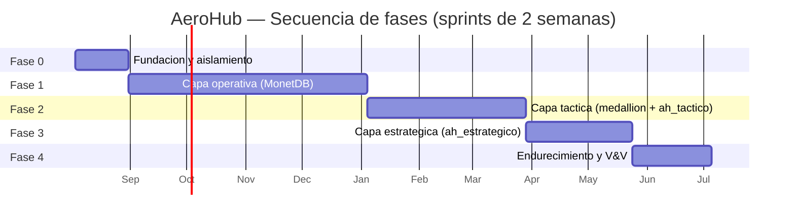
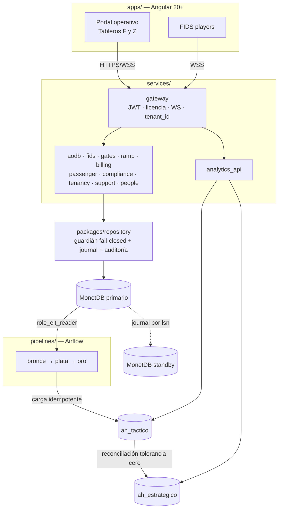

# Plan de Implementación — Plataforma AeroHub

| Campo | Contenido |
|:---|:---|
| **Identificador de documento** | AEROHUB-PLAN-002 |
| **Versión** | 2.0 — línea base única |
| **Fecha** | 2026-07-30 |
| **Documentos fuente** | [SRS v2.0](srs/AEROHUB-SRS-001-v2.0.md) · [SDD-DATA-001 (MonetDB)](sdd/AEROHUB-SDD-DATA-001-MonetDB-v1.0.md) · [SDD-DATA-002 (ClickHouse)](sdd/AEROHUB-SDD-DATA-002-ClickHouse-v1.0.md) · [Análisis Estratégico v6.0](estrategia/AEROHUB-ANALISIS-ESTRATEGICO-v6.0.md) |
| **Metodología** | Specification-Driven Development (SDD) sobre marco ágil, sprints de 2 semanas |
| **Marco de referencia** | ISO/IEC 12207:2017 · ISO/IEC/IEEE 29119 · IEEE 1016-2009 · ISO/IEC/IEEE 42010:2011 · ISO/IEC 25010:2011 · ISO/IEC 27001/27002:2022 · ISO/IEC 27701:2019 |
| **Estado** | Línea base aprobada para ejecución |

---

## Nota de línea base única

Toda versión anterior de la especificación, del diseño y del plan **fue eliminada del repositorio**, no archivada. La SRS v2.0 declara que *todo artefacto de diseño derivado de la SRS v1.0 y basado en PostgreSQL/RLS queda invalidado*; conservar esos archivos como referencia histórica solo habilitaba que una consulta futura tomara por vigente una premisa caída.

**Artefactos eliminados el 2026-07-30:**

| Artefacto | Premisa invalidada |
|:---|:---|
| `docs/PLAN_IMPLEMENTACION.md` (AEROHUB-PLAN-001 v1.0) | Derivaba de SRS v1.0 |
| `docs/srs/AeroHub_SRS_v1.0.md` | Superseded por SRS v2.0 |
| `docs/adr/ADR-001-monorepo-y-stack.md` | Stack con PostgreSQL 16+ y MonetDB como DW |
| `docs/adr/ADR-002-patron-rls-y-exenciones.md` | RLS nativo — retirado por ADR-013/ADR-014 |
| `docs/adr/ADR-003-catalogo-roles-tabla-referencia.md` | Catálogo de 15 roles y `tenants.catalogo_roles`, inexistentes en el modelo vigente |
| `db/` completo (migraciones, modelos, políticas, seeds, Alembic) | `psycopg`, `UUID` de PostgreSQL, `apply_tenant_rls()`, esquema `analytics_bsc` retirado |
| `tests/negative/` completo | Verificaba enforcement de motor que la operacional ya no posee |
| `infra/docker-compose.yml` (versión previa) | Servicio `postgres:16-alpine` |
| `.github/workflows/ci.yml` (versión previa) | `alembic upgrade head` y `roles_grants.sql` sobre PostgreSQL |

**Única fuente normativa vigente:** los cuatro documentos de la cabecera, alojados en `docs/`. Ninguna actividad de este plan carece de trazabilidad a un `RF-*`, `RNF-*`, `PN-*` o a una acción del Plan de Acción Estratégico (§13 del Análisis v6.0).

---

## Tabla de contenidos

- [1. Contexto y propósito](#1-contexto-y-propósito)
- [2. Parámetros de ejecución](#2-parámetros-de-ejecución)
- [3. Principios rectores no negociables](#3-principios-rectores-no-negociables)
- [4. Estrategia de fases](#4-estrategia-de-fases)
- [5. Arquitectura de la solución](#5-arquitectura-de-la-solución)
- [6. Convenciones, compuerta de pruebas y Definition of Done](#6-convenciones-compuerta-de-pruebas-y-definition-of-done)
- [7. FASE 0 — Fundación y aislamiento verificable](#7-fase-0--fundación-y-aislamiento-verificable)
- [8. FASE 1 — Capa operativa (RF-O\*)](#8-fase-1--capa-operativa-rf-o)
- [9. FASE 2 — Capa táctica (RF-T\*)](#9-fase-2--capa-táctica-rf-t)
- [10. FASE 3 — Capa estratégica (RF-E\*)](#10-fase-3--capa-estratégica-rf-e)
- [11. FASE 4 — Endurecimiento y cierre de V&V](#11-fase-4--endurecimiento-y-cierre-de-vv)
- [12. Matriz de trazabilidad requisito → sprint](#12-matriz-de-trazabilidad-requisito--sprint)
- [13. Matriz de pruebas negativas → sprint](#13-matriz-de-pruebas-negativas--sprint)
- [14. Mapeo Plan de Acción Estratégico → sprint](#14-mapeo-plan-de-acción-estratégico--sprint)
- [15. Gestión de riesgos](#15-gestión-de-riesgos)
- [16. Backlog de mejoras de los SDD](#16-backlog-de-mejoras-de-los-sdd)
- [17. Registro de decisiones arquitectónicas](#17-registro-de-decisiones-arquitectónicas)
- [18. Criterios de entrada y salida por fase](#18-criterios-de-entrada-y-salida-por-fase)
- [19. Alcance mínimo demostrable](#19-alcance-mínimo-demostrable)

---

## 1. Contexto y propósito

### 1.1 Qué construye este plan

| Dimensión | Cifra |
|:---|:---|
| Requisitos funcionales normativos | 6 estratégicos (RF-E01…E06) · 12 tácticos (RF-T01…T12) · 19 operativos (RF-O01…O19) |
| Requisitos no funcionales | RNF-S01…S05 · RNF-R01…R04 · RNF-P01…P05 · RNF-M01…M03 · RNF-C01…C03 · RNF-U01, U02, PO01 |
| Pruebas negativas obligatorias | PN-01 … PN-15 (puerta de release) |
| Esquemas operacionales (MonetDB) | `tenants`, `ops`, `rampa`, `billing`, `compliance`, `support`, `people`, `etl_control`, `continuidad` (ADR-018) + 10 catálogos globales |
| Bases analíticas (ClickHouse) | `ah_tactico` (8 dimensiones + 5 hechos/features) · `ah_estrategico` (6 tablas) |
| Roles RBAC | 16 (9 internos + 7 por tenant) |
| Módulos de producto | M1…M9 sobre 6 departamentos propietarios (D1…D6) |

### 1.2 Orden de construcción

El orden **operativo → táctico → estratégico** coincide con la regla de alineación objetivo ↔ capa de datos (ADR-016) y con la dirección obligatoria del flujo:

```
MonetDB (operacional) → bronce → plata → oro → ah_tactico → ah_estrategico
```

No es una preferencia de secuenciación: es una **dependencia física**. No existe `ah_tactico` sin registros operativos que extraer, ni `ah_estrategico` sin detalle táctico que reconciliar. Reordenar las fases violaría la regla de derivación unidireccional (SDD-DATA-002 §4).

---

## 2. Parámetros de ejecución

| Parámetro | Valor |
|:---|:---|
| **Naturaleza del proyecto** | Académico / capstone demostrable — prioriza evidencia de trazabilidad SRS → diseño → código → prueba |
| **Entorno objetivo** | `docker-compose` local: MonetDB (primario + standby) · ClickHouse (2 bases) · Airflow · MinIO · Prometheus · Loki · Grafana |
| **Datos** | Sintéticos, ≥ 2 tenants poblados (criterio de entrada de fase Sistema, SRS §8.3) y filas canario permanentes por tenant |
| **Equipo** | 3–5 desarrolladores |
| **Duración de sprint** | 2 semanas (coherente con Anexo A.1 del Análisis v6.0) |
| **Total** | 5 fases · **24 sprints** · ~48 semanas |
| **Machine Learning** | XGBoost + SHAP con validación temporal estricta · MLflow local · Evidently para drift |
| **Frontend** | Angular 20+ como framework único (RNF-U02); players FIDS como build ligero del mismo monorepo (RNF-PO01) |
| **Fuera de alcance de ejecución** | Certificación SOC 2 externa (Acción 31), despliegue multi-región productivo (Acción 30), acciones comerciales y legales. Se implementan sus **mecanismos técnicos**, no el trámite |

### 2.1 Ritual de sprint

| Día | Ceremonia | Salida |
|:---:|:---|:---|
| 1 | Planning | Alcance comprometido, con `RF-*`/`PN-*` declarado por historia |
| 2–7 | Desarrollo + daily asíncrona | Bloqueos declarados |
| 8 | Revisión de diseño | Verificación de trazabilidad y de reglas de dependencia (ADR-017) |
| **9–10** | **Compuerta de pruebas (Sección 6.4)** | **Evidencia ejecutable archivada en `docs/evidencia/<sprint>/`** |
| 10 | Demo + retrospectiva | Aceptación o rechazo del sprint; pendientes reprogramados, nunca acumulados en silencio |

---

## 3. Principios rectores no negociables

Se verifican en **cada** sprint, no solo en el que los introduce. Su incumplimiento bloquea la aceptación.

| # | Principio | Origen | Verificación continua |
|:---|:---|:---|:---|
| P1 | **Ningún componente fuera de `packages/repository` emite SQL hacia MonetDB.** | ADR-014, SRS §2.6 | Análisis estático en CI (PN-15); el build falla |
| P2 | **El `tenant_id` proviene del token JWT validado, nunca del cuerpo.** Toda consulta de alcance tenant sin filtro **se aborta en ejecución** (ADR-019). | ADR-014, ADR-019 | PN-01, PN-02; guardián *fail-closed* |
| P3 | **Derivación unidireccional:** `ah_estrategico` solo desde `ah_tactico`, con reconciliación de tolerancia cero. | ADR-016 | Suite de reconciliación como *gate* de publicación |
| P4 | **Capa ⟂ estado** en el pipeline medallion. | ADR-015 | Unicidad `(run_id, capa)` (PN-14) |
| P5 | **Sin `DELETE` físico** en tablas de negocio; `compliance` append-only salvo la excepción de `post_mortem`. | SRS §2.6, ADR-009 | PN-04 |
| P6 | **Cero PII de pasajeros** en cualquier capa. | RNF-S05 | PN-11 sobre esquema operacional y analítico |
| P7 | **Toda decisión estructural exige ADR aprobado antes de implementarse.** | RF-T09, ISO/IEC 12207 | Revisión de diseño del día 8 |
| P8 | **Toda mutación se registra en el journal de continuidad dentro de la misma transacción** (ADR-018). | RNF-R01 | Prueba de atomicidad journal ↔ mutación |

### 3.1 Tratamiento de los dos riesgos declarados por la fuente

Ambos riesgos **tienen ahora mecanismo asignado**. Ninguno se declara mitigado, porque las fuentes lo prohíben expresamente; lo que cambia es que dejan de estar sin solución.

#### RNF-R01 — Continuidad operacional (MonetDB sin PITR nativo)

**Resuelto por [ADR-018](adr/ADR-018-continuidad-operacional-monetdb.md).** La arquitectura ya obliga a que toda mutación pase por un punto único de código (P1); ese cuello de botella, creado por razones de seguridad, se convierte en el punto de captura de cambios que el motor no ofrece:

| Componente | Aporte al objetivo |
|:---|:---|
| **C1 — Journal transaccional** (`continuidad.journal_mutacion`, patrón *outbox*) | La entrada del journal se escribe en la **misma transacción** que la mutación: atomicidad garantizada por el motor, no por disciplina. Orden total por `lsn`. |
| **C2 — Snapshot base** (`hot_snapshot` cada 6 h + volcado lógico diario a MinIO/S3) | Punto de partida de la restauración. El RPO ya **no depende** de su periodicidad. |
| **C3 — Standby caliente + shipper idempotente** | Drena el journal por `lsn` sobre una segunda instancia; publica `aerohub_standby_lag_seconds`. **RPO = lag observable**, con alerta a los 120 s (mitad del presupuesto). |
| **C4 — Failover por cambio de DSN + prueba semanal y game day mensual** | Al existir un único emisor de SQL, la conmutación es un cambio de configuración en **un solo lugar**. Presupuesto de RTO ≈ 9 min frente a los 15 exigidos. |

**Condición de cierre:** 4 semanas consecutivas de prueba automatizada en verde + 1 game day con failover real + lag nunca > 120 s. Hasta entonces se reporta como **riesgo abierto con mecanismo y métrica de avance** en cada cierre de fase. Si al término de la Fase 4 no se sostiene, se activa el plan de contingencia: ADR de revisión de ADR-013, escalado a decisión de plataforma.

#### Riesgo residual de aislamiento (SRS §9.4)

**Resuelto por [ADR-019](adr/ADR-019-guardian-de-tenant-fail-closed.md).** El problema no era la ausencia de controles, era su naturaleza: los tres primeros controles de §9.3 verifican **dónde** está el SQL, no **qué contiene**, y el cuarto depende de cobertura por disciplina. El guardián cambia la naturaleza del control:

| | Línea base (§9.3) | Con G1–G4 (ADR-019) |
|:---|:---|:---|
| Superficie de fallo | Cualquier método que omita el filtro | Defecto del guardián · tabla mal clasificada · uso indebido de `alcance_global` |
| Detección | En producción, o nunca si el endpoint no está cubierto | Sentencia **abortada** en ejecución, o build fallido |
| Ante omisión | **Falla abierto** (devuelve datos ajenos) | **Falla cerrado** (aborta y audita) |
| Naturaleza | Ilimitada, crece con el código | Finita, enumerable, auditada |
| Cobertura de prueba | 100 % de endpoints *por disciplina* | 100 % de métodos de acceso a datos *por construcción* (test por introspección) |

> **Mandato respetado:** SRS §9.4 exige que este riesgo *"permanezca visible en toda revisión de seguridad futura y no se presente como mitigado"*. Este plan lo reporta en todos los cierres de fase con su magnitud reducida y su mecanismo de contención explícito — **nunca como cerrado**.

---

## 4. Estrategia de fases

| Fase | Nombre | Sprints | Semanas | Capa protagonista | Objetivo de cierre |
|:---|:---|:---:|:---:|:---|:---|
| **0** | Fundación y aislamiento verificable | 2 | 1–4 | Infraestructura | Guardián *fail-closed* operando antes de la primera tabla de negocio |
| **1** | Capa operativa (RF-O\*) | 9 | 5–22 | MonetDB | AODB, FIDS, Gates, Rampa, Billing, Compliance y continuidad sobre dato vivo |
| **2** | Capa táctica (RF-T\*) | 6 | 23–34 | Medallion + `ah_tactico` | Pipeline gobernado, detalle histórico idempotente, ML promovible |
| **3** | Capa estratégica (RF-E\*) | 4 | 35–42 | `ah_estrategico` | BSC reconciliado con tolerancia cero |
| **4** | Endurecimiento y cierre de V&V | 3 | 43–48 | Transversal | PN-01…PN-15 en verde; criterios de salida de fase Sistema |



**Regla de solape:** un sprint de Fase 2 puede iniciarse en paralelo al último de Fase 1 solo si su fuente (`ops`) está en verde. Ningún sprint de Fase 3 arranca antes de que S2.3 (carga a `ah_tactico`) haya cerrado, por P3.

---

## 5. Arquitectura de la solución

> Decisión completa, alternativas y reglas: **[ADR-017](adr/ADR-017-arquitectura-modular-por-capas.md)**.

### 5.1 Arquitectura elegida: **módulos de dominio con capas internas**

Se descartan las dos opciones puras y se adopta el cruce de ambos ejes:

| Opción | Veredicto |
|:---|:---|
| **Solo capas** (n-tier horizontal global) | ❌ Disuelve la propiedad departamental. Un cambio en facturación tocaría los mismos paquetes que operaciones; la segregación de funciones (ISO/IEC 27002 8.2/8.3) y la matriz RBAC por esquema quedarían como convención documental, sin reflejo estructural. |
| **Solo módulos** (vertical slices sin capas internas) | ❌ Cada módulo resolvería su propio acceso a datos: el control "único emisor de SQL" tendría N puntos de instalación, el guardián de ADR-019 sería inaplicable y PN-15 se volvería declarativo. |
| **Capas + módulos** | ✅ **Elegida.** El eje vertical (módulo = bounded context = departamento propietario = esquema) preserva la segregación; el eje horizontal (api → application → domain) preserva la disciplina de dominio; `packages/repository` como capa transversal obligatoria hace verificables P1, P2 y PN-15 en **un único punto**. |

### 5.2 Sobre la división `front / back / bff / etl`

Se conserva la división de primer nivel por **naturaleza de ejecución** (`apps` / `services` / `pipelines`), pero con dos correcciones:

- **No habrá capa BFF.** El patrón fue **retirado explícitamente** en v4.0 (Next.js BFF → API Gateway FastAPI + Angular único; SRS §6.4, Análisis §8.4). La SRS establece que *"ningún componente de esa tabla puede reintroducirse sin un nuevo ADR que revierta la decisión"*. Su función —fachada de agregación— la cumple el **API Gateway**, que además es el punto de inyección del `tenant_id` desde el token; un BFF duplicaría precisamente el control que sustituye al RLS perdido.
- **`back` no puede ser un bloque indiferenciado.** Colapsaría los nueve módulos y sus seis propietarios departamentales, reintroduciendo el defecto de "solo capas". El corte de dominio ocurre **dentro** de `services/`.

### 5.3 Estructura del monorepo

```
AeroHub/
├─ apps/                              # PRESENTACIÓN — Angular 20+ (RNF-U02)
│  ├─ web/
│  │  ├─ src/app/operativo/           # glanceability: posición fija, sin recorrido
│  │  ├─ src/app/tactico/             # patrón F — consume ah_tactico
│  │  ├─ src/app/estrategico/         # patrón Z — consume ah_estrategico
│  │  └─ src/app/admin/               # aprovisionamiento, licencias, API Keys
│  └─ fids-player/                    # build ligero del mismo monorepo (RNF-PO01)
│
├─ services/                          # BACKEND — un módulo por bounded context
│  ├─ gateway/                        # AuthN/AuthZ JWT · rate limit · licencia (RF-O18)
│  │                                  # · WebSocket · INYECCIÓN DE tenant_id (ADR-014)
│  ├─ aodb/         # M1 · D1 · ops
│  ├─ fids/         # M2 · D1 · ops (plantillas, pantallas)
│  ├─ gates/        # M3 · D1 · ops (asignaciones + PuLP)
│  ├─ ramp/         # M4 · D2 · rampa
│  ├─ billing/      # M5 · D3 · billing
│  ├─ passenger/    # M6 · D1 · billing.tiempo_espera_agregado
│  ├─ compliance/   # M9 · D5 · compliance
│  ├─ tenancy/      #      D5 · tenants
│  ├─ support/      #      D6 · support
│  ├─ people/       #      D5 · people
│  └─ analytics_api/# M7 · D4 · ClickHouse (solo lectura)
│     │
│     └─ <cada módulo>/
│        ├─ api/              # routers FastAPI, DTOs Pydantic v2, códigos HTTP
│        ├─ application/      # casos de uso CU-*, límites transaccionales
│        ├─ domain/           # entidades, invariantes — SIN framework ni SQL
│        └─ infrastructure/   # adaptadores; único que invoca packages/repository
│
├─ packages/                          # TRANSVERSAL
│  ├─ repository/                     # ÚNICO EMISOR DE SQL HACIA MonetDB (P1)
│  │  ├─ base.py                      # sesión + tenant_id obligatorio desde ContextVar
│  │  ├─ guard.py                     # guardián fail-closed (ADR-019, G1-G3)
│  │  ├─ journal.py                   # outbox de continuidad (ADR-018, C1)
│  │  ├─ audit.py                     # compliance.log_auditoria en la misma transacción
│  │  └─ <esquema>/                   # un submódulo por esquema departamental
│  ├─ contracts/                      # DTOs y eventos compartidos entre módulos
│  └─ kernel/                         # tipos de dominio comunes (dinero, UTC, IATA)
│
├─ pipelines/                         # ETL — Airflow (D4)
│  ├─ dags/                           # ingesta, promociones, agregación BSC, SOC 2
│  ├─ contracts/                      # Great Expectations (bronce→plata)
│  ├─ transforms/                     # Polars + SQL (plata→oro)
│  └─ reconciliation/                 # tolerancia cero (ah_tactico → ah_estrategico)
│
├─ ml/                                # features, entrenamiento, SHAP, MLflow, Evidently
├─ db/
│  ├─ ddl/monetdb/                    # por esquema, derivado de SDD-DATA-001
│  ├─ ddl/clickhouse/                 # ah_tactico y ah_estrategico (SDD-DATA-002)
│  ├─ migrations/                     # versionado; se aplica a primario Y standby
│  └─ seeds/                          # 2+ tenants, filas canario permanentes
├─ infra/                             # docker-compose, prometheus, loki, grafana, minio
├─ tests/
│  ├─ unit/ integration/ e2e/
│  ├─ negative/                       # PN-01 … PN-15
│  ├─ cross_tenant/                   # suite cruzada + test por introspección (G4)
│  └─ performance/                    # RNF-P01…P05, carga FIDS
└─ docs/
   ├─ srs/ sdd/ estrategia/ adr/ runbooks/
   └─ evidencia/<sprint>/             # salida de la compuerta de pruebas
```

### 5.4 Reglas de dependencia (verificadas en CI con `import-linter`)

```
api ──► application ──► domain ◄── infrastructure ──► packages/repository ──► MonetDB
```

1. `domain` **no importa** FastAPI, SQLAlchemy, Airflow ni driver alguno.
2. `application` importa `domain` y declara puertos; nunca importa `api`.
3. `api` importa `application`; **nunca** `infrastructure` ni `packages/repository`.
4. `infrastructure` es el **único** que importa `packages/repository`.
5. **Ningún módulo importa `domain` ni `application` de otro módulo.** La comunicación inter-módulo es por puerto o evento, conforme a la tabla de dependencias SRS §2.3 (M2→M1, M3→M1, M4→M1/M3, M5→M1/M3, M6→M2, M7→M1/M4/M5, M9→M1). Una importación cruzada no declarada **hace fallar el build**.

### 5.5 Vista de despliegue



---

## 6. Convenciones, compuerta de pruebas y Definition of Done

### 6.1 Nomenclatura (cierra SDD-001 M-10)

| Objeto | Patrón | Ejemplo |
|:---|:---|:---|
| CHECK | `chk_<tabla>_<columna>` | `chk_vuelo_sentido` |
| Unicidad | `uq_<tabla>_<columnas>` | `uq_vuelo_tenant_aerolinea_numero_fecha_sentido` |
| Índice | `idx_<tabla>_<columnas>` | `idx_vuelo_estado_tenant_vuelo_registrado` |
| Clave foránea | `fk_<tabla>_<destino>` | `fk_puerta_terminal` |
| DAG | `<verbo>_<objeto>_<cadencia>` | `ingesta_vuelos_diaria` |
| Rama git | `<fase>/<sprint>/<rf>-<slug>` | `f1/s1.4/rf-o02-asignacion-puerta` |

### 6.2 Tipificación

Vinculante sin excepción: **SDD-DATA-001 §4** para MonetDB, **SDD-DATA-002 §5** para ClickHouse. Toda desviación exige ADR (P7).

### 6.3 Módulo nuevo

Todo módulo nuevo nace con los cuatro directorios de capa (§5.3), su entrada en `import-linter` y su submódulo en `packages/repository`. No se acepta un módulo con acceso a datos propio.

### 6.4 Compuerta de pruebas de fin de sprint (obligatoria)

**Los días 9 y 10 de cada sprint se dedican a pruebas.** Ninguna historia se considera entregada sin su evidencia; un módulo entregado sin su prueba negativa **no cuenta como entregado**.

| Nivel | Alcance | Cuándo | Automatización |
|:---|:---|:---|:---|
| **Unitario** | Reglas de `domain/` sin infraestructura: invariantes, cálculo de tarifas, transiciones de estado, no solapamiento | **Todo sprint** | CI en cada PR; cobertura ≥ 80 % en módulos críticos |
| **Integración** | `api` → `application` → `repository` → MonetDB / ClickHouse, con contenedores efímeros | **Todo sprint** | CI |
| **Negativas nuevas** | Las `PN-*` que el sprint introduce (Sección 13) | Sprint que las introduce | CI |
| **Regresión de PN** | **Todas** las `PN-*` ya introducidas vuelven a ejecutarse | **Todo sprint, sin excepción** | CI |
| **Contrato de API** | Spectral sobre OpenAPI 3.1, 0 errores | Todo sprint con cambio de API | CI |
| **Contrato de datos** | Great Expectations sobre artefactos del sprint | Fase 2 en adelante | DAG |
| **Arquitectura** | `import-linter` (reglas §5.4) + PN-15 | **Todo sprint** | CI |
| **Rendimiento** | El RNF-P\*/R\* que el sprint compromete | Sprint que lo compromete + S4.2 | CI nocturna |
| **Cruzada por tenant** | Suite cruzada + test por introspección (ADR-019 G4) | **Todo sprint desde S0.2** | CI; cobertura publicada en cada PR |
| **E2E** | Flujo de caso de uso completo | Fin de cada fase | Suite nocturna |

**Salida de la compuerta:** `docs/evidencia/<sprint>/` con el informe de ejecución, la cobertura, las métricas de rendimiento medidas y el resultado de cada PN. Un sprint sin ese directorio no se acepta en la demo.

### 6.5 Definition of Done genérica

Adicional a la DoD específica de cada sprint:

1. Cada historia declara su `RF-*`/`RNF-*` de origen; sin trazabilidad no entra al sprint.
2. Compuerta de pruebas (§6.4) superada, con evidencia archivada.
3. Toda tabla de alcance de tenant: `tenant_id` como **primer** componente de PK/índice y **alcance declarado** en el registro del guardián (ADR-019 G1).
4. Toda mutación produce su entrada en `compliance.log_auditoria` **y** en `continuidad.journal_mutacion`, en la misma transacción (P8).
5. Toda API nueva figura en OpenAPI 3.1 con 0 errores de Spectral.
6. Reglas de dependencia de §5.4 en verde.
7. Sin secretos en el repositorio; Ruff + bandit + trivy + gitleaks sin hallazgos críticos.
8. ADR si hubo decisión estructural; runbook si hubo componente operable.

---

## 7. FASE 0 — Fundación y aislamiento verificable

**Semanas 1–4 · 2 sprints · D5**

> Se construyen los controles compensatorios **antes** que el dato que protegen. Crear tablas de negocio antes del guardián dejaría un intervalo en el que el aislamiento sería una convención, no un control.

### 7.1 Sprint S0.1 — Monorepo, infraestructura y cadena de CI

| Elemento | Contenido |
|:---|:---|
| **Objetivo** | Estructura de ADR-017 en pie, entorno completo reproducible y CI capaz de rechazar. |
| **Acciones fuente** | 5, 6 |
| **Requisitos** | RF-T06, RF-T09, RNF-M02, RNF-U02 |

**Entregables**

| Área | Entregable |
|:---|:---|
| Monorepo | Estructura de §5.3 con workspace unificado (`pyproject.toml` por paquete, `package.json` de Angular). `import-linter` configurado con las 5 reglas de §5.4. |
| ADR | Alta de ADR-012 … ADR-016 (de la fuente) y ADR-017 … ADR-019 (locales) en `docs/adr/`, con formato RNF-M02. |
| Infra | `docker-compose`: MonetDB **primario + standby**, ClickHouse (`ah_tactico`, `ah_estrategico`), Airflow, MinIO, Prometheus, Loki, Grafana. Healthcheck por servicio. |
| CI | GitHub Actions: `ruff`, `bandit`, `trivy`, `gitleaks`, `spectral`, `import-linter`, `pytest`. Bloqueo de merge ante hallazgo crítico. |
| Convenciones | Linter de nomenclatura DDL (§6.1) como paso de CI. |

**Compuerta de pruebas:** arquitectura (`import-linter` con un módulo de prueba que viola cada regla → el build debe fallar 5 veces), arranque del entorno, inyección deliberada de secreto y de vulnerabilidad crítica para verificar que CI rechaza.

**DoD:** `docker-compose up` levanta los 9 servicios con healthcheck verde en < 5 min; CI falla ante los 5 commits de prueba inyectados; los 8 ADR referencian su supersedido cuando corresponde.

**Riesgo:** MonetDB en contenedor tiene menos documentación operativa que motores mainstream → *spike* técnico en este sprint, imagen y versión fijadas, `docs/runbooks/monetdb.md`.

---

### 7.2 Sprint S0.2 — Capa de repositorio, guardián de tenant y roles

| Elemento | Contenido |
|:---|:---|
| **Objetivo** | Que una consulta sin filtro de tenant **no pueda ejecutarse**, y que el aislamiento departamental esté en el motor, antes de la primera tabla de negocio. |
| **Acciones fuente** | 1, 1c |
| **Requisitos** | RNF-S01, RNF-S02, RNF-S04, RNF-M01 · **ADR-019** |

**Entregables**

| Área | Entregable |
|:---|:---|
| DDL | 10 catálogos globales sin `tenant_id` (SDD-001 §5). Esquema `tenants` completo (SDD-001 §6). Los 7 esquemas restantes creados vacíos con sus privilegios. Esquema `continuidad` (ADR-018 C1). |
| Roles | `db/ddl/monetdb/roles_grants.sql` con la matriz 4.3.1: 16 roles. `role_elt_reader` solo lectura sobre toda la operacional. **Sin `DELETE` para ningún rol de negocio.** |
| Repositorio | `packages/repository/base.py`: sesión SQLAlchemy Core con `tenant_id` obligatorio desde `ContextVar`; el constructor exige el parámetro. `audit.py` y `journal.py` escribiendo en la misma transacción que la mutación. |
| **Guardián (ADR-019)** | **G1** registro declarativo de alcance por tabla (`tenant`/`global`/`interno`). **G2** manejador `before_execute` que recorre el AST y **aborta** toda sentencia sobre tabla de alcance tenant sin predicado de igualdad sobre `tenant_id` vinculado al contexto. **G3** bloque `alcance_global(motivo=, rol=)` para excepciones legítimas, cada uso auditado. |
| Análisis estático | Regla `no-sql-outside-repository` por AST (no por expresión regular) en CI. |
| Seeds | Generador con 2 tenants y **filas canario permanentes**. |

**Compuerta de pruebas**

- **PN-03** (rol sin privilegio sobre esquema ajeno), **PN-04** (mutación de auditoría), **PN-08** (cualquier rol ≠ `role_people_viewer` sobre `people`, incluido `role_platform_admin`), **PN-15** (literal SQL fuera del repositorio).
- **Prueba del guardián:** una consulta escrita deliberadamente sin filtro sobre `tenants.usuario` debe lanzar `TenantScopeViolation` y quedar registrada como incidente.
- **G4 — test por introspección:** enumera todos los métodos públicos de todos los repositorios y los invoca con canario de tenant A bajo contexto de tenant B → 0 filas o excepción, en el 100 % de los métodos.
- Conformidad G1: una tabla nueva sin alcance declarado hace fallar el build.
- Atomicidad P8: mutación con fallo forzado posterior deja **ni** la fila **ni** la entrada del journal.

**DoD:** PN-03, PN-04, PN-08 y PN-15 en verde en cada PR; el guardián aborta el caso negativo; cobertura G4 = 100 % de métodos publicada en CI; `hash_credencial`/`hash_secreto` con **Argon2id** (cierra SDD-001 M-07).

**Riesgo:** falsos positivos del guardián en `JOIN` complejos → se acepta el falso positivo (obliga a explicitar el filtro) frente al falso negativo; caché del análisis por sentencia compilada para amortizar el coste.

---

## 8. FASE 1 — Capa operativa (RF-O\*)

**Semanas 5–22 · 9 sprints · D1, D2, D3, D5, D6 · MonetDB**

> OP1–OP16 se sirven de la base operacional (ADR-016). Esta fase construye la fuente de verdad de la que se alimenta todo el pipeline analítico.

### 8.1 Sprint S1.1 — Núcleo AODB y aprovisionamiento de tenants

| Elemento | Contenido |
|:---|:---|
| **Objetivo** | `ops.vuelo` operativo con estado derivado y aprovisionamiento de tenant con aislamiento verificado. |
| **Acciones fuente** | 1, 2 · **Módulos** `services/aodb`, `services/tenancy` |
| **Requisitos** | RF-O01, RNF-S01, RNF-P04, RNF-M01 · CU-O18 |

**Entregables**

| Capa | Entregable |
|:---|:---|
| DDL | `ops.terminal`, `ops.puerta` (FK a `terminal`, corrige 3NF), `ops.vuelo` (**sin `estado_actual`**, **sin `ruta_id`**), `ops.vuelo_estado`, `ops.vuelo_demora`. Índices de SDD-001 §19. |
| Vista | `v_vuelo_estado_actual` — último registro por `vuelo_id`. |
| `domain/` | Invariantes de vuelo: origen ≠ destino, coherencia de tiempos programados, transiciones válidas de estado. |
| `application/` | CU-O18 (aprovisionar tenant), alta de vuelo, registro de cambio de estado con `origen_cambio`. |
| `api/` + frontend | Portal de administración de tenants (Angular + FastAPI). |

**Compuerta de pruebas:** **PN-01** (tenant A pide recurso de B → HTTP **404**, nunca 403), **PN-02** (`tenant_id` del cuerpo ≠ token → ignorado y alertado); regresión de PN-03/04/08/15; unitarias de invariantes sin base de datos; medición de RNF-P04.

**DoD:** aprovisionamiento < 10 min medido; PN-01 y PN-02 en verde; middleware **único** de traducción de excepción de acceso (un solo endpoint que devuelva 403 confirmaría la existencia del recurso ajeno).

---

### 8.2 Sprint S1.2 — API del AODB, OpenAPI 3.1 y tiempo real

| Elemento | Contenido |
|:---|:---|
| **Objetivo** | Exponer el AODB con contrato formal y propagación en tiempo real. |
| **Acciones fuente** | 3, 15 · **Módulos** `services/gateway`, `services/aodb` |
| **Requisitos** | RF-T02, RF-O04, RNF-P01, RNF-C03 |

**Entregables:** especificación OpenAPI 3.1 generada desde Pydantic v2; Gateway con JWT de corta vida, rate limiting y cuotas por API Key, canal WebSocket; publicación de cambios de estado por WSS; vista operativa con *glanceability* (posición fija, sin patrón Z/F).

**Compuerta de pruebas:** **PN-06** (API Key revocada/expirada → 401 auditado), **PN-07** (JWT expirado o scope insuficiente → 401/403 sin fuga); regresión completa de PN; Spectral 0 errores; **medición de RNF-P01** con 100 cambios de estado concurrentes.

**DoD:** propagación **< 1 s** verificada por telemetría; PN-06 y PN-07 en verde.

---

### 8.3 Sprint S1.3 — M2 FIDS

| Elemento | Contenido |
|:---|:---|
| **Objetivo** | Distribución a pantallas físicas con detección de ausencia de señal. |
| **Acciones fuente** | 4 · **Módulo** `services/fids` + `apps/fids-player` |
| **Requisitos** | RF-T03, RF-O07, RNF-P02, RNF-R04, RNF-PO01 |

**Entregables:** `ops.plantilla_fids` (versionada, `definicion_json`) y `ops.pantalla_fids` (`ultima_senal_en`, `version_firmware`, estado); servicio de publicación y *heartbeat*; `apps/fids-player` como build ligero; métricas de latencia WebSocket por pantalla en Grafana.

**Compuerta de pruebas:** **PN-11** sobre el esquema de M2 (0 campos capaces de identificar a un pasajero); regresión de PN; medición de RNF-P02 y RNF-R04 (simulación de corte de señal).

**DoD:** plantilla reflejada **< 1 s**; alerta de pantalla sin señal **< 60 s**.

---

### 8.4 Sprint S1.4 — M3 Terminal & Gate Manager

| Elemento | Contenido |
|:---|:---|
| **Objetivo** | Asignación de puertas sin solapamiento, en ausencia de restricción de exclusión nativa. |
| **Acciones fuente** | 27 · **Módulo** `services/gates` |
| **Requisitos** | RF-O02 · OP2a |

**Entregables:** `ops.asignacion_puerta` con sus CHECK; **verificación de no solapamiento** en `domain/` + transacción serializable con bloqueo de fila sobre `puerta_id` (MonetDB carece de `EXCLUDE USING gist`), documentada como riesgo acotado y **no** como control cerrado; asignación automática por programación lineal (PuLP) considerando envergadura, tipo contacto/remota y ventanas; tablero de puertas con notificación de conflicto.

**Compuerta de pruebas:** **PN-05** en variante secuencial **y concurrente** (dos peticiones simultáneas sobre la misma puerta); unitarias exhaustivas del algoritmo de intersección de intervalos (bordes: fin == inicio, contención, solape parcial); regresión de PN.

**DoD:** PN-05 en verde también bajo concurrencia; plan automático sin conflictos sobre el dataset sintético.

---

### 8.5 Sprint S1.5 — M4 Ground Operations (turnaround)

| Elemento | Contenido |
|:---|:---|
| **Objetivo** | Turnaround como entidad propia que empareja llegada y salida. |
| **Módulo** | `services/ramp` |
| **Requisitos** | RF-O16 · OP2b · CU-O16 |

**Entregables:** catálogos `rampa.tipo_tarea` (con `duracion_estandar_min`, `es_ruta_critica`) y `tipo_incidencia_rampa`; `rampa.turnaround` con `uq (tenant_id, vuelo_llegada_id)`; `rampa.tarea_turnaround` (**duración derivada, no almacenada**); `rampa.incidencia_rampa`; detección automática de desviación del estándar; interfaz responsiva Angular.

**Compuerta de pruebas:** mínimo privilegio de `role_ramp_agent` (no lee ni escribe turnarounds ajenos); generación de incidencia dentro de la ventana; regresión de PN.

**DoD:** incidencia generada **< 60 s** tras superar el estándar.

---

### 8.6 Sprint S1.6 — M5 Revenue & Billing + M6 Passenger Experience

| Elemento | Contenido |
|:---|:---|
| **Objetivo** | Tarifación normalizada, facturación conciliada y tiempos de espera agregados sin PII. |
| **Acciones fuente** | 16, 27b · **Módulos** `services/billing`, `services/passenger` |
| **Requisitos** | RF-O15, RF-O17, RF-E02 (parcial), RF-T10 · CU-O17, CU-O19 |

**Entregables:** `concepto_cargo` (catálogo global); `tarifario` (cabecera) + `tarifario_concepto` (detalle) — corrige 2NF, resuelve la ternaria en 5NF y habilita RF-T10 sin desplegar código; `cargo_aeronautico` con **denormalización deliberada** (`tarifa_aplicada`, `monto_calculado`) como instantánea inmutable; `factura` (**sin `total`**) + `factura_linea` con `uq cargo_aeronautico_id`; `conciliacion_pax` (**sin `diferencia`**); `billing.tiempo_espera_agregado` por terminal y franja, con `muestra_n`.

**Compuerta de pruebas:** inmutabilidad —cambiar la tarifa vigente **no** altera cargos ni facturas históricas—; conciliación factura ↔ movimientos con diferencia **cero**; **PN-11** sobre M6; segregación de funciones (`role_support` sin acceso a `billing`); regresión de PN.

**DoD:** factura mensual concilia sin diferencias; actualización de tiempos de espera **≤ 15 min**; 0 campos de PII.

---

### 8.7 Sprint S1.7 — Licenciamiento, credenciales y Compliance Hub

| Elemento | Contenido |
|:---|:---|
| **Objetivo** | Cerrar el control de acceso por licencia y la auditoría append-only. |
| **Acciones fuente** | 15b · **Módulos** `services/compliance`, `services/tenancy` |
| **Requisitos** | RF-O18, RF-O12, RF-O13, RNF-S04 · CU-O20, CU-O13 |

**Entregables:** validación de **licencia vigente por módulo** en el Gateway; `compliance.log_auditoria` (append-only, `idx (tenant_id, ocurrido_en DESC)`), `tipo_incidente`, `incidente_seguridad`, `tipo_reporte_regulatorio`, `reporte_dgac` (hash SHA-256), `acceso_auditor`, `post_mortem` + `post_mortem_accion`, `control_soc2`, `evidencia_soc2`; excepción controlada de `post_mortem` **solo** para `role_sre` con toda edición auditada; rotación automática de API Keys, credenciales y certificados; post-mortem con línea de tiempo desde la observabilidad.

**Compuerta de pruebas:** **PN-09** (módulo sin licencia → 403 en el 100 % de los casos); **PN-04 reforzada** (ninguna ruta del repositorio expone mutación sobre las 5 tablas append-only); caducidad automática de `usuario_rol.expira_en`; regresión de PN.

**DoD:** PN-09 en verde; post-mortem publicable **< 72 h** con eventos correlacionados.

---

### 8.8 Sprint S1.8 — Soporte D6 y observabilidad

| Elemento | Contenido |
|:---|:---|
| **Objetivo** | Cerrar la vertical de soporte y la observabilidad que alimenta el BSC. |
| **Acciones fuente** | 13 · **Módulo** `services/support` |
| **Requisitos** | RF-O08, RF-O10, RF-O11, RF-O14, RF-E03 (base), RNF-R02, RNF-R03 |

**Entregables:** `support.categoria_ticket`, `ticket` (`sla_objetivo_min`, `primera_respuesta_en`), `ticket_mensaje` (hilo, corrige 1NF), `articulo_kb` (**sin `tenant_id`**), `etiqueta`, `articulo_kb_etiqueta`, `changelog`, `changelog_item`; pila LGTM con dashboards de uptime AODB/FIDS, error budget y alertas Sev1–Sev3; bloqueo automático de despliegues al superar el **80 %** del error budget.

**Compuerta de pruebas:** SLA de primera respuesta < 2 h (FIDS/AODB) y < 4 h (rampa); bloqueo de despliegue verificado en escenario simulado; regresión de PN.

---

### 8.9 Sprint S1.9 — Continuidad operacional (ADR-018)

| Elemento | Contenido |
|:---|:---|
| **Objetivo** | Construir el mecanismo completo de RTO/RPO y ponerlo a medir. **Sprint dedicado: es el riesgo mayor del proyecto.** |
| **Acciones fuente** | 1b · **ADR-018** |
| **Requisitos** | RNF-R01, RF-O09 · OP7 |

**Entregables**

| Componente | Entregable |
|:---|:---|
| **C1** | `continuidad.journal_mutacion` con `lsn` monótono y `checksum_sha256`; escritura en la **misma transacción** que la mutación (outbox), integrada en `packages/repository/journal.py`. Retención 48 h. |
| **C2** | `hot_snapshot` cada 6 h + volcado lógico diario hacia MinIO/S3; catálogo de snapshots con su `lsn` de corte; verificación de integridad por checksum. |
| **C3** | Standby caliente restaurado desde snapshot; *shipper* idempotente que drena por `lsn` y registra el último aplicado; métrica `aerohub_standby_lag_seconds` en Prometheus con **alerta a 120 s**. |
| **C4** | Failover por cambio de DSN en la capa de repositorio; prueba de restauración **semanal automatizada** publicando `rpo_observado_segundos` y `rto_observado_segundos`; runbook de conmutación. |
| Regla derivada | Toda migración se aplica a **primario y standby** por el mismo pipeline versionado (verificado en CI). |

**Compuerta de pruebas**

- **Atomicidad:** fallo forzado tras la mutación deja ni fila ni entrada de journal.
- **Idempotencia del shipper:** reaplicar un `lsn` ya procesado es no-op.
- **Failover cronometrado** sobre datos sintéticos, con medición de RTO y RPO reales.
- **Sobrecoste de latencia:** comparación de RNF-P01 con y sin journal activo — si el margen se estrecha, se optimiza la serialización del `payload`, **nunca se relaja el control**.
- Regresión completa de PN.

**DoD:** el mecanismo opera y **publica sus métricas**. RNF-R01 **no se declara cerrado** en este sprint: requiere 4 semanas consecutivas en verde + 1 game day (S4.2). Se reporta como riesgo abierto **con mecanismo y métrica**, no sin solución.

---

### 8.10 Sprint S1.10 — Identidad y acceso (ADR-020)

| Elemento | Contenido |
|:---|:---|
| **Objetivo** | Cerrar "todavía no hay login real" (deuda documentada desde S1.1): autenticación por credenciales propias, sesión revocable, invitaciones, verificación de correo y recuperación de contraseña. |
| **Acciones fuente** | Deuda de arquitectura acumulada, sin acción numerada propia — cierra la precondición de UX que todo sprint anterior asumió resuelta ("mintar un JWT de prueba a mano"). |
| **Requisitos** | RF-IA01..RF-IA08, RNF-S06 · ADR-020 |

**Entregables:** `tenants.sesion`, `token_acceso`, `invitacion`, `intento_acceso` + 3 columnas nuevas en `tenants.usuario`
(`email_verificado_en`, `debe_cambiar_password`, `bloqueado_hasta`); migración de `uq_usuario_tenant_email` a `uq_usuario_email`
(correo único global); login con bloqueo por fuerza bruta; verificación de sesión vigente en cada petición autenticada
(revocación real, no solo `exp`); cambio de contraseña obligatorio en el primer acceso; invitaciones/verificación/recuperación
por correo (adaptador SMTP, `mailpit` en desarrollo); frontend completo de `apps/web` (`auth.service`, interceptor, guard, shell
con menú dinámico por rol × licencia) — la aplicación deja de pedir un JWT pegado a mano.

**Compuerta de pruebas:** PN-16 (login no revela existencia de cuenta); ciclo completo de login/logout/cambio/recuperación contra
MonetDB real; invitación y verificación de correo contra `mailpit` real (SMTP real, sin mock de `smtplib`); regresión completa de
PN-01 a PN-16 con sesión obtenida por login real, no por token fabricado; RNF-P01 re-medido con el costo de la verificación de
sesión por petición.

**DoD:** un tenant nuevo puede operar con más de un usuario humano por primera vez desde S0.1, sin que nadie pegue un token a
mano en ningún formulario.

---

### 8.11 Sprint S1.11 — Sistema de diseño + deuda de JWT + vista canónica

| Elemento | Contenido |
|:---|:---|
| **Objetivo** | Primero de 4 sprints de rediseño de interfaz (`docs/diseno/DIRECCION_VISUAL.md`): construir el sistema de diseño (tokens + primitivos compartidos), probarlo en un consumidor real, y cerrar la deuda del JWT manual que S1.10 dejó pendiente en 5 de las 14 vistas. |
| **Acciones fuente** | Rediseño de interfaz aprobado con el usuario (no es Fase 2 del plan de implementación) — `specs/013-diseno-sistema-jwt/`. |
| **Requisitos** | Sin requisitos RF-/RNF- nuevos — sprint de presentación, sin cambios de backend ni de esquema. |

**Entregables:** tokens de semáforo operacional (`--ah-estado-ok/atencion/critico/neutro`) y tipografía mono para dato en
`apps/web/src/styles.scss`; primitivos compartidos nuevos en `apps/web/src/app/_primitivos.scss` (`.ah-tira`, `.ah-tabla`,
`.ah-campo`, `.ah-btn`, `.ah-alerta`, `.ah-vacio`), reutilizados desde S1.12 en adelante; `_auth-form.scss` (S1.10) consolidado
sobre esos mismos primitivos; `vuelos/estado-tiempo-real` (M1) rediseñada por completo como la vista canónica del componente
"tira"; las 4 vistas que aún pedían un JWT pegado a mano (estado de vuelos, facturas, turnaround, tablero de puertas) y sus 3
servicios HTTP dejan de requerirlo — el WebSocket de vuelos (que no pasa por `HttpClient`/`authInterceptor`) lee el token de
`AuthService.token()` en vez de un textarea.

**Compuerta de pruebas:** vista canónica verificada contra el WebSocket real del gateway en Docker (3 cambios de estado reales
del vuelo canario MEC, colores de semáforo correctos, orden más-reciente-primero); cero campos de token en las 4 vistas
afectadas (`grep -rn tokenJwt apps/web/src` sin coincidencias fuera de comentarios); responsiva en escritorio y móvil sin scroll
horizontal; foco de teclado visible; regla `prefers-reduced-motion` presente; sin errores de consola.

**DoD:** el sistema de diseño existe y está probado en una vista real; la aplicación deja de pedir un token que ya no necesita
en ninguna pantalla.

---

### 8.12 Sprint S1.12 — Tableros operativos densos (puertas + rampa)

| Elemento | Contenido |
|:---|:---|
| **Objetivo** | Segundo de 4 sprints de rediseño de interfaz: aplicar el sistema de diseño de S1.11 a las 2 vistas de tableros densos que quedaron con HTML crudo desde S1.4/S1.5. |
| **Acciones fuente** | Rediseño de interfaz aprobado con el usuario — `specs/014-tableros-operativos-densos/`. |
| **Requisitos** | Sin requisitos RF-/RNF- nuevos — sprint de presentación, sin cambios de backend ni de contrato HTTP. |

**Entregables:** `puertas/tablero-puertas` (M3) rediseñada con `.ah-tira` por puerta (color = ocupación/conflicto, calculado
en el frontend por solapamiento de intervalos de las asignaciones ya cargadas, sin endpoint nuevo) y `.ah-tabla` para las
asignaciones anidadas; `rampa/panel-turnaround` (M4) rediseñada con `.ah-tira` por turnaround (color = desviación aproximada
por `estado`, con refinamiento de "en curso vencido") y `.ah-tabla` para tareas e incidencias, con un primitivo nuevo
`.ah-punto` (semáforo dentro de celda) para las columnas de estado de tarea y severidad de incidencia. Cero cambios en
`puertas.service.ts`/`rampa.service.ts` — exclusivamente presentación.

**Compuerta de pruebas:** verificado en navegador real contra el backend real en Docker — tablero de puertas real con
ocupación correcta (verde/gris según asignaciones, lógica de solapamiento trazada manualmente sobre datos reales);
turnarounds/tareas/incidencias reales con semáforo correcto (tareas completadas en verde, incidencias de severidad
alta/crítica en rojo); responsivo en móvil sin scroll horizontal; sin errores de consola; build de producción en verde.

**DoD:** las 3 vistas rediseñadas hasta ahora (vuelos, puertas, rampa) se leen como un mismo sistema visual — mismo
componente tira, misma tipografía mono, misma paleta de semáforo.

---

### 8.13 Sprint S1.13 — Vistas administrativas + consolidación

| Elemento | Contenido |
|:---|:---|
| **Objetivo** | Tercero de 4 sprints de rediseño: rediseñar `billing/panel-facturas` y `tenants/tenant-creation`, y auditar las 8 vistas de identidad de S1.10 contra el sistema ya formalizado en S1.11/S1.12. |
| **Acciones fuente** | Rediseño de interfaz aprobado con el usuario — `specs/015-vistas-administrativas-consolidacion/`. |
| **Requisitos** | Sin requisitos RF-/RNF- nuevos — sprint de presentación, sin cambios de backend. |

**Entregables:** `billing/panel-facturas` (M5) rediseñada con `.ah-tira` por factura (color = estado, 5 valores reales:
`vencida`/`disputada`→crítico, `emitida`→atención, `pagada`→ok, `borrador`→neutro) y `.ah-tabla` para las líneas de cargo;
`tenants/tenant-creation` rediseñado con `.ah-campo`/`.ah-btn`, resultado de creación presentado como lista de definición
dentro de un aviso; auditoría de las 8 vistas de identidad de S1.10 — encontró y corrigió una inconsistencia real:
`auth/login/login.scss` era la única de las 6 vistas de auth que nunca se consolidó sobre `_auth-form.scss` en S1.11,
manteniendo una copia duplicada completa de `.field`/`.btn`/`.alert`/`.card__link`; corregida importando el archivo
compartido y dejando en `login.scss` solo sus reglas exclusivas (el riel navy decorativo). Las otras 5 vistas y el shell
ya estaban consistentes.

**Compuerta de pruebas:** verificado en navegador real — facturas reales con semáforo correcto (borrador=neutro,
disputada=rojo, confirmado con datos reales); formulario de tenant funcional con los primitivos correctos; sin scroll
horizontal en móvil; sin errores de consola; build de producción en verde.

**DoD:** las cinco áreas de negocio de `apps/web` (identidad, vuelos, puertas, rampa, facturación) y el formulario de
tenant se leen como un mismo sistema visual de punta a punta.

---

## 9. FASE 2 — Capa táctica (RF-T\*)

**Semanas 23–34 · 6 sprints · D4 · Medallion (Parquet) + ClickHouse `ah_tactico`**

### 9.1 Sprint S2.1 — `etl_control` e ingesta a bronce

**Objetivo:** gobierno de ejecuciones e ingesta diaria trazable, con reprocesamiento concurrente imposible por restricción de motor. **Acción 9 · RF-O03, RF-O19 · CU-O03.**

**Entregables:** `etl_control.etl_ejecucion` con **`uq (run_id, capa)`**, estados CRUDO/PROCESANDO/TERMINADO/RECHAZADO, conteos, `checksum_sha256`; `etl_control.etl_validacion` (1NF); `/data/bronce/YYYY-MM-DD/<tenant_id>/` en Parquet con `_manifest.json` (SDD-002 §10.3), retención 90 días; DAG `ingesta_vuelos_diaria` bajo `role_elt_reader`; máquina de estados con las 4 transiciones válidas y solo esas.

**Compuerta de pruebas:** **PN-14** (dos DAGs sobre el mismo `(run_id, capa)` → la segunda rechazada por **violación de unicidad**, no por convención); reconstrucción del estado del pipeline desde los `_manifest.json` simulando pérdida total de `etl_control`; transición inválida rechazada; regresión de PN.

**DoD:** carga diaria sin pérdida de registros; toda ejecución trazable.

---

### 9.2 Sprint S2.2 — Promoción bronce→plata y cuarentena

**Objetivo:** contratos de datos como condición de promoción. **Acción 10 · RF-T04, RF-T12 · CU-T14.**

**Entregables:** suites de Great Expectations por fuente (esquema, tipos, **dominios contra catálogo**, nulos en obligatorios, duplicados por clave natural); DAG `promocion_bronce_plata`; `/plata` (30 días) y `/cuarentena` (180 días) con `_informe_validacion.json`; cada validación persistida en `etl_validacion`.

**Compuerta de pruebas:** **PN-12** sobre un set de artefactos deliberadamente corruptos — esquema alterado, dominio inválido, clave duplicada, nulo en obligatorio — con **0 promociones indebidas**; regresión de PN.

**DoD:** veredicto bronce→plata **< 15 min**.

---

### 9.3 Sprint S2.3 — Plata→oro y carga idempotente a `ah_tactico`

**Objetivo:** esquema estrella cargado con idempotencia nativa. **Acción 11 · RNF-P05, RNF-M03.**

**Entregables:** reglas de negocio plata→oro en Polars + SQL (conciliación de pasajeros, integridad referencial contra dimensiones, coherencia temporal ATA ≥ ATD del tramo previo, `distancia_km` por gran círculo, surrogate `ruta_id`, derivación de minutos de demora); DDL completo de `ah_tactico` — 8 dimensiones `ReplacingMergeTree(version)` y hechos `ReplacingMergeTree(cargado_en)` particionados por `toYYYYMM(...)`, con TTL 5 años y **7 años en `hecho_cargo`** (retención fiscal); carga idempotente con verificación conteo destino = origen por partición y rollback vía `ALTER TABLE ... DROP PARTITION`.

**Compuerta de pruebas:** **recarga del mismo período no duplica** (verificada con `FINAL` o agregación explícita, no por conteo crudo — la deduplicación de `ReplacingMergeTree` es diferida); ninguna columna de la clave de ordenamiento es `Nullable`; **medición de RNF-P05**; regresión de PN.

**DoD:** carga incremental diaria **< 10 min**.

---

### 9.4 Sprint S2.4 — Aislamiento analítico y tableros tácticos

**Objetivo:** restituir el enforcement estructural de tenant en la superficie de mayor volumen histórico. **Acciones 11c, 26 · RF-O06, RNF-P03, RNF-U01.**

**Entregables:** `CREATE ROW POLICY politica_tenant ... USING tenant_id = getSetting('SQL_tenant_actual') TO role_tenant_analyst` sobre **todos** los hechos; excepción auditada para `role_data_engineer` y `role_ml_engineer`; `role_business_viewer` **sin ningún acceso** a `ah_tactico`; `role_elt_writer` como único escritor dual; tableros tácticos en **patrón F** (KPI prioritario arriba-izquierda, métricas relacionadas contiguas, **el color codifica desviación respecto a la meta, nunca identidad de métrica**); `analytics_api` propagando el `tenant_id` del token al setting de sesión.

**Compuerta de pruebas:** **PN-13** en sus dos variantes (`role_business_viewer` → denegación; `role_tenant_analyst` sobre otro tenant → **0 filas**); medición de RNF-P03; revisión de diseño de usabilidad firmada; regresión de PN.

---

### 9.5 Sprint S2.5 — Modelo predictivo de demoras y MLOps

**Objetivo:** predicción explicable promovible solo bajo validación temporal estricta. **Acciones 12, 21 · RF-O05, RF-T05 · SRS §8.4 · CU-O05.**

**Entregables:** `ah_tactico.feature_prediccion_demora` como **`MergeTree` simple** —append-only: cada observación es un evento distinto, no una versión sustituible; aplicar `ReplacingMergeTree` descartaría observaciones legítimas— TTL 2 años; features sin fuga temporal (`demora_historica_promedio_ruta_min` en ventana móvil de 90 días, `ocupacion_puerta_pct`, hora local, día de semana, categoría de estela); XGBoost + SHAP con **partición temporal estricta** y champion-challenger; MLflow (versión, dataset, métricas) y Evidently (drift con umbrales); reentrenamiento quincenal (OP14).

**Compuerta de pruebas:** **prueba de fuga temporal** — una feature calculada con datos futuros debe hacer fallar la suite; reproducibilidad del split; regresión de PN.

**DoD:** promoción **solo si MAPE ≤ 12 %** en holdout temporal; SHAP versionado junto al modelo.

---

### 9.6 Sprint S2.6 — Sandbox, portal de desarrollador y calidad del pipeline

**Objetivo:** cerrar los RF tácticos de habilitación. **Acciones 18c, 24, 26b, 22 · RF-T01, RF-T07, RF-T08, RNF-C01, RNF-C02 · CU-T13, CU-O21.**

**Entregables:** sandbox por tenant con datos sintéticos (`tenant.es_sandbox`), aislado de producción; portal de desarrollador con documentación interactiva y **SDKs Python y TypeScript** sincronizados; tablero de calidad del pipeline (estado, capa, tenant, fecha y **motivo de rechazo**, con enlace al artefacto en cuarentena); consulta periódica de costo cloud con alerta ante desviación **> 20 %**, sin replicar la fuente externa; contrato de entrada del CRM vía webhook al Gateway.

**Compuerta de pruebas:** aislamiento sandbox ↔ producción; firma SDK ↔ especificación; alerta de costo en escenario simulado; medición de RNF-P04 para sandbox; regresión de PN.

**DoD:** sandbox operativo **< 10 min**.

---

## 10. FASE 3 — Capa estratégica (RF-E\*)

**Semanas 35–42 · 4 sprints · D3, D4 · ClickHouse `ah_estrategico`**

### 10.1 Sprint S3.1 — `ah_estrategico`, `dim_kpi` y reconciliación

**Objetivo:** construir la base estratégica y, **antes** de publicar cifra alguna, la suite que la valida. **Acción 11b · ADR-016.**

**Entregables:** `dim_kpi` (`kpi_codigo`, `perspectiva`, `meta_objetivo`, `direccion_favorable`, `formula_descripcion`, **`fuente_tabla`**) con verificación de unicidad **en la DAG de carga** (ClickHouse no ofrece `UNIQUE` de motor — cierra SDD-002 M-04); privilegios con `role_elt_writer` como único escritor y **ningún rol con escritura simultánea en ambas bases**; `pipelines/reconciliation/` con consulta equivalente sobre el detalle de `ah_tactico` por cada KPI, **tolerancia cero**; DAG `agregacion_bsc_diaria` con la reconciliación como *gate* **previo** al `INSERT`, no como verificación posterior.

**Compuerta de pruebas:** **discrepancia inyectada de 1 unidad bloquea la publicación** y el tablero conserva el corte anterior; ningún registro llega a `ah_estrategico` sin reconciliar; regresión de PN.

---

### 10.2 Sprint S3.2 — Tablero BSC y resúmenes agregados

**Objetivo:** las 4 perspectivas visibles con corte ≤ 24 h y trazabilidad hasta el dato. **Acción 28c · RF-E01, RF-E02, RNF-U01 · CU-E01.**

**Entregables:** `kpi_snapshot` (`ReplacingMergeTree(calculado_en)`, `tenant_id` nullable para KPI internos), `resumen_operacion_mensual`, `resumen_financiero_mensual` (`costo_cloud` de fuente externa, `margen_bruto_pct` derivado), `resumen_cliente_trimestral`; agregación con `meta` desnormalizada desde `dim_kpi` vigente al momento del cálculo; tablero estratégico en **patrón Z** (baja densidad, máx. 17 KPIs, punto terminal de cierre), cada KPI mostrando su `fuente_tabla`.

**Compuerta de pruebas:** corte **≤ 24 h**; consolidación de ingresos concilia **al 100 %** con las facturas emitidas; revisión de diseño RNF-U01 firmada; **E2E de fin de fase**; regresión de PN.

---

### 10.3 Sprint S3.3 — Talento interno: `people`, eNPS y OKRs

**Objetivo:** perspectiva de aprendizaje con anonimidad **estructural**, no procedimental. **Acción 28b · RF-E05, RF-E06, RNF-S05 · CU-E05, CU-E06.**

**Entregables:** `people.periodo_encuesta`, `people.encuesta_enps_respuesta` (**deliberadamente sin FK a empleado**; `categoria_derivada` materializada para agregar sin exponer la puntuación individual), `people.metrica_departamento` (retención derivada); explotación de `tenants.okr` + `okr_resultado_clave`; `ah_estrategico.resumen_talento_trimestral` agregado por `departamento_id`, **sin `tenant_id`**; `role_people_viewer` como único acceso.

**Compuerta de pruebas:** **PN-08** (denegación a cualquier otro rol, incluido `role_platform_admin`) y **PN-11** (ausencia estructural de identificador individual); ninguna consulta del tablero desagrega por debajo de `departamento_id`; regresión de PN.

---

### 10.4 Sprint S3.4 — Cumplimiento, uptime y evidencia SOC 2

**Objetivo:** cerrar los RF estratégicos de resiliencia y conformidad. **Acción 23 · RF-E03, RF-E04, RF-T11.**

**Entregables:** panel de uptime AODB/FIDS con granularidad mensual y error budget, alimentado desde Prometheus hacia la DAG del BSC; reportes DGAC/OACI desde `log_auditoria` con artefacto exportable y `hash_contenido` SHA-256; DAG que puebla `compliance.evidencia_soc2` **sin intervención manual**, vinculando cada evidencia a su control y a su `referencia_log_id`.

**Compuerta de pruebas:** integridad por hash del artefacto exportado; trazabilidad reporte → evento auditado individual; **E2E de fin de fase**; regresión de PN.

---

## 11. FASE 4 — Endurecimiento y cierre de V&V

**Semanas 43–48 · 3 sprints · D5**

### 11.1 Sprint S4.1 — Cierre de la batería de pruebas negativas

**Objetivo:** PN-01…PN-15 en verde **simultáneo**. **Acción 18b · criterio de salida de fase Sistema (SRS §8.3).**

**Entregables:** ejecución conjunta y automatizada de las 15 PN como puerta de release; **suite cruzada al 100 % de endpoints** con filas canario permanentes, complementando la cobertura por construcción de ADR-019 G4; **PN-10** — `testssl.sh` en CI, verificación de cifrado en reposo en MonetDB y ClickHouse; suite E2E nocturna por caso de uso.

**DoD:** las 15 PN en verde en una misma ejecución; cobertura cruzada = 100 %; el riesgo residual de §9.4 se reporta con su magnitud reducida (ADR-019) y **explícitamente no como mitigado**.

---

### 11.2 Sprint S4.2 — Carga, caos y cierre de RNF-R01

**Objetivo:** comportamiento bajo estrés y resolución del riesgo mayor. **Acciones 17, 18 · RNF-R01, RNF-R02, RNF-P01…P05.**

**Entregables:** carga del FIDS con **1000 pantallas concurrentes** (latencia WSS estable < 1 s); pruebas de caos sobre primario y standby; **game day con failover real**; PN-05 bajo concurrencia sostenida; verificación de RNF-P05 con volumen de un año; medición del sobrecoste del journal sobre RNF-P01.

**DoD — cierre de RNF-R01 (condiciones de ADR-018):**

1. 4 semanas consecutivas de prueba de restauración con RTO < 15 min y RPO ≤ 5 min.
2. Al menos un game day con failover real cumpliendo ambos objetivos.
3. `aerohub_standby_lag_seconds` sin superar 120 s en el periodo de observación.

Si las tres se cumplen, RNF-R01 se declara cerrado **con evidencia**. Si no, se activa el plan de contingencia: **ADR de revisión de ADR-013**, escalado a decisión de plataforma, **no absorbido por el equipo**.

---

### 11.3 Sprint S4.3 — Backlog de mejoras de diseño e IaC

**Objetivo:** tramitar por ADR las mejoras de prioridad A/M. **Acciones 25, 29 · RF-T09, RNF-M02, RNF-M03.**

**Entregables:** ADR + implementación de los hallazgos de prioridad **A** (Sección 16); contratos de datos al **100 %** de las fuentes; infraestructura declarada en Terraform (declaración, no despliegue multi-región); registro formal de las capacidades del **Apéndice A** de la SRS (RF-O19-bis, RF-O20…O22, RF-T13, RF-T14) como backlog **no implementable** sin confirmación normativa del propietario del producto.

**DoD:** cada mejora posee ADR aprobado previo; ninguna capacidad del Apéndice A entra al código sin confirmación documentada.

---

## 12. Matriz de trazabilidad requisito → sprint

| Requisito | Descripción abreviada | Sprint |
|:---|:---|:---|
| RF-E01 | Tablero BSC 4 perspectivas | S3.2 |
| RF-E02 | Consolidación de ingresos | S1.6 · S3.2 |
| RF-E03 | Uptime de servicios críticos | S1.8 · S3.4 |
| RF-E04 | Reportes DGAC/OACI | S3.4 |
| RF-E05 | OKRs por departamento | S3.3 |
| RF-E06 | eNPS interno | S3.3 |
| RF-T01 | Sandbox por tenant | S2.6 |
| RF-T02 | API AODB bajo OpenAPI 3.1 | S1.2 |
| RF-T03 | Plantillas FIDS | S1.3 |
| RF-T04 | Contratos de datos bronce→plata | S2.2 |
| RF-T05 | Versiones, métricas y drift de ML | S2.5 |
| RF-T06 | CI/CD con SAST y escaneos | S0.1 |
| RF-T07 | Portal del desarrollador y SDKs | S2.6 |
| RF-T08 | Costo cloud por tenant | S2.6 |
| RF-T09 | Documentación de ADR | S0.1 (transversal) |
| RF-T10 | Experimentación de precios | S1.6 |
| RF-T11 | Evidencia SOC 2 automatizada | S3.4 |
| RF-T12 | Promoción entre capas medallion | S2.2 |
| RF-O01 | Aprovisionamiento de tenants | S1.1 |
| RF-O02 | Registro de vuelos y puertas | S1.1 · S1.4 |
| RF-O03 | Ingesta diaria a bronce | S2.1 |
| RF-O04 | Estado de vuelo en tiempo real | S1.2 |
| RF-O05 | Reentrenamiento del modelo | S2.5 |
| RF-O06 | Refresco de BI operativo | S2.4 |
| RF-O07 | Telemetría FIDS | S1.3 |
| RF-O08 | Tickets con SLA | S1.8 |
| RF-O09 | Backups y restauración | **S1.9** · S4.2 |
| RF-O10 | Error budget y bloqueo de deploy | S1.8 |
| RF-O11 | Changelog | S1.8 |
| RF-O12 | Rotación de credenciales | S1.7 |
| RF-O13 | Post-mortems | S1.7 |
| RF-O14 | Base de conocimientos | S1.8 |
| RF-O15 | Facturación mensual Pax/slots | S1.6 |
| RF-O16 | Incidencias de rampa | S1.5 |
| RF-O17 | Tiempos de espera agregados | S1.6 |
| RF-O18 | Verificación de licencia | S1.7 |
| RF-O19 | Gobierno de ejecuciones ETL | S2.1 · S2.6 |
| RNF-S01 | Aislamiento de tenant | **S0.2 (guardián)** · S1.1 · S2.4 |
| RNF-S02 | Aislamiento departamental | S0.2 |
| RNF-S03 | Cifrado en tránsito y reposo | S4.1 |
| RNF-S04 | Auditoría append-only | S1.7 |
| RNF-S05 | Minimización de PII | S1.3 · S1.6 · S3.3 · S4.1 |
| RNF-R01 | RTO/RPO | **S1.9 (mecanismo)** · S4.2 (cierre) |
| RNF-R02 | SLA de uptime | S1.8 · S3.4 |
| RNF-R03 | Bloqueo por error budget | S1.8 |
| RNF-R04 | Pantalla sin señal < 60 s | S1.3 |
| RNF-P01 | Propagación de estado < 1 s | S1.2 · S1.9 (sobrecoste) |
| RNF-P02 | Plantilla FIDS < 1 s | S1.3 |
| RNF-P03 | Refresco BI ≤ 5 min | S2.4 |
| RNF-P04 | Aprovisionamiento < 10 min | S1.1 · S2.6 |
| RNF-P05 | Carga incremental < 10 min | S2.3 |
| RNF-M01 | BCNF/4NF/5NF | S0.2 · S1.1–S1.8 |
| RNF-M02 | Formato de ADR | S0.1 |
| RNF-M03 | Particionamiento por rango | S2.3 · S4.3 |
| RNF-C01 | Integración CRM | S2.6 |
| RNF-C02 | Costo cloud PaaS | S2.6 |
| RNF-C03 | API pública y SDKs | S1.2 · S2.6 |
| RNF-U01 | Patrones Z / F / glanceability | S1.2 · S2.4 · S3.2 |
| RNF-U02 | Framework frontend único | S0.1 |
| RNF-PO01 | Players FIDS ligeros | S1.3 |

---

## 13. Matriz de pruebas negativas → sprint

| PN | Condición | Enforcement | Introducida | Regresión |
|:---|:---|:---|:---|:---|
| PN-01 | Acceso cruzado entre tenants → 404 | Capa de repositorio | S1.1 | **Todo sprint** |
| PN-02 | `tenant_id` del cuerpo ≠ token | API Gateway | S1.1 | Todo sprint |
| PN-03 | Rol sin privilegio sobre esquema | Motor MonetDB | S0.2 | Todo sprint |
| PN-04 | Mutación de `log_auditoria` | Motor + repositorio | S0.2 | S1.7 · todo sprint |
| PN-05 | Puertas solapadas | Capa de aplicación | S1.4 | Todo sprint · S4.2 (concurrente) |
| PN-06 | API Key revocada/expirada | API Gateway | S1.2 | Todo sprint |
| PN-07 | JWT expirado o scope insuficiente | API Gateway | S1.2 | Todo sprint |
| PN-08 | Acceso a `people` por rol ajeno | Motor MonetDB | S0.2 | S3.3 · todo sprint |
| PN-09 | Módulo sin licencia activa | API Gateway | S1.7 | Todo sprint |
| PN-10 | TLS < 1.2 o sin cifrado en reposo | Infraestructura / CI | S4.1 | Puerta de release |
| PN-11 | Campo de PII de pasajero | Validación de esquema | S1.3 | S1.6 · S3.3 · todo sprint |
| PN-12 | Contrato de datos inválido promueve | Great Expectations | S2.2 | Todo sprint |
| PN-13 | Acceso indebido a `ah_tactico` | ClickHouse | S2.4 | S3.1 · todo sprint |
| PN-14 | Reproceso concurrente `(run_id, capa)` | Restricción única | S2.1 | Todo sprint |
| PN-15 | SQL fuera de la capa de repositorio | Análisis estático | S0.2 | Todo PR |
| **G4** | Método de repositorio sin filtro de tenant | **Guardián en ejecución (ADR-019)** | **S0.2** | **Todo sprint, por introspección** |

---

## 14. Mapeo Plan de Acción Estratégico → sprint

| Acción | Descripción abreviada | Sprint |
|:---|:---|:---|
| 1 | Aprovisionar MonetDB con esquemas y privilegios | S0.2 |
| 1b | Estrategia de continuidad de MonetDB | **S1.9** · S4.2 |
| 1c | Capa de repositorio y análisis estático | S0.2 |
| 2 | Portal de administración de tenants | S1.1 |
| 3 | API base del AODB y OpenAPI 3.1 | S1.2 |
| 4 | Primer FIDS con WebSockets | S1.3 |
| 5 | Infraestructura y despliegue automático | S0.1 |
| 6 | CI/CD con Ruff, bandit, trivy, Spectral | S0.1 |
| 9 | DAG de ingesta a bronce | S2.1 |
| 10 | Promoción bronce→plata y cuarentena | S2.2 |
| 11 | Promoción plata→oro y carga a `ah_tactico` | S2.3 |
| 11b | `ah_estrategico` con reconciliación | S3.1 |
| 11c | Políticas de fila y segregación analítica | S2.4 |
| 12 | Modelo ML v1 (XGBoost + SHAP) | S2.5 |
| 13 | Observabilidad del MVP | S1.8 |
| 15 | Rate limiting y cuotas | S1.2 |
| 15b | Validación de licencia por módulo | S1.7 |
| 16 | Módulo de billing y facturación | S1.6 |
| 17 | Carga del FIDS con 1000 pantallas | S4.2 |
| 18 | Pruebas de caos y failover | S4.2 |
| 18b | Escaneo TLS/cifrado (PN-10) | S4.1 |
| 18c | Sandbox con datos sintéticos | S2.6 |
| 21 | MLOps completo (MLflow + Evidently) | S2.5 |
| 22 | Optimización de costos PaaS | S2.6 |
| 23 | Evidencias SOC 2 continuas | S3.4 |
| 24 | SDKs Python y TypeScript | S2.6 |
| 25 | Contratos de datos en todas las fuentes | S4.3 |
| 26 | Dashboard BI de autoservicio (patrón F) | S2.4 |
| 26b | Tablero de calidad del pipeline | S2.6 |
| 27 | Terminales y puertas con PuLP | S1.4 |
| 27b | M6 Passenger Experience | S1.6 |
| 28b | `people`, eNPS y OKRs internos | S3.3 |
| 28c | Tablero BSC (patrón Z) | S3.2 |
| 29 | IaC con Terraform | S4.3 |
| 7, 8, 14, 14b, 19, 20, 28, 30, 31, 32 | Acciones comerciales, legales, de piloto y certificación externa | Fuera del alcance de ejecución técnica (§2) |

---

## 15. Gestión de riesgos

| ID | Riesgo | P × I | Sprint | Mecanismo | Estado |
|:---|:---|:---:|:---|:---|:---|
| R-01 | **RNF-R01**: MonetDB sin PITR nativo | Media × Crítico | S1.9, S4.2 | **ADR-018**: journal transaccional + snapshot + standby caliente + failover por DSN; RPO como métrica observable con alerta a 120 s | **Abierto con mecanismo y métrica** — cierre condicionado a 4 semanas + game day. Contingencia: ADR de revisión de ADR-013 |
| R-02 | **Riesgo residual de aislamiento (§9.4)** | Media × Crítico | Transversal | **ADR-019**: guardián *fail-closed* en ejecución + registro de alcance + excepciones auditadas + cobertura por introspección | **Declarado, no mitigado** por mandato de §9.4 — magnitud reducida a 3 superficies enumerables |
| R-03 | Solapamiento de puertas por ruta no cubierta | Media × Alto | S1.4 | PN-05 secuencial y concurrente + job de reconciliación nocturno (SDD-001 M-08, S4.3) | Mitigación parcial |
| R-04 | `dim_tenant` SCD Tipo 1 distorsiona KPI históricos | Alta × Alto | S2.3, S3.2 | Migración a SCD Tipo 2 vía ADR (SDD-002 M-01) | Planificado S4.3 |
| R-05 | ClickHouse sin estrategia de respaldo pese a 5–7 años de historia | Alta × Alto | S2.3 | `BACKUP`/`RESTORE` nativo hacia S3 con prueba periódica (SDD-002 M-03) | Planificado S4.3 |
| R-06 | Divergencia de cifras táctico ↔ estratégico | Baja × Crítico | S3.1, S3.2 | Reconciliación de tolerancia cero como *gate* de publicación (P3) | Mitigado por diseño |
| R-07 | Fuga temporal invalida el MAPE | Media × Alto | S2.5 | Partición temporal estricta + prueba que falla ante feature con datos futuros | Mitigado |
| R-08 | **Sobrecoste de latencia del journal** compromete RNF-P01 | Media × Alto | S1.9, S4.2 | Medición comparativa con y sin journal; optimización de serialización del `payload`. **No se relaja el control** | Vigilado con métrica |
| R-09 | Curva de aprendizaje de MonetDB | Alta × Medio | S0.1–S1.1 | *Spike* en S0.1, imagen fijada, runbook propio | Mitigado |
| R-10 | Deduplicación diferida de `ReplacingMergeTree` leída como duplicación | Media × Medio | S2.3 | Verificación con `FINAL` o agregación explícita; documentado en runbook | Mitigado |
| R-11 | Falsos positivos del guardián bloquean desarrollo | Media × Medio | S0.2 | Análisis por AST; se prefiere el falso positivo al falso negativo; caché por sentencia compilada | Aceptado conscientemente |
| R-12 | Migración DDL aplicada solo al primario rompe el standby | Media × Alto | S1.9+ | Pipeline único que aplica a ambas instancias, verificado en CI | Mitigado |
| R-13 | Apéndice A implementado sin confirmación normativa | Media × Medio | S4.3 | Registro como backlog; prohibición explícita de implementar | Controlado |

---

## 16. Backlog de mejoras de los SDD

Ninguna forma parte de la línea base hasta su ADR (P7). Se tramitan en **S4.3**, salvo las que un sprint anterior resuelve naturalmente.

### 16.1 SDD-DATA-001 (MonetDB)

| ID | Hallazgo | Prioridad | Tratamiento |
|:---|:---|:---:|:---|
| M-01 | `log_auditoria` sin política de retención/archivado | A | S4.3 — particionamiento mensual + desconexión hacia archivo frío preservando el hash |
| M-02 | `tenants.usuario` sin marca de supresión lógica | A | S4.3 — `eliminado_en`, `motivo_eliminacion` (ISO/IEC 27701) |
| M-03 | Sin tabla de Acuerdo de Tratamiento de Datos | A | S4.3 — `tenants.acuerdo_tratamiento_datos` |
| M-04 | `ops.vuelo` sin control de concurrencia optimista | A | S4.3 — `version BIGINT` verificada por el repositorio |
| M-05 | `licencia` no distingue suspendida de vencida | M | S4.3 |
| M-06 | Esquemas `ml`/`finops` sin modelo confirmado | M | S4.3 — diseño anticipado, **sin implementar** |
| M-07 | Algoritmo de hash no fijado | M | **Resuelto en S0.2** (Argon2id) |
| M-08 | Sin reconciliación periódica de solapamiento de puertas | M | S4.3 — job nocturno → `incidente_seguridad` |
| M-09 | `tarifario_concepto` sin validación económica | B | S4.3 |
| M-10 | Sin convención de nomenclatura | B | **Resuelto en S0.1** |

### 16.2 SDD-DATA-002 (ClickHouse)

| ID | Hallazgo | Prioridad | Tratamiento |
|:---|:---|:---:|:---|
| M-01 | `dim_tenant` SCD Tipo 1 | A | S4.3 — migración a SCD Tipo 2 (`vigente_desde`, `vigente_hasta`, `es_version_vigente`) |
| M-02 | `ah_estrategico` sin TTL explícito | M | S4.3 — declarar aunque el resultado sea "sin expiración", para que la decisión sea auditable |
| M-03 | Sin respaldo/recuperación de ClickHouse | A | S4.3 — `BACKUP`/`RESTORE` hacia S3 con prueba periódica |
| M-04 | `dim_kpi.kpi_codigo` sin unicidad de motor | M | **Resuelto en S3.1** (verificación en la DAG) |
| M-05 | `feature_prediccion_demora` sin columna de conjunto | M | S4.3 — `conjunto` ∈ entrenamiento/validacion/holdout |
| M-06 | Sin enmascaramiento para roles técnicos | B | S4.3 — vista con `tenant_id` enmascarado |
| M-07 | `costo_cloud` sin contraparte física | B | S4.3 — diseño anticipado de `costo_cloud_detalle` |

---

## 17. Registro de decisiones arquitectónicas

| ADR | Título | Estado | Documento |
|:---|:---|:---|:---|
| ADR-012 | ClickHouse como almacén analítico único, dos bases por nivel de objetivo | Vigente (fuente) | Análisis v6.0 §9 |
| ADR-013 | MonetDB como motor operacional | Vigente (fuente) | Análisis v6.0 §9 |
| ADR-014 | Aislamiento asimétrico y controles compensatorios | Vigente (fuente) | Análisis v6.0 §9 |
| ADR-015 | Arquitectura medallion con estados desacoplados | Vigente (fuente) | Análisis v6.0 §9 |
| ADR-016 | Derivación reconciliada `ah_tactico` → `ah_estrategico` | Vigente (fuente) | Análisis v6.0 §9 |
| **ADR-017** | Arquitectura modular por capas · sin BFF | Aceptado | [adr/ADR-017](adr/ADR-017-arquitectura-modular-por-capas.md) |
| **ADR-018** | Continuidad operacional de MonetDB | Aceptado — cierre condicionado | [adr/ADR-018](adr/ADR-018-continuidad-operacional-monetdb.md) |
| **ADR-019** | Guardián de tenant *fail-closed* | Aceptado — riesgo declarado | [adr/ADR-019](adr/ADR-019-guardian-de-tenant-fail-closed.md) |

ADR-001 a ADR-011 pertenecen al registro histórico del documento fuente; los ADR locales homónimos de la versión anterior fueron **eliminados** por derivar de premisas invalidadas.

---

## 18. Criterios de entrada y salida por fase

| Fase | Entrada | Salida |
|:---|:---|:---|
| **0** | Repositorio con las 4 fuentes vigentes en `docs/` | PN-03, PN-04, PN-08, PN-15 en verde; **guardián abortando el caso negativo**; cobertura G4 = 100 % de métodos; 0 artefactos de versiones anteriores; CI capaz de rechazar |
| **1** | Fase 0 cerrada | PN-01, PN-02, PN-04…PN-09, PN-11 en verde; 8 esquemas operacionales en BCNF/4NF/5NF; RNF-P01, P02, P04, R04 medidos; **mecanismo de continuidad operando y publicando `aerohub_standby_lag_seconds`** (RNF-R01 abierto con métrica) |
| **2** | Fase 1 cerrada; ≥ 2 tenants con datos representativos | PN-12, PN-13, PN-14 en verde; carga incremental < 10 min sin duplicar; MAPE ≤ 12 % en holdout; tablero F conforme a RNF-U01 |
| **3** | Fase 2 cerrada; `ah_tactico` poblado y reconciliable | Todo KPI reproducible desde el detalle con tolerancia cero; corte ≤ 24 h; PN-08 y PN-11 en verde sobre `people` |
| **4** | Fases 1–3 cerradas | **PN-01…PN-15 en verde en una misma ejecución**; suite cruzada al 100 % de endpoints; PN-10 como puerta de release; **RNF-R01 cerrado con evidencia sostenida o escalado por ADR**; riesgo §9.4 reportado con magnitud reducida y **no como mitigado** |

> **Regla de no relajación:** ningún criterio de salida se sustituye por una declaración. La evidencia es la ejecución de la prueba, archivada en `docs/evidencia/`, no su descripción.

---

## 19. Alcance mínimo demostrable

Si el tiempo se reduce, este subconjunto preserva la coherencia del sistema —una vertical que atraviesa las tres capas de decisión— y **no** es un recorte por facilidad de implementación:

| Fase | Mínimo irrenunciable | Motivo |
|:---|:---|:---|
| 0 | S0.1 + S0.2 completos | Sin guardián *fail-closed*, el aislamiento sería una convención; la demostración perdería su tesis central |
| 1 | S1.1, S1.2, S1.4, S1.7, **S1.9** | AODB + API + no solapamiento + auditoría + continuidad: la vertical operativa mínima con sus dos pruebas negativas más representativas (PN-01, PN-05) y el mecanismo que resuelve el riesgo mayor |
| 2 | S2.1, S2.2, S2.3 | Las tres transiciones medallion con sus tres validaciones; sin ellas no hay `ah_tactico` que reconciliar |
| 3 | S3.1, S3.2 | La reconciliación de tolerancia cero es la decisión de diseño más distintiva del sistema; el tablero Z la hace visible |
| 4 | S4.1 | Las 15 pruebas negativas en verde son la evidencia de que los controles existen, no de que están descritos |

**Se pospone, en este orden:** S2.5 y S2.6 → S1.3, S1.5, S1.6, S1.8 → S3.3, S3.4 → S4.2, S4.3.

**Nunca se pospone:** los ocho principios rectores (§3), la compuerta de pruebas de fin de sprint (§6.4) y las pruebas negativas asociadas a cada sprint entregado. **Un módulo entregado sin su prueba no cuenta como entregado.**

---

**Fin del documento — AEROHUB-PLAN-002 v2.0**
