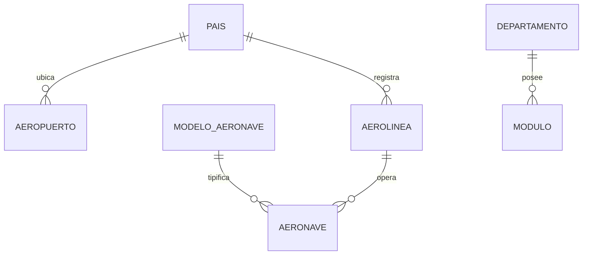
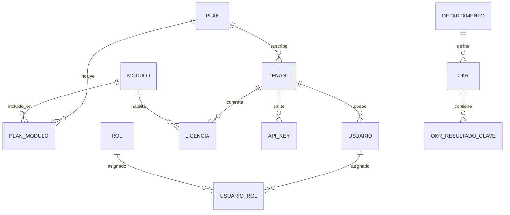
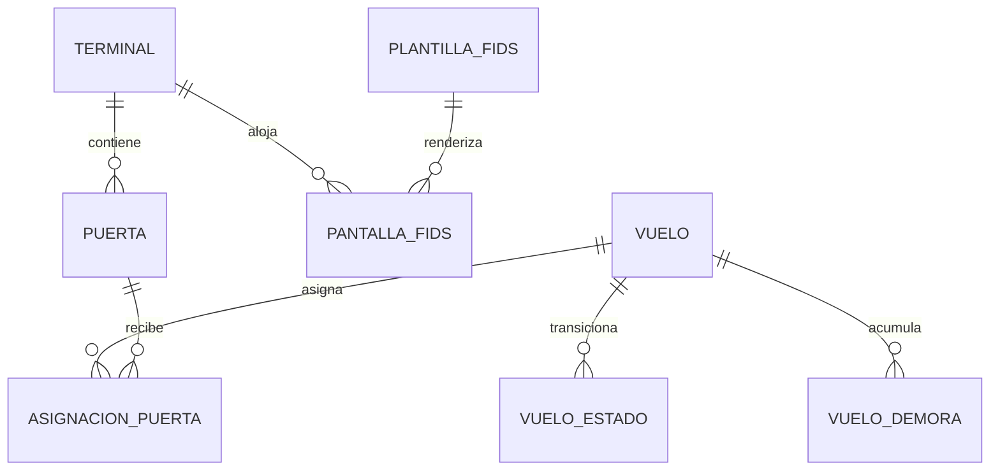
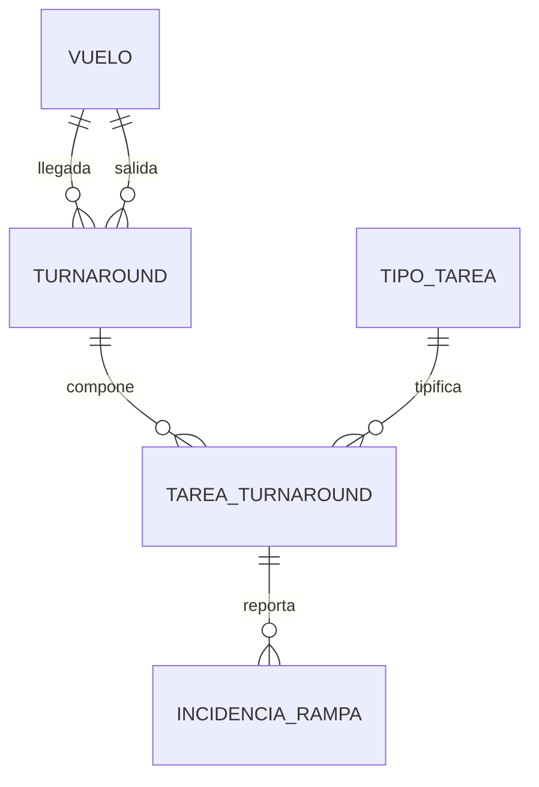
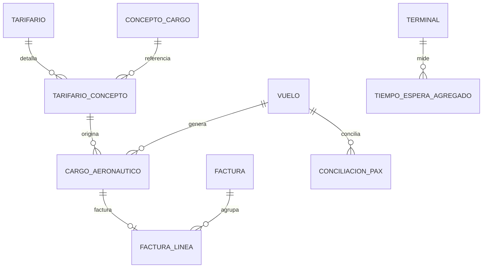
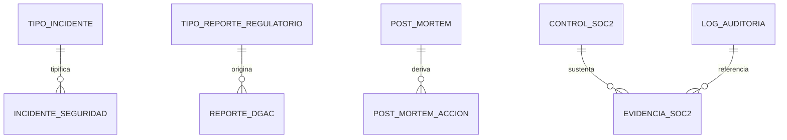
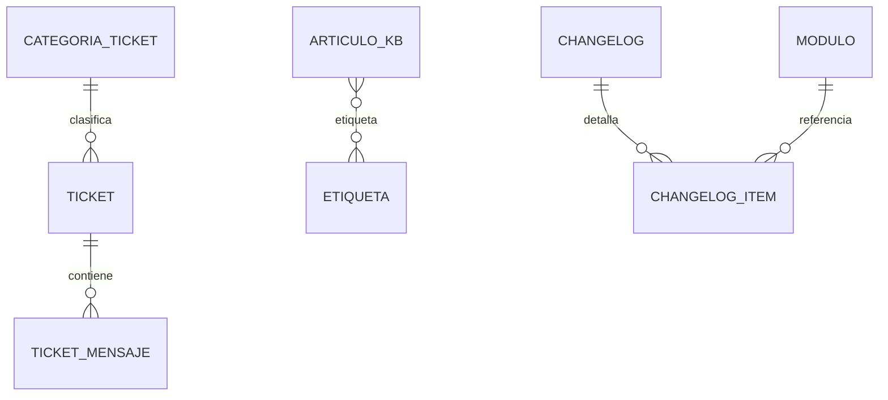
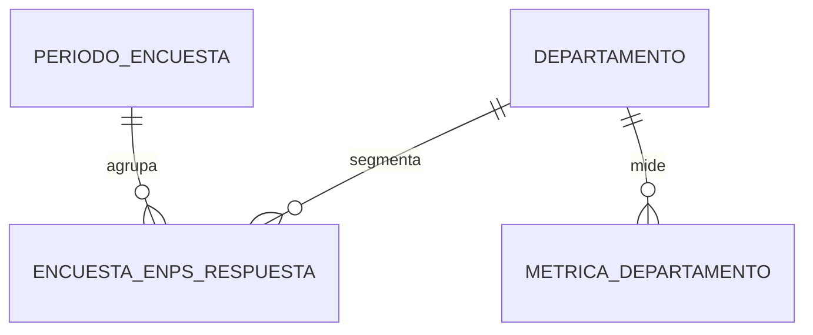
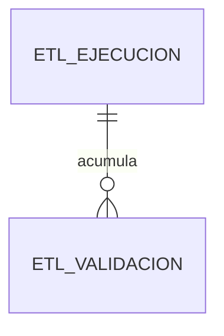
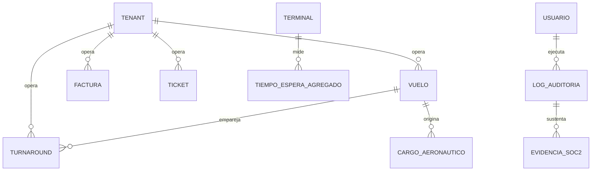

# Descripción de Diseño de Software (SDD) — Modelo de Datos Operacional

## Plataforma AeroHub — Base Operacional MonetDB

| Campo | Contenido |
|:---|:---|
| **Identificador de documento** | AEROHUB-SDD-DATA-001 |
| **Versión** | 1.0 |
| **Deriva de** | AEROHUB-SRS-001 v2.0 (§7), AeroHub — Análisis Documental Estratégico v6.0 (§7.1–7.2) |
| **Metodología** | Specification-Driven Development (SDD) |
| **Marco normativo** | IEEE 1016-2009 (estructura de este SDD) · ISO/IEC/IEEE 42010:2011 (puntos de vista y fundamento) · ISO/IEC 25010:2011 (calidad) · ISO/IEC 12207:2017 (ciclo de vida) · ISO/IEC/IEEE 29119 (V&V) · ISO/IEC 27001/27002:2022 (seguridad) · ISO/IEC 27701:2019 (privacidad) |
| **Sistema de gestión de datos** | MonetDB (ADR-013), sin Row-Level Security nativo |
| **Estado** | Línea base para revisión de diseño detallado |

---

## Nota de control de cambios

Todo SDD previo derivado de una SRS basada en PostgreSQL/RLS queda invalidado (SRS v2.0, Nota de control de versión). Este documento se deriva íntegramente de AEROHUB-SRS-001 v2.0 y constituye la Vista de Información (Information Viewpoint, IEEE 1016 §5.4) del diseño de la base operacional. No introduce elementos sin trazabilidad explícita a un RF/RNF confirmado; las extensiones propuestas por este documento se aíslan en la Sección 15 (Plan de Mejoras) y no forman parte de la línea base hasta su aprobación formal mediante ADR, conforme al proceso de la Sección 4 de la fuente.

---

# 1. Introducción

## 1.1 Propósito

Este documento constituye la Descripción de Diseño de Software (SDD), conforme a IEEE 1016-2009, del subsistema de persistencia operacional de AeroHub. Detalla, tabla por tabla, la estructura física del modelo de datos alojado en MonetDB: tipos de dato, nulabilidad, claves primarias y foráneas, restricciones de dominio, índices y reglas de integridad no expresables mediante restricciones declarativas. Sirve como entrada directa para la generación de DDL, la construcción de la capa de repositorio (único emisor de SQL autorizado, ADR-014) y la verificación de la batería de pruebas negativas PN-01 a PN-15.

## 1.2 Alcance

Cubre los ocho esquemas de la base operacional (`tenants`, `ops`, `rampa`, `billing`, `compliance`, `support`, `people`, `etl_control`) y los diez catálogos globales de referencia sin `tenant_id`. Excluye explícitamente: la capa analítica ClickHouse (`ah_tactico`, `ah_estrategico`), cubierta en AEROHUB-SDD-DATA-002; la lógica de negocio de servicios FastAPI; y los esquemas de hoja de ruta no confirmados (`ml`, `finops`), referenciados únicamente en la Sección 15 como propuesta.

## 1.3 Convenciones de notación

- **PK** — Clave primaria. **FK** — Clave foránea, con notación `FK → esquema.tabla.columna`. **UQ** — Restricción de unicidad. **IDX** — Índice secundario recomendado. **CHK** — Restricción de dominio (`CHECK`).
- Toda tabla de alcance de tenant incluye `tenant_id` como primer atributo del índice primario compuesto cuando aplica, conforme al mandato de la Sección 7.2 de la fuente.
- Los diagramas de relación usan notación Mermaid `erDiagram`; la cardinalidad se lee origen→destino (`||--o{` = uno a muchos, `}o--o{` = muchos a muchos).

## 1.4 Referencias

AEROHUB-SRS-001 v2.0, Secciones 3, 6, 7, 9; AeroHub — Análisis Documental Estratégico v6.0, Secciones 4, 7.1–7.2, 9; ADR-013, ADR-014, ADR-015; ISO/IEC/IEEE 42010:2011; IEEE 1016-2009.

---

# 2. Interesados de Diseño y sus Preocupaciones (ISO/IEC/IEEE 42010)

| Interesado | Preocupación respecto al modelo de datos |
|:---|:---|
| CTO / `role_platform_admin` | Que el modelo sostenga el aislamiento departamental estructural y no introduzca dependencias cruzadas entre esquemas fuera de la matriz de la Sección 7.5. |
| Data Engineer / `role_data_engineer` | Que cada tabla tenga clave de extracción determinística (`tenant_id`, `fecha_operacion` o equivalente) compatible con el particionamiento del área de trabajo medallion. |
| Auditor DGAC/OACI / `role_regulatory_auditor` | Que `compliance.log_auditoria`, `reporte_dgac` y `evidencia_soc2` sean append-only y verificables por hash. |
| Oficial de Seguridad (D5) | Que ningún esquema almacene PII de pasajeros y que el `tenant_id` nunca se acepte desde el cuerpo de la petición. |
| Ingeniero de Backend (capa de repositorio) | Que el diccionario de datos sea suficiente para generar DDL sin ambigüedad de tipos ni de restricciones. |
| Auditor de Privacidad (ISO/IEC 27701) | Que el esquema `people` preserve anonimidad estructural y que `tenants.usuario` soporte los derechos del titular (acceso, rectificación, supresión lógica). |

---

# 3. Puntos de Vista de Diseño Seleccionados

Conforme a ISO/IEC/IEEE 42010, este SDD adopta dos puntos de vista:

| Punto de vista | Justificación de selección | Preocupaciones que resuelve |
|:---|:---|:---|
| **Información (Data Viewpoint)** | El riesgo dominante del sistema —pérdida de RLS nativo (ADR-013)— es de naturaleza estructural sobre los datos, no sobre el comportamiento; el punto de vista de información es el único que permite verificar el aislamiento departamental a nivel de esquema. | Interesados D5, Data Engineer, Auditor de Privacidad. |
| **Estructural (Dependency Viewpoint)** | Las relaciones inter-esquema (Sección 10) determinan el orden de aprovisionamiento, el alcance de las transacciones distribuidas de facturación y la superficie de la capa de repositorio. | Interesado CTO, Backend. |

Se descarta explícitamente el punto de vista de Interacción (secuencias de mensajes) por no aportar valor a un artefacto centrado en persistencia; dicho punto de vista corresponde al SDD del API Gateway, fuera del alcance de este documento.

---

# 4. Convenciones de Tipificación de Datos

Convención vinculante para la generación de DDL. Toda desviación requiere ADR.

| Categoría lógica | Tipo físico MonetDB | Notas |
|:---|:---|:---|
| Identificador sustituto (`id`) | `BIGINT` generado por secuencia (equivalente a `GENERATED ALWAYS AS IDENTITY`) | Nunca reutilizado; no se expone como clave de negocio. |
| Identificador de tenant (`tenant_id`) | `BIGINT NOT NULL` (FK a `tenants.tenant.id`) | Primer componente de PK o índice compuesto en toda tabla de alcance de tenant. |
| Código IATA de 2 letras | `CHAR(2)` | Aerolínea, motivo de demora. |
| Código IATA de 3 letras / ICAO de 4 | `CHAR(3)` / `CHAR(4)` | Aeropuerto. |
| Nombre corto | `VARCHAR(100)` | |
| Nombre largo / razón social | `VARCHAR(200)` | |
| Descripción libre acotada | `VARCHAR(300)`–`VARCHAR(500)` según campo | |
| Texto largo (cuerpo de mensaje, causa raíz) | `TEXT` | |
| Marca temporal | `TIMESTAMP WITH TIME ZONE` | Siempre UTC en almacenamiento; conversión a huso local en capa de presentación. |
| Fecha sin hora | `DATE` | |
| Hora sin fecha | `TIME` | Franjas horarias de `tiempo_espera_agregado`. |
| Monto monetario | `DECIMAL(14,2)` | Tarifas unitarias con mayor precisión: `DECIMAL(14,4)`. |
| Moneda | `CHAR(3)` | ISO 4217. |
| Booleano | `BOOLEAN` | |
| Documento semiestructurado | `JSON` | Tipo nativo MonetDB; usado en `definicion_json`, `valores_anteriores/nuevos`, `alcance_json`, `detalle_json`. |
| Hash de integridad | `CHAR(64)` | SHA-256 en representación hexadecimal. |
| Enumeración cerrada | `VARCHAR(n)` + `CHECK ... IN (...)` | MonetDB carece de tipo `ENUM` nativo estable entre versiones; se prefiere `CHECK` explícito, documentado por tabla. |

---

# 5. Vista de Información — Catálogos Globales de Referencia

Sin `tenant_id`: son datos de industria compartidos (aeropuertos, aerolíneas, modelos de aeronave, motivos de demora IATA); su duplicación por tenant introduciría anomalías de actualización sin beneficio de aislamiento (fuente, §7.2).

### 5.1 `pais`

| Columna | Tipo | Nulo | Restricción |
|:---|:---|:---|:---|
| id | BIGINT | NO | PK |
| codigo_iso2 | CHAR(2) | NO | UQ |
| codigo_iso3 | CHAR(3) | NO | UQ |
| nombre | VARCHAR(100) | NO | |

### 5.2 `aeropuerto`

| Columna | Tipo | Nulo | Restricción |
|:---|:---|:---|:---|
| id | BIGINT | NO | PK |
| codigo_iata | CHAR(3) | NO | UQ — clave candidata natural (BCNF) |
| codigo_icao | CHAR(4) | NO | UQ |
| nombre | VARCHAR(150) | NO | |
| pais_id | BIGINT | NO | FK → `pais.id` |
| ciudad | VARCHAR(100) | NO | |
| zona_horaria | VARCHAR(50) | NO | Identificador IANA tz (`America/Guayaquil`) |
| latitud | DECIMAL(9,6) | NO | CHK entre -90 y 90 |
| longitud | DECIMAL(9,6) | NO | CHK entre -180 y 180 |

### 5.3 `aerolinea`

| Columna | Tipo | Nulo | Restricción |
|:---|:---|:---|:---|
| id | BIGINT | NO | PK |
| codigo_iata | CHAR(2) | NO | UQ — clave candidata natural |
| codigo_icao | CHAR(3) | NO | UQ |
| nombre | VARCHAR(150) | NO | |
| pais_id | BIGINT | NO | FK → `pais.id` |

### 5.4 `modelo_aeronave`

| Columna | Tipo | Nulo | Restricción |
|:---|:---|:---|:---|
| id | BIGINT | NO | PK |
| codigo_icao_tipo | VARCHAR(4) | NO | UQ |
| fabricante | VARCHAR(100) | NO | |
| modelo | VARCHAR(100) | NO | |
| capacidad_pax_tipica | SMALLINT | NO | CHK > 0 |
| envergadura_m | DECIMAL(5,2) | NO | |
| categoria_estela | CHAR(1) | NO | CHK IN ('L','M','H','J') — categoría de estela OACI |

### 5.5 `aeronave`

| Columna | Tipo | Nulo | Restricción |
|:---|:---|:---|:---|
| id | BIGINT | NO | PK |
| matricula | VARCHAR(10) | NO | UQ global (convención OACI) |
| modelo_aeronave_id | BIGINT | NO | FK → `modelo_aeronave.id` |
| aerolinea_id | BIGINT | NO | FK → `aerolinea.id` |

### 5.6 `tipo_vuelo`

| Columna | Tipo | Nulo | Restricción |
|:---|:---|:---|:---|
| id | BIGINT | NO | PK |
| codigo | VARCHAR(20) | NO | UQ — `comercial`, `carga`, `charter`, `aviacion_general`, `militar` |
| descripcion | VARCHAR(100) | NO | |

### 5.7 `motivo_demora`

| Columna | Tipo | Nulo | Restricción |
|:---|:---|:---|:---|
| id | BIGINT | NO | PK |
| codigo_iata | CHAR(2) | NO | UQ — código IATA estandarizado de demora |
| descripcion | VARCHAR(200) | NO | |
| categoria | VARCHAR(50) | NO | Agrupador consumido por el BSC |

### 5.8 `estado_vuelo_catalogo`

| Columna | Tipo | Nulo | Restricción |
|:---|:---|:---|:---|
| id | BIGINT | NO | PK |
| codigo | VARCHAR(20) | NO | UQ |
| descripcion | VARCHAR(100) | NO | |
| es_terminal | BOOLEAN | NO | DEFAULT FALSE — marca estados finales (aterrizado, cancelado, desviado) |

### 5.9 `departamento` / 5.10 `modulo`

| Tabla | Columna | Tipo | Nulo | Restricción |
|:---|:---|:---|:---|:---|
| `departamento` | id | BIGINT | NO | PK |
| `departamento` | codigo | CHAR(2) | NO | UQ — catálogo D1–D6 |
| `departamento` | nombre | VARCHAR(100) | NO | |
| `modulo` | id | BIGINT | NO | PK |
| `modulo` | codigo | VARCHAR(4) | NO | UQ — catálogo M1–M9 |
| `modulo` | nombre | VARCHAR(100) | NO | |
| `modulo` | departamento_id | BIGINT | NO | FK → `departamento.id` |

---

# 6. Vista de Información — Esquema `tenants` (D5)

Identidad, acceso, licenciamiento y OKRs internos.

### 6.1 `plan`

| Columna | Tipo | Nulo | Restricción |
|:---|:---|:---|:---|
| id | BIGINT | NO | PK |
| codigo | VARCHAR(30) | NO | UQ |
| nombre | VARCHAR(100) | NO | |
| tarifa_base_mensual | DECIMAL(12,2) | NO | CHK ≥ 0 |
| moneda | CHAR(3) | NO | ISO 4217 |
| activo | BOOLEAN | NO | DEFAULT TRUE |

### 6.2 `plan_modulo`

| Columna | Tipo | Nulo | Restricción |
|:---|:---|:---|:---|
| plan_id | BIGINT | NO | PK compuesta; FK → `plan.id` |
| modulo_id | BIGINT | NO | PK compuesta; FK → `modulo.id` |

N:M sin atributos propios (2NF trivialmente satisfecha).

### 6.3 `tenant`

| Columna | Tipo | Nulo | Restricción |
|:---|:---|:---|:---|
| id | BIGINT | NO | PK |
| codigo | VARCHAR(30) | NO | UQ |
| razon_social | VARCHAR(200) | NO | |
| aeropuerto_id | BIGINT | NO | FK → `aeropuerto.id` |
| plan_id | BIGINT | NO | FK → `plan.id` |
| es_sandbox | BOOLEAN | NO | DEFAULT FALSE — sustenta CU-T13 |
| estado | VARCHAR(20) | NO | CHK IN ('activo','suspendido','en_onboarding','dado_de_baja') |
| creado_en | TIMESTAMPTZ | NO | DEFAULT now() |

### 6.4 `licencia`

| Columna | Tipo | Nulo | Restricción |
|:---|:---|:---|:---|
| id | BIGINT | NO | PK |
| tenant_id | BIGINT | NO | FK → `tenant.id` |
| modulo_id | BIGINT | NO | FK → `modulo.id` |
| activa_desde | TIMESTAMPTZ | NO | |
| activa_hasta | TIMESTAMPTZ | SÍ | NULL = vigencia indefinida |
| | | | UQ (tenant_id, modulo_id, activa_desde) — verificada en cada acceso (RF-O18, PN-09) |

### 6.5 `usuario`

| Columna | Tipo | Nulo | Restricción |
|:---|:---|:---|:---|
| id | BIGINT | NO | PK |
| tenant_id | BIGINT | SÍ | FK → `tenant.id`; NULL únicamente para personal de plataforma AeroHub |
| email | VARCHAR(254) | NO | UQ (tenant_id, email) |
| hash_credencial | VARCHAR(255) | NO | Algoritmo Argon2id (Sección 15, hallazgo H-11) |
| nombre | VARCHAR(150) | NO | |
| estado | VARCHAR(20) | NO | CHK IN ('activo','suspendido','eliminado_logicamente') |
| mfa_habilitado | BOOLEAN | NO | DEFAULT FALSE |
| creado_en | TIMESTAMPTZ | NO | DEFAULT now() |
| ultimo_acceso_en | TIMESTAMPTZ | SÍ | |

### 6.6 `rol` / 6.7 `usuario_rol`

| Tabla | Columna | Tipo | Nulo | Restricción |
|:---|:---|:---|:---|:---|
| `rol` | id | BIGINT | NO | PK |
| `rol` | codigo | VARCHAR(50) | NO | UQ |
| `rol` | nombre | VARCHAR(100) | NO | |
| `rol` | alcance | VARCHAR(20) | NO | CHK IN ('plataforma','tenant') |
| `usuario_rol` | usuario_id | BIGINT | NO | PK compuesta; FK → `usuario.id` |
| `usuario_rol` | rol_id | BIGINT | NO | PK compuesta; FK → `rol.id` |
| `usuario_rol` | otorgado_por | BIGINT | NO | FK → `usuario.id` |
| `usuario_rol` | otorgado_en | TIMESTAMPTZ | NO | |
| `usuario_rol` | expira_en | TIMESTAMPTZ | SÍ | Sustenta acceso temporal de `role_implementation` y `role_regulatory_auditor` |

### 6.8 `api_key`

| Columna | Tipo | Nulo | Restricción |
|:---|:---|:---|:---|
| id | BIGINT | NO | PK |
| tenant_id | BIGINT | NO | FK → `tenant.id` |
| prefijo | VARCHAR(12) | NO | UQ |
| hash_secreto | VARCHAR(255) | NO | Nunca almacena el secreto en claro (RF-O12) |
| creada_en | TIMESTAMPTZ | NO | |
| rotada_en | TIMESTAMPTZ | SÍ | |
| expira_en | TIMESTAMPTZ | SÍ | |
| estado | VARCHAR(20) | NO | CHK IN ('activa','revocada','expirada') |

### 6.9 `okr` / 6.10 `okr_resultado_clave`

| Tabla | Columna | Tipo | Nulo | Restricción |
|:---|:---|:---|:---|:---|
| `okr` | id | BIGINT | NO | PK |
| `okr` | departamento_id | BIGINT | NO | FK → `departamento.id`; sin `tenant_id` (alcance interno) |
| `okr` | periodo | VARCHAR(7) | NO | Formato `AAAA-Tn` |
| `okr` | objetivo_descripcion | VARCHAR(500) | NO | |
| `okr` | responsable_usuario_id | BIGINT | NO | FK → `usuario.id` |
| `okr` | estado | VARCHAR(20) | NO | CHK IN ('planificado','en_progreso','cumplido','no_cumplido') |
| `okr_resultado_clave` | id | BIGINT | NO | PK |
| `okr_resultado_clave` | okr_id | BIGINT | NO | FK → `okr.id` |
| `okr_resultado_clave` | descripcion | VARCHAR(300) | NO | |
| `okr_resultado_clave` | valor_inicial | DECIMAL(14,2) | NO | |
| `okr_resultado_clave` | valor_objetivo | DECIMAL(14,2) | NO | |
| `okr_resultado_clave` | valor_actual | DECIMAL(14,2) | NO | DEFAULT 0 |
| `okr_resultado_clave` | unidad | VARCHAR(20) | NO | |

**Corrige 1NF respecto a v5.1**: un OKR posee múltiples resultados clave, antes no representables.

---

# 7. Vista de Información — Esquema `ops` (D1, núcleo AODB)

### 7.1 `terminal`

| Columna | Tipo | Nulo | Restricción |
|:---|:---|:---|:---|
| id | BIGINT | NO | PK |
| tenant_id | BIGINT | NO | FK → `tenants.tenant.id`; UQ (tenant_id, codigo) |
| codigo | VARCHAR(10) | NO | |
| nombre | VARCHAR(100) | NO | |

### 7.2 `puerta`

| Columna | Tipo | Nulo | Restricción |
|:---|:---|:---|:---|
| id | BIGINT | NO | PK |
| tenant_id | BIGINT | NO | UQ (tenant_id, codigo) |
| terminal_id | BIGINT | NO | FK → `terminal.id` — corrige dependencia transitiva 3NF de v5.1, donde la terminal era texto |
| codigo | VARCHAR(10) | NO | |
| tipo | VARCHAR(20) | NO | CHK IN ('contacto','remota') |
| envergadura_max_m | DECIMAL(5,2) | NO | |
| tiene_pasarela | BOOLEAN | NO | DEFAULT FALSE |

### 7.3 `vuelo` — entidad núcleo del AODB

| Columna | Tipo | Nulo | Restricción |
|:---|:---|:---|:---|
| id | BIGINT | NO | PK |
| tenant_id | BIGINT | NO | Componente de UQ compuesta |
| aerolinea_id | BIGINT | NO | FK → catálogo global `aerolinea.id` |
| aeronave_id | BIGINT | NO | FK → catálogo global `aeronave.id` |
| numero_vuelo | VARCHAR(10) | NO | |
| tipo_vuelo_id | BIGINT | NO | FK → catálogo global `tipo_vuelo.id` |
| fecha_operacion | DATE | NO | Clave de particionamiento del área de trabajo medallion |
| sentido | CHAR(1) | NO | CHK IN ('L','S') — llegada / salida |
| aeropuerto_origen_id | BIGINT | NO | FK → `aeropuerto.id` |
| aeropuerto_destino_id | BIGINT | NO | FK → `aeropuerto.id`; CHK ≠ aeropuerto_origen_id |
| sta_utc | TIMESTAMPTZ | NO | Scheduled Time of Arrival |
| std_utc | TIMESTAMPTZ | NO | Scheduled Time of Departure |
| eta_utc | TIMESTAMPTZ | SÍ | |
| etd_utc | TIMESTAMPTZ | SÍ | |
| ata_utc | TIMESTAMPTZ | SÍ | Actual Time of Arrival |
| atd_utc | TIMESTAMPTZ | SÍ | Actual Time of Departure |
| pax_estimado | SMALLINT | SÍ | CHK ≥ 0 |
| creado_en | TIMESTAMPTZ | NO | DEFAULT now() |
| | | | UQ (tenant_id, aerolinea_id, numero_vuelo, fecha_operacion, sentido) |

**Sin `estado_actual`** (3NF): el estado vigente se obtiene mediante la vista `v_vuelo_estado_actual` sobre `vuelo_estado`. **Sin `ruta_id`**: la pareja origen–destino se deriva; solo se materializa como dimensión conformada en la capa analítica (`ah_tactico.dim_ruta`).

### 7.4 `vuelo_estado`

| Columna | Tipo | Nulo | Restricción |
|:---|:---|:---|:---|
| id | BIGINT | NO | PK |
| tenant_id | BIGINT | NO | Componente de IDX |
| vuelo_id | BIGINT | NO | FK → `vuelo.id` |
| estado_id | BIGINT | NO | FK → catálogo global `estado_vuelo_catalogo.id` |
| registrado_en | TIMESTAMPTZ | NO | DEFAULT now() |
| registrado_por_usuario_id | BIGINT | SÍ | FK → `tenants.usuario.id` (nulo si `origen_cambio = 'automatico'`) |
| origen_cambio | VARCHAR(20) | NO | CHK IN ('manual','api','automatico') |
| | | | IDX (tenant_id, vuelo_id, registrado_en DESC) |

Bitácora de eventos append-in-place; el estado vigente es el registro más reciente por `vuelo_id`.

### 7.5 `asignacion_puerta`

| Columna | Tipo | Nulo | Restricción |
|:---|:---|:---|:---|
| id | BIGINT | NO | PK |
| tenant_id | BIGINT | NO | |
| vuelo_id | BIGINT | NO | FK → `vuelo.id` |
| puerta_id | BIGINT | NO | FK → `puerta.id` |
| inicio_previsto | TIMESTAMPTZ | NO | |
| fin_previsto | TIMESTAMPTZ | NO | CHK > inicio_previsto |
| inicio_real | TIMESTAMPTZ | SÍ | |
| fin_real | TIMESTAMPTZ | SÍ | |
| asignado_por_usuario_id | BIGINT | NO | FK → `tenants.usuario.id` |
| asignado_en | TIMESTAMPTZ | NO | DEFAULT now() |
| estado | VARCHAR(20) | NO | CHK IN ('planificada','activa','finalizada','cancelada') |

**Restricción de no solapamiento** (regla de negocio, no declarativa): no pueden coexistir dos asignaciones activas sobre la misma `puerta_id` con intervalos `[inicio_previsto, fin_previsto)` intersecados. MonetDB carece de tipos de rango con restricción de exclusión nativa (a diferencia de PostgreSQL `EXCLUDE USING gist`); la verificación se implementa en la capa de repositorio mediante transacción serializable con bloqueo de fila sobre `puerta_id` antes del `INSERT`, y se audita mediante PN-05.

### 7.6 `vuelo_demora`

| Columna | Tipo | Nulo | Restricción |
|:---|:---|:---|:---|
| id | BIGINT | NO | PK |
| tenant_id | BIGINT | NO | |
| vuelo_id | BIGINT | NO | FK → `vuelo.id` |
| motivo_demora_id | BIGINT | NO | FK → catálogo global `motivo_demora.id` |
| minutos | SMALLINT | NO | CHK > 0 |
| registrado_en | TIMESTAMPTZ | NO | DEFAULT now() |
| registrado_por_usuario_id | BIGINT | SÍ | FK → `tenants.usuario.id` |

**4NF**: un vuelo acumula motivos de demora independientes de sus cambios de estado y de sus asignaciones de puerta; se separan para evitar el producto cartesiano que produciría un modelo plano.

### 7.7 `plantilla_fids` / 7.8 `pantalla_fids`

| Tabla | Columna | Tipo | Nulo | Restricción |
|:---|:---|:---|:---|:---|
| `plantilla_fids` | id | BIGINT | NO | PK |
| `plantilla_fids` | tenant_id | BIGINT | NO | UQ (tenant_id, nombre, version) |
| `plantilla_fids` | nombre | VARCHAR(100) | NO | |
| `plantilla_fids` | definicion_json | JSON | NO | Definición declarativa del layout |
| `plantilla_fids` | version | INTEGER | NO | |
| `plantilla_fids` | vigente_desde | TIMESTAMPTZ | NO | |
| `plantilla_fids` | creada_por_usuario_id | BIGINT | NO | FK → `tenants.usuario.id` |
| `pantalla_fids` | id | BIGINT | NO | PK |
| `pantalla_fids` | tenant_id | BIGINT | NO | UQ (tenant_id, codigo) |
| `pantalla_fids` | terminal_id | BIGINT | NO | FK → `terminal.id` |
| `pantalla_fids` | codigo | VARCHAR(20) | NO | |
| `pantalla_fids` | ubicacion_descripcion | VARCHAR(150) | SÍ | |
| `pantalla_fids` | plantilla_id | BIGINT | NO | FK → `plantilla_fids.id` |
| `pantalla_fids` | ultima_senal_en | TIMESTAMPTZ | SÍ | Telemetría RF-O07; detección de ausencia de señal < 60 s (RNF-R04) |
| `pantalla_fids` | version_firmware | VARCHAR(20) | SÍ | |
| `pantalla_fids` | estado | VARCHAR(20) | NO | CHK IN ('en_linea','sin_senal','mantenimiento') |

---

# 8. Vista de Información — Esquema `rampa` (D2, Turnaround)

### 8.1 `tipo_tarea` / 8.2 `tipo_incidencia_rampa`

Catálogos globales (no por tenant): estándar de industria.

| Tabla | Columna | Tipo | Nulo | Restricción |
|:---|:---|:---|:---|:---|
| `tipo_tarea` | id | BIGINT | NO | PK |
| `tipo_tarea` | codigo | VARCHAR(20) | NO | UQ |
| `tipo_tarea` | nombre | VARCHAR(100) | NO | |
| `tipo_tarea` | duracion_estandar_min | SMALLINT | NO | CHK > 0 |
| `tipo_tarea` | es_ruta_critica | BOOLEAN | NO | DEFAULT FALSE |
| `tipo_incidencia_rampa` | id | BIGINT | NO | PK |
| `tipo_incidencia_rampa` | codigo | VARCHAR(20) | NO | UQ |
| `tipo_incidencia_rampa` | descripcion | VARCHAR(150) | NO | |

### 8.3 `turnaround`

| Columna | Tipo | Nulo | Restricción |
|:---|:---|:---|:---|
| id | BIGINT | NO | PK |
| tenant_id | BIGINT | NO | UQ (tenant_id, vuelo_llegada_id) |
| vuelo_llegada_id | BIGINT | NO | FK → `ops.vuelo.id` |
| vuelo_salida_id | BIGINT | NO | FK → `ops.vuelo.id`; CHK ≠ vuelo_llegada_id |
| aeronave_id | BIGINT | NO | FK → catálogo global `aeronave.id` |
| inicio_previsto | TIMESTAMPTZ | NO | |
| fin_previsto | TIMESTAMPTZ | NO | CHK > inicio_previsto |
| inicio_real | TIMESTAMPTZ | SÍ | |
| fin_real | TIMESTAMPTZ | SÍ | |
| estado | VARCHAR(20) | NO | CHK IN ('planificado','en_curso','completado','interrumpido') |

**Entidad nueva en v6.0**: en v5.1 las tareas colgaban directamente del vuelo, sin representar el emparejamiento llegada→salida que define un turnaround; se inferría por convención. Esta tabla lo hace explícito y verificable.

### 8.4 `tarea_turnaround`

| Columna | Tipo | Nulo | Restricción |
|:---|:---|:---|:---|
| id | BIGINT | NO | PK |
| tenant_id | BIGINT | NO | |
| turnaround_id | BIGINT | NO | FK → `turnaround.id` |
| tipo_tarea_id | BIGINT | NO | FK → `tipo_tarea.id` |
| agente_usuario_id | BIGINT | NO | FK → `tenants.usuario.id` (rol `role_ramp_agent`) |
| inicio_real | TIMESTAMPTZ | SÍ | |
| fin_real | TIMESTAMPTZ | SÍ | CHK ≥ inicio_real cuando ambos no nulos |
| estado | VARCHAR(20) | NO | CHK IN ('pendiente','en_curso','completada','omitida') |

La duración se deriva de `fin_real - inicio_real`; no se almacena (3NF).

### 8.5 `incidencia_rampa`

| Columna | Tipo | Nulo | Restricción |
|:---|:---|:---|:---|
| id | BIGINT | NO | PK |
| tenant_id | BIGINT | NO | |
| tarea_turnaround_id | BIGINT | NO | FK → `tarea_turnaround.id` |
| tipo_incidencia_id | BIGINT | NO | FK → `tipo_incidencia_rampa.id` |
| descripcion | VARCHAR(300) | NO | |
| severidad | VARCHAR(10) | NO | CHK IN ('baja','media','alta','critica') |
| detectada_en | TIMESTAMPTZ | NO | DEFAULT now() |
| resuelta_en | TIMESTAMPTZ | SÍ | |
| resuelta_por_usuario_id | BIGINT | SÍ | FK → `tenants.usuario.id` |

Sustenta RF-O16 y OP2b.

---

# 9. Vista de Información — Esquema `billing` (D3, Tarifación y Facturación)

### 9.1 `concepto_cargo`

| Columna | Tipo | Nulo | Restricción |
|:---|:---|:---|:---|
| id | BIGINT | NO | PK |
| codigo | VARCHAR(30) | NO | UQ |
| nombre | VARCHAR(150) | NO | |
| unidad_medida | VARCHAR(20) | NO | |
| base_calculo | VARCHAR(30) | NO | CHK IN ('peso_mtow','pax','tiempo_estacionamiento','uso_pasarela','fijo') |

Catálogo global.

### 9.2 `tarifario`

| Columna | Tipo | Nulo | Restricción |
|:---|:---|:---|:---|
| id | BIGINT | NO | PK |
| tenant_id | BIGINT | NO | |
| nombre | VARCHAR(100) | NO | |
| moneda | CHAR(3) | NO | |
| vigente_desde | DATE | NO | |
| vigente_hasta | DATE | SÍ | CHK ≥ vigente_desde cuando no nulo |
| estado | VARCHAR(20) | NO | CHK IN ('borrador','vigente','expirado') |
| creado_por_usuario_id | BIGINT | NO | FK → `tenants.usuario.id` |

**Corrige 2NF respecto a v5.1**: la cabecera (vigencia, moneda) se separa de los precios por concepto, que dependían solo parcialmente de la clave compuesta.

### 9.3 `tarifario_concepto`

| Columna | Tipo | Nulo | Restricción |
|:---|:---|:---|:---|
| id | BIGINT | NO | PK |
| tarifario_id | BIGINT | NO | FK → `tarifario.id`; UQ (tarifario_id, concepto_cargo_id) |
| concepto_cargo_id | BIGINT | NO | FK → `concepto_cargo.id` |
| tarifa_unitaria | DECIMAL(14,4) | NO | CHK ≥ 0 |
| monto_minimo | DECIMAL(14,2) | SÍ | |
| monto_maximo | DECIMAL(14,2) | SÍ | CHK ≥ monto_minimo cuando ambos no nulos |

Resuelve la relación ternaria tarifario–concepto–precio en 5NF, sin descomposición adicional posible sin pérdida.

### 9.4 `cargo_aeronautico`

| Columna | Tipo | Nulo | Restricción |
|:---|:---|:---|:---|
| id | BIGINT | NO | PK |
| tenant_id | BIGINT | NO | |
| vuelo_id | BIGINT | NO | FK → `ops.vuelo.id` |
| concepto_cargo_id | BIGINT | NO | FK → `concepto_cargo.id` |
| tarifario_concepto_id | BIGINT | NO | FK → `tarifario_concepto.id` |
| cantidad | DECIMAL(12,2) | NO | CHK > 0 |
| tarifa_aplicada | DECIMAL(14,4) | NO | **Denormalización deliberada** — instantánea inmutable |
| monto_calculado | DECIMAL(14,2) | NO | **Denormalización deliberada** — instantánea inmutable |
| calculado_en | TIMESTAMPTZ | NO | DEFAULT now() |

`tarifa_aplicada` y `monto_calculado` no se recalculan desde `tarifario_concepto`: si la tarifa cambia después, el cargo histórico y la factura emitida no deben alterarse (integridad financiera y de auditoría, ISO/IEC 27002 8.15).

### 9.5 `factura` / 9.6 `factura_linea`

| Tabla | Columna | Tipo | Nulo | Restricción |
|:---|:---|:---|:---|:---|
| `factura` | id | BIGINT | NO | PK |
| `factura` | tenant_id | BIGINT | NO | UQ (tenant_id, aerolinea_id, periodo_inicio, periodo_fin) |
| `factura` | aerolinea_id | BIGINT | NO | FK → catálogo global `aerolinea.id` |
| `factura` | periodo_inicio | DATE | NO | |
| `factura` | periodo_fin | DATE | NO | CHK ≥ periodo_inicio |
| `factura` | moneda | CHAR(3) | NO | |
| `factura` | estado | VARCHAR(20) | NO | CHK IN ('borrador','emitida','pagada','vencida','disputada') |
| `factura` | emitida_en | TIMESTAMPTZ | SÍ | |
| `factura` | vence_en | TIMESTAMPTZ | SÍ | |
| `factura_linea` | id | BIGINT | NO | PK |
| `factura_linea` | factura_id | BIGINT | NO | FK → `factura.id` |
| `factura_linea` | cargo_aeronautico_id | BIGINT | NO | FK → `cargo_aeronautico.id`; UQ — un cargo se factura una sola vez |
| `factura_linea` | descripcion | VARCHAR(200) | NO | |
| `factura_linea` | cantidad | DECIMAL(12,2) | NO | |
| `factura_linea` | precio_unitario | DECIMAL(14,4) | NO | **Denormalización deliberada** — evidencia contable congelada |
| `factura_linea` | monto | DECIMAL(14,2) | NO | **Denormalización deliberada** |

`factura` **sin `total`** (3NF): se obtiene por agregación de `factura_linea`.

### 9.7 `conciliacion_pax`

| Columna | Tipo | Nulo | Restricción |
|:---|:---|:---|:---|
| id | BIGINT | NO | PK |
| tenant_id | BIGINT | NO | UQ (tenant_id, vuelo_id, periodo) |
| vuelo_id | BIGINT | NO | FK → `ops.vuelo.id` |
| periodo | VARCHAR(7) | NO | |
| pax_reportado_aerolinea | SMALLINT | NO | CHK ≥ 0 |
| pax_registrado_sistema | SMALLINT | NO | CHK ≥ 0 |
| fuente_reporte | VARCHAR(50) | NO | |
| conciliado_en | TIMESTAMPTZ | SÍ | |
| conciliado_por_usuario_id | BIGINT | SÍ | FK → `tenants.usuario.id` |

**Sin `diferencia`** (3NF): derivada de los dos conteos.

### 9.8 `tiempo_espera_agregado`

| Columna | Tipo | Nulo | Restricción |
|:---|:---|:---|:---|
| id | BIGINT | NO | PK |
| tenant_id | BIGINT | NO | UQ (tenant_id, terminal_id, fecha, franja_inicio) |
| terminal_id | BIGINT | NO | FK → `ops.terminal.id` |
| fecha | DATE | NO | |
| franja_inicio | TIME | NO | |
| franja_fin | TIME | NO | CHK > franja_inicio |
| minutos_estimados | DECIMAL(6,2) | NO | CHK ≥ 0 |
| muestra_n | INTEGER | NO | CHK ≥ 0 — permite descartar estimaciones con soporte estadístico insuficiente |
| calculado_en | TIMESTAMPTZ | NO | DEFAULT now() |

Módulo M6 (RF-O17). **Sin atributo alguno que identifique a un pasajero** (RNF-S05, verificado por PN-11).

---

# 10. Vista de Información — Esquema `compliance` (D5, Auditoría y Cumplimiento)

### 10.1 `log_auditoria`

| Columna | Tipo | Nulo | Restricción |
|:---|:---|:---|:---|
| id | BIGINT | NO | PK |
| tenant_id | BIGINT | SÍ | Tomado siempre del token validado, nunca del cuerpo de la petición (ADR-014) |
| esquema | VARCHAR(30) | NO | |
| tabla | VARCHAR(50) | NO | |
| registro_id | BIGINT | NO | |
| operacion | VARCHAR(10) | NO | CHK IN ('INSERT','UPDATE','DELETE') |
| usuario_id | BIGINT | SÍ | FK → `tenants.usuario.id` |
| rol_codigo | VARCHAR(50) | NO | |
| ocurrido_en | TIMESTAMPTZ | NO | DEFAULT now() |
| valores_anteriores | JSON | SÍ | |
| valores_nuevos | JSON | SÍ | |
| ip_origen | VARCHAR(45) | SÍ | Compatible IPv4/IPv6 |
| | | | IDX (tenant_id, ocurrido_en DESC) |

**Append-only**: sin método de mutación expuesto por la capa de repositorio (PN-04). Poblado exclusivamente por dicha capa, dado que MonetDB no ofrece triggers equivalentes a los de un motor con soporte nativo.

### 10.2 `tipo_incidente` / 10.3 `incidente_seguridad`

| Tabla | Columna | Tipo | Nulo | Restricción |
|:---|:---|:---|:---|:---|
| `tipo_incidente` | id | BIGINT | NO | PK |
| `tipo_incidente` | codigo | VARCHAR(30) | NO | UQ |
| `tipo_incidente` | descripcion | VARCHAR(200) | NO | |
| `tipo_incidente` | categoria | VARCHAR(50) | NO | |
| `incidente_seguridad` | id | BIGINT | NO | PK |
| `incidente_seguridad` | tenant_id | BIGINT | NO | |
| `incidente_seguridad` | tipo_incidente_id | BIGINT | NO | FK → `tipo_incidente.id` |
| `incidente_seguridad` | descripcion | VARCHAR(500) | NO | |
| `incidente_seguridad` | severidad | VARCHAR(10) | NO | CHK IN ('baja','media','alta','critica') |
| `incidente_seguridad` | detectado_en | TIMESTAMPTZ | NO | |
| `incidente_seguridad` | reportado_por_usuario_id | BIGINT | NO | FK → `tenants.usuario.id` |
| `incidente_seguridad` | estado | VARCHAR(20) | NO | CHK IN ('abierto','en_investigacion','contenido','cerrado') |

Append-only.

### 10.4 `tipo_reporte_regulatorio` / 10.5 `reporte_dgac`

| Tabla | Columna | Tipo | Nulo | Restricción |
|:---|:---|:---|:---|:---|
| `tipo_reporte_regulatorio` | id | BIGINT | NO | PK |
| `tipo_reporte_regulatorio` | codigo | VARCHAR(30) | NO | UQ |
| `tipo_reporte_regulatorio` | nombre | VARCHAR(150) | NO | |
| `tipo_reporte_regulatorio` | periodicidad | VARCHAR(20) | NO | |
| `tipo_reporte_regulatorio` | autoridad | VARCHAR(20) | NO | CHK IN ('DGAC','OACI') |
| `reporte_dgac` | id | BIGINT | NO | PK |
| `reporte_dgac` | tenant_id | BIGINT | NO | |
| `reporte_dgac` | tipo_reporte_id | BIGINT | NO | FK → `tipo_reporte_regulatorio.id` |
| `reporte_dgac` | periodo_inicio | DATE | NO | |
| `reporte_dgac` | periodo_fin | DATE | NO | CHK ≥ periodo_inicio |
| `reporte_dgac` | contenido_ref | VARCHAR(500) | NO | URI al artefacto exportado |
| `reporte_dgac` | hash_contenido | CHAR(64) | NO | SHA-256; verifica integridad del artefacto |
| `reporte_dgac` | emitido_por_usuario_id | BIGINT | NO | FK → `tenants.usuario.id` |
| `reporte_dgac` | emitido_en | TIMESTAMPTZ | NO | DEFAULT now() |

Append-only.

### 10.6 `acceso_auditor`

| Columna | Tipo | Nulo | Restricción |
|:---|:---|:---|:---|
| id | BIGINT | NO | PK |
| tenant_id | BIGINT | NO | |
| auditor_usuario_id | BIGINT | NO | FK → `tenants.usuario.id` (rol `role_regulatory_auditor`) |
| otorgado_por_usuario_id | BIGINT | NO | FK → `tenants.usuario.id` |
| inicio | TIMESTAMPTZ | NO | |
| fin | TIMESTAMPTZ | NO | CHK > inicio |
| alcance_json | JSON | NO | |
| motivo | VARCHAR(300) | NO | |

Append-only.

### 10.7 `post_mortem` / 10.8 `post_mortem_accion`

| Columna | Tipo | Nulo | Restricción |
|:---|:---|:---|:---|
| id | BIGINT | NO | PK |
| tenant_id | BIGINT | SÍ | |
| incidente_ref | VARCHAR(100) | NO | |
| severidad | VARCHAR(10) | NO | CHK IN ('baja','media','alta','critica') |
| causa_raiz | TEXT | SÍ | **Excepción controlada de UPDATE** (ADR-009); único rol autorizado: `role_sre` |
| estado | VARCHAR(20) | NO | CHK IN ('en_progreso','publicado'); **mutable** bajo la misma excepción |
| iniciado_en | TIMESTAMPTZ | NO | |
| publicado_en | TIMESTAMPTZ | SÍ | Meta OP16: publicación en ≤ 72 h |
| tiempo_resolucion_min | INTEGER | SÍ | CHK ≥ 0 |

Toda edición sobre `causa_raiz`/`estado` queda registrada en `log_auditoria`, preservando trazabilidad pese a la excepción de inmutabilidad.

| Columna (`post_mortem_accion`) | Tipo | Nulo | Restricción |
|:---|:---|:---|:---|
| id | BIGINT | NO | PK |
| post_mortem_id | BIGINT | NO | FK → `post_mortem.id` |
| descripcion | VARCHAR(300) | NO | |
| responsable_usuario_id | BIGINT | NO | FK → `tenants.usuario.id` |
| ticket_ref | VARCHAR(50) | SÍ | |
| estado | VARCHAR(20) | NO | CHK IN ('pendiente','en_progreso','completada','vencida') |
| vence_en | TIMESTAMPTZ | NO | |
| completada_en | TIMESTAMPTZ | SÍ | |

**Corrige 1NF respecto a v5.1**, donde las acciones de remediación se almacenaban como un único atributo no atómico; permite consultar acciones vencidas sin análisis de texto.

### 10.9 `control_soc2` / 10.10 `evidencia_soc2`

| Tabla | Columna | Tipo | Nulo | Restricción |
|:---|:---|:---|:---|:---|
| `control_soc2` | id | BIGINT | NO | PK |
| `control_soc2` | codigo_control | VARCHAR(20) | NO | UQ — p. ej. CC6.1, CC7.2 |
| `control_soc2` | nombre | VARCHAR(200) | NO | |
| `control_soc2` | categoria | VARCHAR(50) | NO | |
| `evidencia_soc2` | id | BIGINT | NO | PK |
| `evidencia_soc2` | control_soc2_id | BIGINT | NO | FK → `control_soc2.id` |
| `evidencia_soc2` | tenant_id | BIGINT | SÍ | |
| `evidencia_soc2` | periodo_inicio | DATE | NO | |
| `evidencia_soc2` | periodo_fin | DATE | NO | |
| `evidencia_soc2` | referencia_log_id | BIGINT | SÍ | FK → `log_auditoria.id` |
| `evidencia_soc2` | ruta_artefacto | VARCHAR(500) | NO | |
| `evidencia_soc2` | hash_artefacto | CHAR(64) | NO | |
| `evidencia_soc2` | generado_en | TIMESTAMPTZ | NO | DEFAULT now() |

Append-only (RF-T11).

---

# 11. Vista de Información — Esquema `support` (D6, Soporte y Documentación)

### 11.1 `categoria_ticket` / 11.2 `ticket` / 11.3 `ticket_mensaje`

| Tabla | Columna | Tipo | Nulo | Restricción |
|:---|:---|:---|:---|:---|
| `categoria_ticket` | id | BIGINT | NO | PK |
| `categoria_ticket` | codigo | VARCHAR(30) | NO | UQ |
| `categoria_ticket` | nombre | VARCHAR(100) | NO | |
| `ticket` | id | BIGINT | NO | PK |
| `ticket` | tenant_id | BIGINT | NO | |
| `ticket` | categoria_id | BIGINT | NO | FK → `categoria_ticket.id` |
| `ticket` | creado_por_usuario_id | BIGINT | NO | FK → `tenants.usuario.id` |
| `ticket` | asignado_a_usuario_id | BIGINT | SÍ | FK → `tenants.usuario.id` (rol `role_support`) |
| `ticket` | severidad | VARCHAR(10) | NO | CHK IN ('baja','media','alta','critica') |
| `ticket` | estado | VARCHAR(20) | NO | CHK IN ('abierto','en_progreso','esperando_cliente','resuelto','cerrado') |
| `ticket` | asunto | VARCHAR(200) | NO | |
| `ticket` | creado_en | TIMESTAMPTZ | NO | DEFAULT now() |
| `ticket` | primera_respuesta_en | TIMESTAMPTZ | SÍ | |
| `ticket` | resuelto_en | TIMESTAMPTZ | SÍ | |
| `ticket` | sla_objetivo_min | INTEGER | NO | |
| `ticket_mensaje` | id | BIGINT | NO | PK |
| `ticket_mensaje` | ticket_id | BIGINT | NO | FK → `ticket.id` |
| `ticket_mensaje` | autor_usuario_id | BIGINT | NO | FK → `tenants.usuario.id` |
| `ticket_mensaje` | cuerpo | TEXT | NO | |
| `ticket_mensaje` | enviado_en | TIMESTAMPTZ | NO | DEFAULT now() |
| `ticket_mensaje` | es_interno | BOOLEAN | NO | DEFAULT FALSE |

`ticket_mensaje` **corrige 1NF de v5.1**: el hilo de conversación no era representable en el modelo anterior. Sustenta RF-O08 y el proxy de OE6 durante el MVP.

### 11.4 `articulo_kb`, `etiqueta`, `articulo_kb_etiqueta`

| Tabla | Columna | Tipo | Nulo | Restricción |
|:---|:---|:---|:---|:---|
| `articulo_kb` | id | BIGINT | NO | PK |
| `articulo_kb` | titulo | VARCHAR(200) | NO | UQ (titulo, version) |
| `articulo_kb` | cuerpo | TEXT | NO | |
| `articulo_kb` | version | INTEGER | NO | |
| `articulo_kb` | estado | VARCHAR(20) | NO | CHK IN ('borrador','publicado','archivado') |
| `articulo_kb` | publicado_en | TIMESTAMPTZ | SÍ | |
| `articulo_kb` | autor_usuario_id | BIGINT | NO | FK → `tenants.usuario.id` |
| `articulo_kb` | embedding_ref | VARCHAR(200) | SÍ | Puntero al almacén vectorial externo |
| `etiqueta` | id | BIGINT | NO | PK |
| `etiqueta` | nombre | VARCHAR(50) | NO | UQ |
| `articulo_kb_etiqueta` | articulo_id | BIGINT | NO | PK compuesta; FK → `articulo_kb.id` |
| `articulo_kb_etiqueta` | etiqueta_id | BIGINT | NO | PK compuesta; FK → `etiqueta.id` |

`articulo_kb` **sin `tenant_id`**: la base de conocimientos es común a todos los tenants. `articulo_kb_etiqueta` **corrige 1NF de v5.1**: las etiquetas eran un atributo multivaluado.

### 11.5 `changelog` / 11.6 `changelog_item`

| Tabla | Columna | Tipo | Nulo | Restricción |
|:---|:---|:---|:---|:---|
| `changelog` | id | BIGINT | NO | PK |
| `changelog` | version_producto | VARCHAR(20) | NO | UQ |
| `changelog` | resumen | VARCHAR(500) | NO | |
| `changelog` | publicado_en | TIMESTAMPTZ | NO | |
| `changelog_item` | id | BIGINT | NO | PK |
| `changelog_item` | changelog_id | BIGINT | NO | FK → `changelog.id` |
| `changelog_item` | modulo_id | BIGINT | NO | FK → catálogo global `modulo.id` |
| `changelog_item` | tipo_cambio | VARCHAR(20) | NO | CHK IN ('nuevo','mejora','correccion','obsolescencia') |
| `changelog_item` | descripcion | VARCHAR(500) | NO | |

**Corrige 1NF de v5.1**.

---

# 12. Vista de Información — Esquema `people` (D5, hosting técnico — Talento Interno)

Sin `tenant_id` por alcance interno de AeroHub (ADR-010). **Ninguna tabla referencia a un empleado individual** — minimización estructural conforme a ISO/IEC 27701.

### 12.1 `periodo_encuesta`

| Columna | Tipo | Nulo | Restricción |
|:---|:---|:---|:---|
| id | BIGINT | NO | PK |
| anio | SMALLINT | NO | UQ (anio, trimestre) |
| trimestre | SMALLINT | NO | CHK IN (1,2,3,4) |
| abierta_desde | TIMESTAMPTZ | NO | |
| cerrada_en | TIMESTAMPTZ | SÍ | |

### 12.2 `encuesta_enps_respuesta`

| Columna | Tipo | Nulo | Restricción |
|:---|:---|:---|:---|
| id | BIGINT | NO | PK |
| periodo_encuesta_id | BIGINT | NO | FK → `periodo_encuesta.id` |
| departamento_id | BIGINT | NO | FK → catálogo global `departamento.id` |
| puntuacion | SMALLINT | NO | CHK entre 0 y 10 |
| categoria_derivada | VARCHAR(10) | NO | CHK IN ('promotor','pasivo','detractor') — **denormalización deliberada**, materializada para permitir agregación sin exponer la puntuación individual |

**Deliberadamente sin FK a empleado**: la anonimidad es estructural, no procedimental (verificado por PN-08 y PN-11).

### 12.3 `metrica_departamento`

| Columna | Tipo | Nulo | Restricción |
|:---|:---|:---|:---|
| id | BIGINT | NO | PK |
| departamento_id | BIGINT | NO | UQ (departamento_id, periodo); FK → catálogo global `departamento.id` |
| periodo | VARCHAR(7) | NO | |
| headcount_inicio | SMALLINT | NO | CHK ≥ 0 |
| headcount_fin | SMALLINT | NO | CHK ≥ 0 |
| bajas_voluntarias | SMALLINT | NO | DEFAULT 0 |
| bajas_involuntarias | SMALLINT | NO | DEFAULT 0 |
| time_to_productivity_dias_prom | DECIMAL(6,1) | SÍ | |

Agregados exclusivamente; la tasa de retención se deriva, no se almacena (3NF).

**Único rol de acceso**: `role_people_viewer`; denegación para cualquier otro rol, incluido `role_platform_admin` (PN-08).

---

# 13. Vista de Información — Esquema `etl_control` (D4, Gobierno del Pipeline)

Incorporado en v6.0 para sustentar RF-O19 y RF-T12 (ADR-015). Sin `tenant_id` como componente de PK; opera a nivel técnico transversal.

### 13.1 `etl_ejecucion`

| Columna | Tipo | Nulo | Restricción |
|:---|:---|:---|:---|
| id | BIGINT | NO | PK |
| run_id | VARCHAR(150) | NO | UQ (run_id, capa) |
| dag_id | VARCHAR(100) | NO | |
| tenant_id | VARCHAR(50) | SÍ | Identificador de tenant o `GLOBAL` para ejecuciones cruzadas |
| capa | VARCHAR(10) | NO | CHK IN ('bronce','plata','oro') |
| archivo_ruta | VARCHAR(500) | NO | |
| estado | VARCHAR(15) | NO | CHK IN ('CRUDO','PROCESANDO','TERMINADO','RECHAZADO') |
| registros_entrada | INTEGER | SÍ | |
| registros_salida | INTEGER | SÍ | |
| checksum_sha256 | CHAR(64) | SÍ | |
| iniciado_en | TIMESTAMPTZ | NO | |
| finalizado_en | TIMESTAMPTZ | SÍ | |
| error_detalle | TEXT | SÍ | |
| | | | IDX (tenant_id, iniciado_en DESC) |

La unicidad de (run_id, capa) impide el reprocesamiento concurrente del mismo artefacto: una segunda DAG que intente tomar un archivo ya en `PROCESANDO` es rechazada por violación de restricción, no por convención de código (RF-O19, PN-14).

### 13.2 `etl_validacion`

| Columna | Tipo | Nulo | Restricción |
|:---|:---|:---|:---|
| id | BIGINT | NO | PK |
| etl_ejecucion_id | BIGINT | NO | FK → `etl_ejecucion.id` |
| tipo_validacion | VARCHAR(50) | NO | |
| regla | VARCHAR(200) | NO | |
| resultado | VARCHAR(15) | NO | CHK IN ('APROBADO','RECHAZADO') |
| registros_fallidos | INTEGER | NO | DEFAULT 0 |
| detalle_json | JSON | SÍ | |

**1NF**: una ejecución acumula múltiples validaciones (esquema, dominios, nulos, duplicados, reglas de negocio).

---

# 14. Máquina de Estados Formal — `etl_ejecucion.estado`

| Estado | Significado | Transición desde | Transición hacia |
|:---|:---|:---|:---|
| `CRUDO` | Archivo depositado en la capa; DAG siguiente aún no lo ha tomado | (inicial) | `PROCESANDO` |
| `PROCESANDO` | DAG en ejecución sobre el archivo | `CRUDO` | `TERMINADO`, `RECHAZADO` |
| `TERMINADO` | Promovido a la capa siguiente con éxito | `PROCESANDO` | (final exitoso) |
| `RECHAZADO` | Falló una validación; artefacto a `/cuarentena`, no promueve | `PROCESANDO` | (final con error) |

Capa (bronce/plata/oro) y estado son dimensiones ortogonales; un archivo en `plata` con estado `CRUDO` es válido (ya promovido desde bronce, aún no tomado por la DAG hacia oro).

---

# 15. Relaciones Inter-Esquema y Diagrama Consolidado

| Origen | Destino | Naturaleza |
|:---|:---|:---|
| `rampa.turnaround.vuelo_llegada_id` / `vuelo_salida_id` | `ops.vuelo.id` | FK dura — todo turnaround empareja dos vuelos del AODB |
| `billing.cargo_aeronautico.vuelo_id` | `ops.vuelo.id` | FK dura |
| `billing.tiempo_espera_agregado.terminal_id` | `ops.terminal.id` | FK dura |
| `compliance.log_auditoria` | (todas) | Lógica, poblada por la capa de repositorio |
| `compliance.evidencia_soc2.referencia_log_id` | `compliance.log_auditoria.id` | FK dura |
| `support.ticket.creado_por_usuario_id` | `tenants.usuario.id` | FK dura |

Toda tabla marcada como "por tenant" en la Sección 7.1 de la fuente hereda `tenant_id` desde `tenants.tenant.id`, inyectado por la capa de repositorio a partir del token JWT validado — nunca desde el cuerpo de la petición (control compensatorio 2 de ADR-014).

---

# 16. Fundamento del Diseño (Design Rationale — ISO/IEC/IEEE 42010)

| Decisión | Alternativas consideradas | Razón de selección |
|:---|:---|:---|
| MonetDB como motor operacional (ADR-013) | PostgreSQL (ADR-001, supersedido) | Decisión de plataforma superior a este SDD; el diseño de datos se adapta a la ausencia de RLS trasladando el control al plano de aplicación. |
| `tenant_id` como primer atributo de PK/índice compuesto | `tenant_id` como columna adicional sin posición fija | Garantiza que el filtro de aislamiento sea siempre indexable, dado que MonetDB no reordena predicados de RLS automáticamente. |
| `turnaround` como entidad propia (v6.0) | Inferencia del emparejamiento llegada-salida por convención de tareas (v5.1) | El modelo v5.1 no permitía consultar el turnaround sin heurística; la entidad explícita habilita FK dura y verificación de integridad. |
| Denormalización de `tarifa_aplicada`/`monto_calculado`/`precio_unitario` | Recalcular en tiempo de consulta desde `tarifario_concepto` | Preserva integridad financiera ante cambios posteriores de tarifa (ISO/IEC 27002, 8.15); el costo de espacio es marginal frente al riesgo de discrepancia contable. |
| Restricción de no solapamiento de `asignacion_puerta` en capa de aplicación | Tipo de rango con `EXCLUDE` nativo | No disponible en MonetDB; se documenta como riesgo acotado, verificado por PN-05, no como control cerrado. |
| Anonimidad estructural en `people` (sin FK a empleado) | Anonimización procedimental (enmascaramiento en consulta) | La anonimización procedimental es reversible por diseño; la ausencia de la relación es irreversible y auditable como ausencia, no como control aplicado. |

---

# 17. Mapeo a Calidad de Software (ISO/IEC 25010)

| Característica | Mecanismo de diseño de datos que la sustenta |
|:---|:---|
| Adecuación funcional | Cobertura 1:1 entre esquema y módulo propietario (Sección 7.1 de la fuente); cada RF traza a una tabla concreta (Sección 20). |
| Eficiencia de desempeño | `fecha_operacion` como clave de particionamiento del área de trabajo medallion; índices compuestos `(tenant_id, ...)` en tablas de alto volumen de lectura (`vuelo_estado`, `log_auditoria`, `etl_ejecucion`). |
| Compatibilidad | Catálogos globales sin duplicación por tenant evitan anomalías de actualización que romperían la compatibilidad entre integraciones de distintos tenants sobre el mismo código IATA. |
| Usabilidad | `dim_kpi.fuente_tabla` (capa analítica) traza cada KPI a su tabla operacional de origen, sustentando RNF-U01. |
| Fiabilidad | Log de auditoría append-only; `etl_control` con máquina de estados explícita y restricción de unicidad `(run_id, capa)` que impide condiciones de carrera en el reprocesamiento. |
| Seguridad | `tenant_id` obligatorio y no nulo en toda tabla de alcance de tenant; esquema `people` sin relación a empleado individual. |
| Mantenibilidad | Normalización hasta BCNF/4NF/5NF (Sección 4 de la fuente) reduce anomalías de actualización; denormalizaciones documentadas explícitamente como excepción, no como deuda técnica oculta. |
| Portabilidad | Tipos de dato ISO estándar (ISO 4217 para moneda, IANA tzdb para husos horarios, ISO 8601 implícito en `TIMESTAMPTZ`) evitan dependencia de convenciones propietarias del motor. |

---

# 18. Seguridad y Privacidad por Esquema (ISO/IEC 27001/27002/27701)

| Esquema | Clasificación de la información | Controles aplicables |
|:---|:---|:---|
| `ops`, `rampa` | Confidencial (operativo por tenant) | Aislamiento de aplicación (control 1–4, ADR-014); sin PII de pasajeros (RNF-S05, PN-11). |
| `billing` | Confidencial (financiero por tenant) | Denormalización de instantáneas como evidencia contable (8.15); conciliación con integridad referencial dura hacia `ops.vuelo`. |
| `compliance` | Restringido (auditoría, mayormente por tenant) | Append-only estructural vía capa de repositorio (8.15); hash de integridad en `reporte_dgac` y `evidencia_soc2`; excepción controlada y auditada en `post_mortem` (ADR-009). |
| `tenants` | Restringido (identidad y credenciales) | `hash_credencial` y `hash_secreto` nunca en claro; MFA obligatorio a nivel de aplicación para `role_tenant_admin` e internos (8.5). |
| `support` | Interno / mixto | `articulo_kb` sin `tenant_id` (conocimiento compartido); `ticket` nunca expone datos financieros a `role_support` (segregación de funciones, 8.2/8.3). |
| `people` | Restringido, anonimizado estructuralmente | Sin FK a empleado individual (minimización, ISO/IEC 27701); acceso exclusivo `role_people_viewer`, denegado incluso a `role_platform_admin` (PN-08). |
| `etl_control` | Interno / técnico | Sin PII; gobierna la trazabilidad del pipeline, no contiene datos de negocio. |
| Catálogos globales | Público / interno | Sin `tenant_id`; no sujetos a control de aislamiento por no ser propiedad de un tenant. |

**Riesgo residual declarado (no eliminable, fuente §9.4):** una consulta emitida correctamente desde la capa de repositorio pero que omita el filtro de `tenant_id` no sería detectada por el análisis estático (PN-15), solo por la suite cruzada si el endpoint está cubierto. Este documento no declara dicho riesgo como mitigado; su cierre depende de la cobertura del 100 % de endpoints (Sección 8.3 de la fuente).

---

# 19. Estrategia de Indexación

| Tabla | Índice recomendado | Justificación |
|:---|:---|:---|
| `ops.vuelo` | UQ (tenant_id, aerolinea_id, numero_vuelo, fecha_operacion, sentido) + IDX (tenant_id, fecha_operacion) | Consulta operativa diaria por tenant y fecha (RF-O04, patrón F). |
| `ops.vuelo_estado` | IDX (tenant_id, vuelo_id, registrado_en DESC) | Resolución de `v_vuelo_estado_actual` sin escaneo completo. |
| `compliance.log_auditoria` | IDX (tenant_id, ocurrido_en DESC) | Consultas de auditoría acotadas por ventana temporal; candidato a particionamiento por rango (Sección 21, mejora M-06). |
| `etl_control.etl_ejecucion` | UQ (run_id, capa) + IDX (tenant_id, iniciado_en DESC) | Prevención de condiciones de carrera (PN-14) y consulta del tablero de calidad de datos (CU-O21). |
| `billing.factura` | UQ (tenant_id, aerolinea_id, periodo_inicio, periodo_fin) | Evita doble emisión de factura para el mismo período. |
| `rampa.turnaround` | UQ (tenant_id, vuelo_llegada_id) | Un vuelo de llegada participa en un único turnaround. |

---

# 20. Trazabilidad a Requisitos

| Requisito | Esquema / Tabla | Mecanismo de verificación |
|:---|:---|:---|
| RF-O01 (aprovisionamiento de tenant) | `tenants.tenant`, `tenants.licencia` | RNF-P04 — aprovisionamiento en < 10 min |
| RF-O02 (asignación de puertas) | `ops.puerta`, `ops.asignacion_puerta` | PN-05 |
| RF-O04 (propagación de estado de vuelo) | `ops.vuelo_estado` | RNF-P01 |
| RF-O07 (telemetría FIDS) | `ops.pantalla_fids` | RNF-R04 |
| RF-O08 (soporte) | `support.ticket`, `ticket_mensaje` | — |
| RF-O09 (continuidad operacional) | Toda tabla de `ops`, `billing` | RNF-R01 (riesgo abierto) |
| RF-O12 (gestión de API Keys) | `tenants.api_key` | PN-06 |
| RF-O16 (incidencias de rampa) | `rampa.incidencia_rampa` | — |
| RF-O17 (Passenger Experience, sin PII) | `billing.tiempo_espera_agregado` | PN-11 |
| RF-O18 (licenciamiento por módulo) | `tenants.licencia` | PN-09 |
| RF-O19 (gobierno ETL) | `etl_control.etl_ejecucion`, `etl_validacion` | PN-14 |
| RF-T11 (evidencia SOC 2) | `compliance.control_soc2`, `evidencia_soc2` | — |
| RF-T12 (contratos de datos) | `etl_control.etl_validacion` | PN-12 |
| RF-E02 (consolidación de ingresos) | `billing.factura`, `factura_linea` | — |
| RF-E05 (OKRs) | `tenants.okr`, `okr_resultado_clave` | — |
| RF-E06 (eNPS) | `people.encuesta_enps_respuesta` | PN-08, PN-11 |
| RNF-S01 / PN-01, PN-02 | Toda tabla de alcance de tenant | Suite cruzada por tenant (100 % de endpoints) |
| RNF-S04 / PN-04 | `compliance.log_auditoria` | Ausencia de método de mutación |
| RNF-M01 | Modelo completo | Sección 4 de la fuente (BCNF/4NF/5NF) |

---

# 21. Plan de Mejoras Propuestas

Hallazgos identificados durante la elaboración de este SDD que **no forman parte de la línea base** hasta su aprobación mediante ADR formal (proceso de la Sección 4 de la fuente, RF-T09). Prioridad: **A** = Alta (riesgo de seguridad/integridad), **M** = Media (deuda técnica con impacto acotado), **B** = Baja (mejora incremental).

| ID | Hallazgo | Componente afectado | Norma / Riesgo relacionado | Recomendación | Prioridad |
|:---|:---|:---|:---|:---|:---|
| M-01 | `compliance.log_auditoria` carece de política de retención/archivado explícita; la fuente solo define retención para las capas medallion, no para la tabla operacional append-only. | `compliance` | ISO/IEC 27701 (minimización y limitación de conservación); RNF-M03 | Particionar por rango mensual (`ocurrido_en`) y definir política de desconexión de partición hacia archivo frío tras N meses, preservando el hash de integridad antes de mover. Formalizar como extensión de RF-O21 (Apéndice A de la fuente). | A |
| M-02 | `tenants.usuario` no posee campo de marca temporal de supresión lógica, pese a que ISO/IEC 27701 exige soportar el derecho de supresión del titular. | `tenants` | ISO/IEC 27701, derechos del titular | Añadir `eliminado_en TIMESTAMPTZ NULL` y `motivo_eliminacion VARCHAR(200) NULL`; excluir de consultas activas sin perder trazabilidad para auditoría. | A |
| M-03 | Ausencia de tabla que registre el Acuerdo de Tratamiento de Datos (DPA) por tenant, mencionado en la Sección 9.6 de la fuente como requisito de rol Encargado/Responsable pero sin soporte de esquema. | `tenants` | ISO/IEC 27701 | Incorporar `tenants.acuerdo_tratamiento_datos (id, tenant_id, version, vigente_desde, vigente_hasta, hash_documento, aceptado_por_usuario_id)`. | A |
| M-04 | `ops.vuelo` carece de columna de control de concurrencia optimista; ante la ausencia de triggers nativos en MonetDB, dos actualizaciones concurrentes desde la capa de repositorio podrían pisarse sin detección. | `ops` | ISO/IEC 25010 (fiabilidad); ADR-014 | Añadir `version BIGINT NOT NULL DEFAULT 0` con incremento obligatorio en cada `UPDATE` verificado por la capa de repositorio; rechazar escritura si la versión no coincide. | A |
| M-05 | `tenants.licencia` no distingue explícitamente una licencia suspendida (por impago, por ejemplo) de una vencida por fecha; el estado se infiere únicamente de `activa_hasta`. | `tenants` | RF-O18 | Añadir columna `estado VARCHAR(20) CHK IN ('activa','suspendida','vencida')`, desacoplando el ciclo de vida comercial de la vigencia temporal. | M |
| M-06 | Los esquemas de hoja de ruta `ml` y `finops` (Apéndice A de la fuente, RF-T13/RF-T14) carecen de modelo de datos confirmado, generando riesgo de que se implementen sin diseño normalizado si se apura el desarrollo. | Nuevo (`ml`, `finops`) | ISO/IEC 12207 (gestión de cambios) | Diseñar de forma anticipada `ml.modelo_registrado (id, nombre, tarea, version_activa, mlflow_run_id, promovido_en)` y `finops.costo_cloud_snapshot (id, tenant_id, periodo, proveedor, monto_usd, capturado_en)`, sujetos a confirmación del propietario del producto antes de su incorporación normativa. | M |
| M-07 | `hash_credencial`/`hash_secreto` no especifican algoritmo ni política de rotación de pepper en el modelo de datos; el diseño actual solo garantiza "nunca en claro". | `tenants.usuario`, `tenants.api_key` | ISO/IEC 27002, 8.5 | Fijar Argon2id como algoritmo obligatorio en el diseño detallado de la capa de repositorio y documentar la rotación de pepper como parámetro de configuración fuera de la base de datos. | M |
| M-08 | La restricción de no solapamiento de `asignacion_puerta` depende enteramente de disciplina de aplicación (PN-05); no existe mecanismo de reconciliación periódica que detecte solapamientos introducidos por una ruta de escritura no cubierta por la suite cruzada. | `ops.asignacion_puerta` | Riesgo residual declarado, §9.4 de la fuente | Añadir job de reconciliación nocturno que detecte intervalos solapados por `puerta_id` y los registre en `compliance.incidente_seguridad` con `tipo_incidente = 'integridad_asignacion_puerta'`. | M |
| M-09 | `billing.tarifario_concepto.monto_minimo`/`monto_maximo` no tienen `CHECK` que impida `monto_minimo > tarifa_unitaria * cantidad_tipica`, lo que permitiría configuraciones económicamente inconsistentes sin detección temprana. | `billing` | ISO/IEC 25010 (adecuación funcional) | Incorporar validación de negocio en la capa de repositorio al momento de publicar un tarifario (`estado = 'vigente'`), no solo restricciones de dominio a nivel de columna. | B |
| M-10 | No existe convención documentada de nomenclatura para índices ni para restricciones `CHECK` con nombre explícito, lo que dificultará la lectura de mensajes de error en producción. | Transversal | ISO/IEC 25010 (mantenibilidad) | Adoptar convención `chk_<tabla>_<columna>`, `uq_<tabla>_<columnas>`, `idx_<tabla>_<columnas>` en el DDL generado a partir de este SDD. | B |

---

**Fin del documento — AEROHUB-SDD-DATA-001 v1.0**
