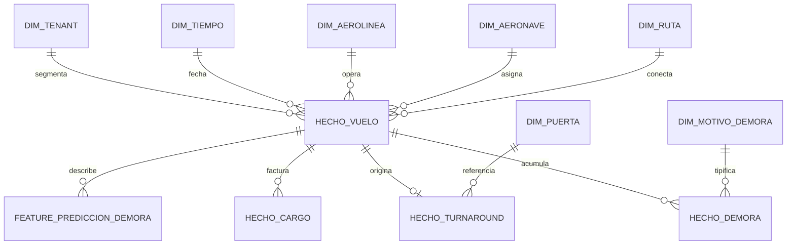
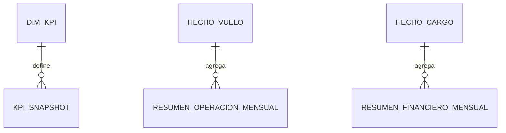
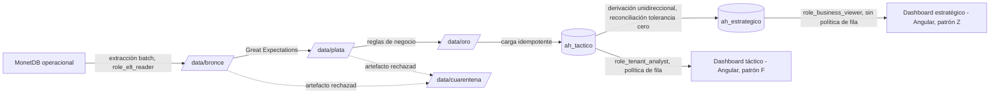

# Descripción de Diseño de Software (SDD) — Modelo de Datos Analítico

## Plataforma AeroHub — Capa Analítica ClickHouse (`ah_tactico` / `ah_estrategico`)

| Campo | Contenido |
|:---|:---|
| **Identificador de documento** | AEROHUB-SDD-DATA-002 |
| **Versión** | 1.0 |
| **Deriva de** | AEROHUB-SRS-001 v2.0 (§7.3–7.4), AeroHub — Análisis Documental Estratégico v6.0 (§7.3, §7.6) |
| **Metodología** | Specification-Driven Development (SDD) |
| **Marco normativo** | IEEE 1016-2009 · ISO/IEC/IEEE 42010:2011 · ISO/IEC 25010:2011 · ISO/IEC 12207:2017 · ISO/IEC/IEEE 29119 · ISO/IEC 27001/27002:2022 · ISO/IEC 27701:2019 |
| **Sistema de gestión de datos** | ClickHouse, dos bases segregadas (ADR-012, ADR-016) |
| **Documento complementario** | AEROHUB-SDD-DATA-001 (base operacional MonetDB) |
| **Estado** | Línea base para revisión de diseño detallado |

---

## Nota de control de cambios

Este documento cubre exclusivamente la capa analítica. La extracción desde la base operacional MonetDB, el particionamiento por departamento y el modelo transaccional se especifican en AEROHUB-SDD-DATA-001; ningún atributo se redefine aquí, solo se referencia por FK lógica. Las extensiones propuestas se aíslan en la Sección 14 (Plan de Mejoras) y no forman parte de la línea base sin ADR aprobatorio.

---

# 1. Introducción

## 1.1 Propósito

Especificar, con el nivel de detalle exigido por IEEE 1016 para la Vista de Información, la estructura física de las dos bases ClickHouse que componen la capa analítica de AeroHub, así como el gobierno del pipeline medallion (Airflow) que las alimenta de forma unidireccional desde la base operacional.

## 1.2 Alcance

Cubre: (a) el esquema estrella de `ah_tactico` (dimensiones conformadas y hechos), (b) los agregados del Balanced Scorecard en `ah_estrategico`, (c) las políticas de fila por tenant, (d) la arquitectura medallion bronce/plata/oro/cuarentena con su máquina de estados y puntos de validación. Excluye el modelo operacional (AEROHUB-SDD-DATA-001) y la plataforma MLOps externa (MLflow, Evidently), referenciada únicamente como fuente de metadatos de modelo.

## 1.3 Convenciones de notación

Motor de tabla, clave de partición, clave de ordenamiento (`ORDER BY`) y TTL se documentan explícitamente por ser, en ClickHouse, decisiones de diseño físico con impacto directo en el rendimiento de consulta — a diferencia de MonetDB, donde el optimizador resuelve el acceso sin declaración explícita del usuario.

## 1.4 Referencias

AEROHUB-SRS-001 v2.0, Secciones 6–7; AeroHub — Análisis Documental Estratégico v6.0, Secciones 7.3, 7.6, 8; ADR-012, ADR-015, ADR-016; ISO/IEC/IEEE 42010:2011; IEEE 1016-2009.

---

# 2. Interesados de Diseño y sus Preocupaciones

| Interesado | Preocupación respecto al modelo analítico |
|:---|:---|
| Director de Crecimiento Comercial / `role_business_viewer` | Que `ah_estrategico` sea reproducible con tolerancia cero desde `ah_tactico`, sin acceso propio al detalle. |
| Data Engineer / `role_data_engineer` | Que las claves de partición y ordenamiento sean compatibles con la carga incremental diaria en < 10 min (RNF-P05). |
| ML Engineer / `role_ml_engineer` | Que `feature_prediccion_demora` esté libre de fuga temporal y versionada junto al modelo. |
| Analista del Tenant / `role_tenant_analyst` | Que la política de fila garantice 0 filas visibles de otro tenant en `ah_tactico` (PN-13). |
| Auditor DGAC/OACI | Que los agregados de puntualidad y demoras sean trazables hasta el hecho individual. |
| CTO / D5 | Que la segregación de escritura entre bases (`role_elt_writer` como único escritor dual) se sostenga en el diseño físico, no solo en el control de acceso. |

---

# 3. Puntos de Vista de Diseño Seleccionados

| Punto de vista | Justificación | Preocupaciones que resuelve |
|:---|:---|:---|
| **Información (Data Viewpoint)** | El esquema estrella y los agregados BSC son el artefacto central de este documento. | Todos los interesados de la Sección 2. |
| **Recursos (Resource Viewpoint)** | Motor de almacenamiento, partición y TTL determinan el consumo de recursos y el costo de retención (Sección 2.4.1 de la fuente, KPI Margen Bruto). | CTO, ML Engineer. |
| **Estado dinámico (State Dynamics Viewpoint)** | La máquina de estados del pipeline medallion (Sección 11) gobierna transiciones no triviales entre capas. | Data Engineer, Auditor. |

---

# 4. Regla de Derivación Unidireccional (principio rector)

```
MonetDB (operacional) → bronce → plata → oro → ah_tactico → ah_estrategico
```

`ah_estrategico` se deriva **exclusivamente** de `ah_tactico`; nunca se ingiere en paralelo desde el origen. Esta restricción es deliberada y no negociable: una doble ingestión independiente permitiría que el tablero estratégico y el táctico reporten cifras distintas para el mismo indicador — el modo de fallo más costoso en reputación de un Balanced Scorecard. Todo diseño posterior de tabla en `ah_estrategico` debe declarar su `fuente_tabla` en `dim_kpi` y ser reconciliable registro a registro contra `ah_tactico` (Sección 11.5, transición final).

---

# 5. Convenciones de Tipificación de Datos (ClickHouse)

| Categoría lógica | Tipo físico | Notas |
|:---|:---|:---|
| Identificador de entidad | `UInt64` | Sin autoincremento nativo; se propaga desde el `id BIGINT` operacional en la capa oro. |
| Código corto de alta repetición (IATA, estado, categoría) | `LowCardinality(String)` | Optimiza almacenamiento y velocidad de agregación en columnas con cardinalidad baja/media. |
| Texto libre / nombre largo | `String` | ClickHouse no distingue longitud máxima a nivel de tipo. |
| Fecha sin hora | `Date` | Clave de partición mensual vía `toYYYYMM(...)`. |
| Marca temporal con precisión de milisegundo | `DateTime64(3)` | Usada en `cargado_en`, `calculado_en` como columna de versión de `ReplacingMergeTree`. |
| Monto monetario | `Decimal(P,S)` | `Decimal(14,2)` para montos operativos; `Decimal(18,4)` para KPI agregados que requieren mayor precisión intermedia. |
| Bandera booleana | `UInt8` (0/1) | ClickHouse trata `Bool` como alias de `UInt8`; se documenta explícitamente para claridad de DDL. |
| Valor nulo permitido | `Nullable(T)` | Uso restringido a columnas donde la ausencia de valor es semánticamente distinta de cero (p. ej. `ata_utc` de un vuelo aún no aterrizado). Se evita en columnas de la clave de ordenamiento. |
| Métrica de punto flotante para features de ML | `Float32` | Suficiente para variables de entrada de XGBoost; evita el costo de `Decimal` en cargas de alto volumen. |

---

# 6. Base `ah_tactico` — Esquema Estrella de Detalle

**Alcance**: hechos por vuelo y turnaround, dimensiones conformadas, features de ML. **Granularidad**: detalle por vuelo, por tenant, por día. **Consumidores**: `role_data_engineer`, `role_ml_engineer`, `role_tenant_analyst`.

## 6.1 Dimensiones Conformadas

### 6.1.1 `dim_tiempo`

| Motor | `MergeTree` | Clave de ordenamiento | `fecha` |
|:---|:---|:---|:---|

| Columna | Tipo | Nulo | Descripción |
|:---|:---|:---|:---|
| fecha | Date | NO | Clave de la dimensión |
| anio | UInt16 | NO | |
| trimestre | UInt8 | NO | 1–4 |
| mes | UInt8 | NO | 1–12 |
| dia | UInt8 | NO | 1–31 |
| semana_iso | UInt8 | NO | ISO 8601 |
| dia_semana | UInt8 | NO | 1 (lunes) – 7 (domingo) |
| es_fin_semana | UInt8 | NO | 0/1 |
| temporada | LowCardinality(String) | NO | `alta` / `baja`, calendario definido por operaciones |
| nombre_mes | LowCardinality(String) | NO | Localización ES |

### 6.1.2 `dim_tenant`

| Motor | `ReplacingMergeTree(version)` | Clave de ordenamiento | `tenant_id` |
|:---|:---|:---|:---|

SCD Tipo 1: refleja el estado vigente del tenant (ver Sección 14, hallazgo M-01, sobre el riesgo de esta elección para KPI financieros históricos).

| Columna | Tipo | Nulo | Descripción |
|:---|:---|:---|:---|
| tenant_id | UInt64 | NO | |
| codigo | LowCardinality(String) | NO | |
| razon_social | String | NO | |
| aeropuerto_id | UInt64 | NO | |
| codigo_iata_aeropuerto | LowCardinality(String) | NO | Desnormalizado desde catálogo global |
| pais_iso2 | LowCardinality(String) | NO | |
| plan_codigo | LowCardinality(String) | NO | |
| estado | LowCardinality(String) | NO | |
| version | UInt64 | NO | Columna de versión de `ReplacingMergeTree` |
| actualizado_en | DateTime64(3) | NO | |

### 6.1.3 `dim_aerolinea` / 6.1.4 `dim_aeropuerto`

| Motor | `ReplacingMergeTree(version)` | Clave de ordenamiento | `aerolinea_id` / `aeropuerto_id` |
|:---|:---|:---|:---|

| Tabla | Columna | Tipo | Nulo |
|:---|:---|:---|:---|
| `dim_aerolinea` | aerolinea_id | UInt64 | NO |
| `dim_aerolinea` | codigo_iata | LowCardinality(String) | NO |
| `dim_aerolinea` | codigo_icao | LowCardinality(String) | NO |
| `dim_aerolinea` | nombre | String | NO |
| `dim_aerolinea` | pais_iso2 | LowCardinality(String) | NO |
| `dim_aerolinea` | version | UInt64 | NO |
| `dim_aeropuerto` | aeropuerto_id | UInt64 | NO |
| `dim_aeropuerto` | codigo_iata | LowCardinality(String) | NO |
| `dim_aeropuerto` | codigo_icao | LowCardinality(String) | NO |
| `dim_aeropuerto` | nombre | String | NO |
| `dim_aeropuerto` | ciudad | String | NO |
| `dim_aeropuerto` | pais_iso2 | LowCardinality(String) | NO |
| `dim_aeropuerto` | zona_horaria | String | NO |
| `dim_aeropuerto` | version | UInt64 | NO |

### 6.1.5 `dim_ruta`

| Motor | `ReplacingMergeTree(version)` | Clave de ordenamiento | `(aeropuerto_origen_id, aeropuerto_destino_id)` |
|:---|:---|:---|:---|

Materializada únicamente aquí; en la operacional sería redundante (`ops.vuelo` deriva origen/destino sin tabla `ruta` propia).

| Columna | Tipo | Nulo | Descripción |
|:---|:---|:---|:---|
| ruta_id | UInt64 | NO | Surrogate generado en la capa oro |
| aeropuerto_origen_id | UInt64 | NO | |
| aeropuerto_origen_iata | LowCardinality(String) | NO | Desnormalizado |
| aeropuerto_destino_id | UInt64 | NO | |
| aeropuerto_destino_iata | LowCardinality(String) | NO | Desnormalizado |
| distancia_km | Nullable(UInt32) | SÍ | Calculada por fórmula de gran círculo en la transición plata→oro |
| version | UInt64 | NO | |

### 6.1.6 `dim_aeronave`

| Motor | `ReplacingMergeTree(version)` | Clave de ordenamiento | `aeronave_id` |
|:---|:---|:---|:---|

| Columna | Tipo | Nulo | Descripción |
|:---|:---|:---|:---|
| aeronave_id | UInt64 | NO | |
| matricula | String | NO | |
| modelo | String | NO | Desnormalizado desde `modelo_aeronave` |
| fabricante | LowCardinality(String) | NO | |
| categoria_estela | LowCardinality(String) | NO | L/M/H/J |
| aerolinea_id | UInt64 | NO | |
| version | UInt64 | NO | |

### 6.1.7 `dim_puerta`

| Motor | `ReplacingMergeTree(version)` | Clave de ordenamiento | `(tenant_id, puerta_id)` |
|:---|:---|:---|:---|

| Columna | Tipo | Nulo | Descripción |
|:---|:---|:---|:---|
| tenant_id | UInt64 | NO | |
| puerta_id | UInt64 | NO | |
| codigo | LowCardinality(String) | NO | |
| tipo | LowCardinality(String) | NO | contacto / remota |
| terminal_codigo | LowCardinality(String) | NO | Desnormalizado |
| terminal_nombre | String | NO | Desnormalizado |
| version | UInt64 | NO | |

### 6.1.8 `dim_motivo_demora`

| Motor | `ReplacingMergeTree(version)` | Clave de ordenamiento | `motivo_demora_id` |
|:---|:---|:---|:---|

| Columna | Tipo | Nulo | Descripción |
|:---|:---|:---|:---|
| motivo_demora_id | UInt64 | NO | |
| codigo_iata | LowCardinality(String) | NO | |
| descripcion | String | NO | |
| categoria | LowCardinality(String) | NO | Agrupador BSC |
| version | UInt64 | NO | |



## 6.2 Tablas de Hechos

### 6.2.1 `hecho_vuelo`

| Motor | `ReplacingMergeTree(cargado_en)` | Partición | `toYYYYMM(fecha_operacion)` | Ordenamiento | `(tenant_id, fecha_operacion, vuelo_id)` | TTL | 5 años |
|:---|:---|:---|:---|:---|:---|:---|:---|

| Columna | Tipo | Nulo | Descripción |
|:---|:---|:---|:---|
| tenant_id | UInt64 | NO | |
| fecha_operacion | Date | NO | |
| vuelo_id | UInt64 | NO | Clave de negocio propagada desde `ops.vuelo.id` |
| aerolinea_id | UInt64 | NO | FK lógica → `dim_aerolinea` |
| aeronave_id | UInt64 | NO | FK lógica → `dim_aeronave` |
| numero_vuelo | LowCardinality(String) | NO | |
| ruta_id | UInt64 | NO | FK lógica → `dim_ruta` |
| sentido | LowCardinality(String) | NO | llegada / salida |
| sta_utc | DateTime64(3) | NO | |
| std_utc | DateTime64(3) | NO | |
| ata_utc | Nullable(DateTime64(3)) | SÍ | |
| atd_utc | Nullable(DateTime64(3)) | SÍ | |
| minutos_demora_llegada | Int32 | NO | Derivado en la transición plata→oro: `ata_utc - sta_utc`; negativo si adelantado |
| minutos_demora_salida | Int32 | NO | Derivado: `atd_utc - std_utc` |
| pax_estimado | Nullable(UInt16) | SÍ | |
| estado_final | LowCardinality(String) | NO | Último `estado_id` con `es_terminal = true` |
| cargado_en | DateTime64(3) | NO | Columna de versión — habilita recarga idempotente del mismo período (RNF-P05) |

### 6.2.2 `hecho_turnaround`

| Motor | `ReplacingMergeTree(cargado_en)` | Partición | `toYYYYMM(fecha_operacion)` | Ordenamiento | `(tenant_id, fecha_operacion, turnaround_id)` | TTL | 5 años |
|:---|:---|:---|:---|:---|:---|:---|:---|

| Columna | Tipo | Nulo | Descripción |
|:---|:---|:---|:---|
| tenant_id | UInt64 | NO | |
| fecha_operacion | Date | NO | |
| turnaround_id | UInt64 | NO | |
| vuelo_llegada_id | UInt64 | NO | |
| vuelo_salida_id | UInt64 | NO | |
| aeronave_id | UInt64 | NO | |
| inicio_previsto | DateTime64(3) | NO | |
| fin_previsto | DateTime64(3) | NO | |
| inicio_real | Nullable(DateTime64(3)) | SÍ | |
| fin_real | Nullable(DateTime64(3)) | SÍ | |
| duracion_real_min | Nullable(UInt16) | SÍ | Derivado |
| cantidad_incidencias | UInt16 | NO | Conteo agregado de `incidencia_rampa` asociadas |
| cargado_en | DateTime64(3) | NO | |

### 6.2.3 `hecho_demora`

| Motor | `ReplacingMergeTree(cargado_en)` | Partición | `toYYYYMM(fecha_operacion)` | Ordenamiento | `(tenant_id, fecha_operacion, vuelo_id, motivo_demora_id)` | TTL | 5 años |
|:---|:---|:---|:---|:---|:---|:---|:---|

| Columna | Tipo | Nulo | Descripción |
|:---|:---|:---|:---|
| tenant_id | UInt64 | NO | |
| fecha_operacion | Date | NO | |
| vuelo_id | UInt64 | NO | |
| motivo_demora_id | UInt64 | NO | |
| minutos | UInt16 | NO | |
| cargado_en | DateTime64(3) | NO | |

### 6.2.4 `hecho_cargo`

| Motor | `ReplacingMergeTree(cargado_en)` | Partición | `toYYYYMM(periodo)` | Ordenamiento | `(tenant_id, periodo, vuelo_id, concepto_cargo_id)` | TTL | 7 años (retención fiscal) |
|:---|:---|:---|:---|:---|:---|:---|:---|

| Columna | Tipo | Nulo | Descripción |
|:---|:---|:---|:---|
| tenant_id | UInt64 | NO | |
| periodo | Date | NO | |
| vuelo_id | UInt64 | NO | |
| concepto_cargo_id | UInt64 | NO | |
| cantidad | Decimal(12,2) | NO | |
| monto_calculado | Decimal(14,2) | NO | |
| moneda | LowCardinality(String) | NO | |
| cargado_en | DateTime64(3) | NO | |

### 6.2.5 `feature_prediccion_demora`

| Motor | `MergeTree` | Partición | `toYYYYMM(fecha_operacion)` | Ordenamiento | `(tenant_id, fecha_operacion, vuelo_id)` | TTL | 2 años |
|:---|:---|:---|:---|:---|:---|:---|:---|

| Columna | Tipo | Nulo | Descripción |
|:---|:---|:---|:---|
| tenant_id | UInt64 | NO | |
| fecha_operacion | Date | NO | |
| vuelo_id | UInt64 | NO | |
| hora_del_dia | UInt8 | NO | 0–23, hora local del aeropuerto |
| dia_semana | UInt8 | NO | |
| categoria_estela | LowCardinality(String) | NO | |
| demora_historica_promedio_ruta_min | Float32 | NO | Ventana móvil 90 días |
| ocupacion_puerta_pct | Float32 | NO | |
| minutos_demora_real | Nullable(Int32) | SÍ | Etiqueta (target); nula hasta el aterrizaje efectivo |
| modelo_version | LowCardinality(String) | NO | Referencia al `run_id` de MLflow (fuente externa, Sección 12) |
| generado_en | DateTime64(3) | NO | |

`MergeTree` simple (no `ReplacingMergeTree`): cada fila representa una observación de entrenamiento/inferencia; no se recarga por período, se acumula. Partición temporal estricta sin mezcla aleatoria que induzca fuga temporal (§8.4 de la fuente).

`ReplacingMergeTree` es la elección correcta para hechos recargables: una reejecución de la DAG sobre el mismo período sustituye registros sin duplicarlos, propiedad indispensable para la idempotencia exigida en la transición oro→ClickHouse.

---

# 7. Base `ah_estrategico` — Agregados del Balanced Scorecard

**Alcance**: KPI consolidados de las cuatro perspectivas del BSC, series históricas largas. **Granularidad**: agregada por mes/trimestre; sin detalle de vuelo individual. **Consumidores**: `role_business_viewer`, `role_platform_admin`, `role_people_viewer` (solo perspectiva de talento).

### 7.1 `kpi_snapshot`

| Motor | `ReplacingMergeTree(calculado_en)` | Partición | `toYYYYMM(fecha_corte)` | Ordenamiento | `(perspectiva, kpi_codigo, tenant_id, fecha_corte)` |
|:---|:---|:---|:---|:---|:---|

| Columna | Tipo | Nulo | Descripción |
|:---|:---|:---|:---|
| perspectiva | LowCardinality(String) | NO | `financiera` / `cliente` / `procesos` / `aprendizaje` |
| kpi_codigo | LowCardinality(String) | NO | FK lógica → `dim_kpi.kpi_codigo` |
| tenant_id | Nullable(UInt64) | SÍ | Nulo para KPI de alcance interno (p. ej. eNPS) |
| fecha_corte | Date | NO | |
| valor | Decimal(18,4) | NO | |
| meta | Decimal(18,4) | NO | Desnormalizado desde `dim_kpi.meta_objetivo` vigente al momento del cálculo |
| unidad | LowCardinality(String) | NO | |
| calculado_en | DateTime64(3) | NO | Columna de versión |

Sustituye a `analytics_bsc.kpi_snapshot` de v5.1 (RF-E01, CU-E01).

### 7.2 `resumen_operacion_mensual`

| Motor | `ReplacingMergeTree(calculado_en)` | Partición | `toYYYYMM(periodo)` | Ordenamiento | `(tenant_id, periodo)` |
|:---|:---|:---|:---|:---|:---|

| Columna | Tipo | Nulo | Descripción |
|:---|:---|:---|:---|
| tenant_id | UInt64 | NO | |
| periodo | Date | NO | Primer día del mes |
| movimientos_totales | UInt32 | NO | |
| puntualidad_pct | Decimal(5,2) | NO | |
| pax_procesados | UInt32 | NO | |
| turnaround_promedio_min | Decimal(6,1) | NO | |
| calculado_en | DateTime64(3) | NO | |

### 7.3 `resumen_financiero_mensual`

| Motor | `ReplacingMergeTree(calculado_en)` | Partición | `toYYYYMM(periodo)` | Ordenamiento | `(tenant_id, periodo)` |
|:---|:---|:---|:---|:---|:---|

| Columna | Tipo | Nulo | Descripción |
|:---|:---|:---|:---|
| tenant_id | UInt64 | NO | |
| periodo | Date | NO | |
| arr_estimado | Decimal(16,2) | NO | |
| facturacion_total | Decimal(16,2) | NO | |
| costo_cloud | Decimal(14,2) | NO | Fuente externa, Sección 12 (RNF-C02) |
| margen_bruto_pct | Decimal(5,2) | NO | `(arr_estimado - costo_cloud) / arr_estimado × 100` |
| moneda | LowCardinality(String) | NO | |
| calculado_en | DateTime64(3) | NO | |

Sustenta OT14 y el KPI de Margen Bruto (Sección 2.4.1 de la fuente).

### 7.4 `resumen_cliente_trimestral`

| Motor | `ReplacingMergeTree(calculado_en)` | Partición | `toYYYYMM(periodo)` | Ordenamiento | `(tenant_id, periodo)` |
|:---|:---|:---|:---|:---|:---|

| Columna | Tipo | Nulo | Descripción |
|:---|:---|:---|:---|
| tenant_id | UInt64 | NO | |
| periodo | Date | NO | Primer día del trimestre |
| nps | Decimal(5,1) | NO | |
| csat | Decimal(5,1) | NO | |
| ttfv_dias | Decimal(6,1) | NO | Time to First Value |
| churn_pct | Decimal(5,2) | NO | |
| calculado_en | DateTime64(3) | NO | |

Sustenta OE6.

### 7.5 `resumen_talento_trimestral`

| Motor | `ReplacingMergeTree(calculado_en)` | Partición | `toYYYYMM(periodo)` | Ordenamiento | `(departamento_id, periodo)` |
|:---|:---|:---|:---|:---|:---|

Sin `tenant_id`: alcance interno.

| Columna | Tipo | Nulo | Descripción |
|:---|:---|:---|:---|
| departamento_id | UInt64 | NO | |
| periodo | Date | NO | |
| enps | Decimal(5,1) | NO | Agregado desde `people.encuesta_enps_respuesta`, sin desagregación individual |
| retencion_pct | Decimal(5,2) | NO | |
| time_to_productivity_dias_prom | Decimal(6,1) | NO | |
| calculado_en | DateTime64(3) | NO | |

### 7.6 `dim_kpi` — Catálogo de Metadatos de KPI

| Motor | `ReplacingMergeTree(version)` | Ordenamiento | `kpi_codigo` |
|:---|:---|:---|:---|

| Columna | Tipo | Nulo | Descripción |
|:---|:---|:---|:---|
| kpi_codigo | LowCardinality(String) | NO | Clave de negocio |
| nombre | String | NO | |
| perspectiva | LowCardinality(String) | NO | |
| unidad | LowCardinality(String) | NO | |
| meta_objetivo | Decimal(18,4) | NO | |
| direccion_favorable | LowCardinality(String) | NO | `mayor_mejor` / `menor_mejor` |
| formula_descripcion | String | NO | |
| fuente_tabla | String | NO | Tabla de origen; cierra la trazabilidad hasta el nivel de dato (RNF-U01) |
| version | UInt64 | NO | Columna de versión |

Permite que el tablero se construya por metadatos en vez de por consultas fijas.



---

# 8. Aislamiento Multi-Tenant en la Capa Analítica

A diferencia de MonetDB, **ClickHouse sí implementa políticas de fila** (`CREATE ROW POLICY`). El aislamiento por tenant se conserva como control estructural, aun cuando en la operacional migró a la capa de aplicación (ADR-014):

```sql
CREATE ROW POLICY politica_tenant ON ah_tactico.hecho_vuelo
  FOR SELECT USING tenant_id = getSetting('SQL_tenant_actual')
  TO role_tenant_analyst;
```

Esta asimetría es intencional: la superficie de datos históricos —de mayor volumen y por tanto de mayor impacto ante una fuga— mantiene enforcement a nivel de motor. `role_data_engineer` y `role_ml_engineer` operan sin política de fila por requerir visión cruzada para diagnóstico de pipeline y entrenamiento, registrado en `compliance.log_auditoria` y verificado por PN-13.

| Tabla objetivo | Política | Rol con excepción (sin política de fila) | Verificación |
|:---|:---|:---|:---|
| `ah_tactico.*` (hechos) | `tenant_id = getSetting('SQL_tenant_actual')` | `role_data_engineer`, `role_ml_engineer` (auditado) | PN-13 |
| `ah_estrategico.*` | Sin política de fila — acceso de solo lectura completo para `role_business_viewer`, `role_platform_admin` | — | Segregación por privilegio de base, no por fila (Sección 9) |

---

# 9. Segregación entre Bases Analíticas

Ningún rol posee acceso simultáneo de escritura a ambas bases. `ah_estrategico` es poblada exclusivamente por la DAG de agregación bajo la identidad técnica `role_elt_writer`; `role_business_viewer` posee únicamente `SELECT` sobre `ah_estrategico` y **ningún acceso a `ah_tactico`**, evitando que el nivel estratégico consulte detalle transaccional que su nivel de decisión no requiere (principio de mínimo privilegio, ISO/IEC 27002, 8.2). Verificación: PN-13.

| Rol | Escritura `ah_tactico` | Lectura `ah_tactico` | Escritura `ah_estrategico` | Lectura `ah_estrategico` |
|:---|:---:|:---:|:---:|:---:|
| `role_elt_writer` (técnico) | Sí | Sí | Sí | Sí |
| `role_data_engineer` | No | Sí (sin política de fila) | No | No |
| `role_ml_engineer` | No | Sí (sin política de fila) | No | No |
| `role_tenant_analyst` | No | Sí (con política de fila) | No | No |
| `role_business_viewer` | No | No | No | Sí |
| `role_platform_admin` | No | No | No | Sí |
| `role_people_viewer` | No | No | No | Sí (solo `resumen_talento_trimestral`) |

---

# 10. Arquitectura Medallion y Gobierno de Ejecuciones ETL

Gobernado en `etl_control` (esquema operacional, detallado en AEROHUB-SDD-DATA-001 §13); esta sección documenta el artefacto en disco que antecede la carga a ClickHouse.

## 10.1 Separación entre Capa de Refinamiento y Estado de Ejecución

Dimensiones ortogonales, no sinónimas:

- **Capa** (bronce / plata / oro): *dónde* está el dato y *cuánto* refinamiento acumula.
- **Estado** (`CRUDO` / `PROCESANDO` / `TERMINADO` / `RECHAZADO`): *en qué punto del ciclo* está la ejecución que produce o consume ese archivo.

Un archivo en plata con estado `CRUDO` es válido: ya fue validado y promovido desde bronce, pero la DAG que lo transformará a oro aún no lo ha tomado.

## 10.2 Estructura de la Carpeta de Datos

```
/data
  /bronce                          <- ingesta cruda, inmutable, retención 90 días
    /YYYY-MM-DD
      /<tenant_id>
        vuelos_<run_id>.parquet
        turnaround_<run_id>.parquet
        _manifest.json
  /plata                           <- validado y normalizado, retención 30 días
    /YYYY-MM-DD
      /<tenant_id>
        vuelos_<run_id>.parquet
        _manifest.json
  /oro                             <- agregados listos para carga, retención 30 días
    /YYYY-MM-DD
      hecho_vuelo_<run_id>.parquet
      hecho_turnaround_<run_id>.parquet
      kpi_estrategico_<run_id>.parquet
      _manifest.json
  /cuarentena                      <- artefactos RECHAZADOS, retención 180 días
    /YYYY-MM-DD
      /<tenant_id>
        vuelos_<run_id>.parquet
        _informe_validacion.json
```

**Formato**: Parquet en las tres capas — columnar, comprimido y tipado, evitando la pérdida de tipos de CSV y reduciendo volumen frente a JSON. **Particionamiento por fecha y tenant**: permite reprocesar un día de un tenant específico sin afectar al resto.

## 10.3 Manifiesto por Ejecución

```json
{
  "run_id": "2026-11-04T03:00:00Z__ingesta_vuelos__aeropuerto_mec",
  "dag_id": "ingesta_vuelos_diaria",
  "tenant_id": "aeropuerto_mec",
  "capa": "bronce",
  "estado": "TERMINADO",
  "registros_entrada": 148,
  "registros_salida": 148,
  "checksum_sha256": "9f2b...",
  "iniciado_en": "2026-11-04T03:00:12Z",
  "finalizado_en": "2026-11-04T03:01:47Z",
  "validaciones": [
    { "tipo": "integridad_transferencia", "resultado": "APROBADO", "registros_fallidos": 0 }
  ]
}
```

Garantiza que el estado del pipeline sea reconstruible aun ante pérdida de la base de control `etl_control`.

## 10.4 Máquina de Estados de Ejecución

| Estado | Significado | Desde | Hacia |
|:---|:---|:---|:---|
| `CRUDO` | Archivo depositado; DAG siguiente aún no lo ha tomado | (inicial) | `PROCESANDO` |
| `PROCESANDO` | DAG en ejecución sobre el archivo | `CRUDO` | `TERMINADO`, `RECHAZADO` |
| `TERMINADO` | Promovido a la capa siguiente con éxito | `PROCESANDO` | (final exitoso) |
| `RECHAZADO` | Falló una validación; a `/cuarentena`, no promueve | `PROCESANDO` | (final con error) |

La unicidad de `(run_id, capa)` en `etl_control.etl_ejecucion` impide el reprocesamiento concurrente: una segunda DAG que intente tomar un archivo ya `PROCESANDO` es rechazada por violación de restricción única, no por convención de código (PN-14).

## 10.5 Puntos de Validación por Transición

| Transición | Validación | Herramienta | Falla implica |
|:---|:---|:---|:---|
| Origen → Bronce | Checksum SHA-256, conteo de registros, formato legible | Sensor de Airflow | `RECHAZADO`; el archivo original permanece en origen para reintento |
| Bronce → Plata | Contrato de datos: esquema, tipos, dominios de catálogo, nulos en obligatorios, duplicados por clave natural | Great Expectations | `RECHAZADO`; artefacto a `/cuarentena` con informe (RF-T12, PN-12) |
| Plata → Oro | Reglas de negocio: conciliación de pasajeros, integridad referencial contra dimensiones, coherencia temporal (ATA ≥ ATD del tramo previo) | Suite SQL / Polars | `RECHAZADO`; el agregado no se construye |
| Oro → ClickHouse (`ah_tactico`) | Idempotencia de carga; conteo destino = conteo origen por partición | Airflow + ClickHouse | Rollback de la partición (`ALTER TABLE ... DROP PARTITION`) |
| `ah_tactico` → `ah_estrategico` | Reconciliación de tolerancia cero: cada KPI agregado debe reproducirse desde el detalle | Suite SQL | La agregación no se publica; el tablero conserva el corte anterior |

La última fila materializa la regla de derivación unidireccional (Sección 4): el tablero estratégico nunca publica una cifra no reproducible desde el detalle táctico.

## 10.6 Retención y Ciclo de Vida de Artefactos en Disco

| Capa | Retención en disco | Justificación |
|:---|:---|:---|
| Bronce | 90 días | Ventana de reproceso ante correcciones tardías del aeropuerto; el dato permanece en ClickHouse indefinidamente según el TTL de cada hecho. |
| Plata | 30 días | Intermedio reconstruible desde bronce. |
| Oro | 30 días | Reconstruible desde plata; ClickHouse es la fuente de verdad una vez cargado. |
| Cuarentena | 180 días | Evidencia de incidentes de calidad de datos; insumo de causa raíz y auditoría. |

---

# 11. Diagrama de Componentes de la Capa Analítica



---

# 12. Fuentes de Datos Externas No Modeladas en la Capa Analítica

| RF / OT | Fuente externa | Mecanismo | Responsable |
|:---|:---|:---|:---|
| RF-E01 (parcial, CAC), OT13 | CRM comercial de terceros | Webhook/API REST hacia el API Gateway; el pipeline comercial reside en el CRM, no en `billing` ni en `ah_tactico` | D3 |
| RF-T08, OT14 | Consola de facturación del proveedor PaaS | API consultada periódicamente por un job de D5; no se replica salvo necesidad de trazabilidad histórica de Margen Bruto | D5 |

No se introducen tablas nuevas: se formaliza la ausencia intencional de modelo interno para datos cuya fuente de verdad es un sistema de terceros, evitando que futuras auditorías de trazabilidad las interpreten como gaps no resueltos.

---

# 13. Fundamento del Diseño (Design Rationale — ISO/IEC/IEEE 42010)

| Decisión | Alternativas consideradas | Razón de selección |
|:---|:---|:---|
| Dos bases ClickHouse segregadas por nivel de objetivo (ADR-012) | Una única base con vistas materializadas por nivel de acceso | Las vistas comparten motor de almacenamiento subyacente; la segregación física impide que un error de permisos en una vista exponga el detalle transaccional al rol estratégico. |
| `ReplacingMergeTree` como motor por defecto en hechos y dimensiones | `MergeTree` simple con `DELETE`+`INSERT` manual | `ReplacingMergeTree` resuelve la idempotencia de recarga (mismo período) de forma nativa, requisito de RNF-P05, sin transacciones explícitas que ClickHouse no soporta con la misma semántica que un motor OLTP. |
| `feature_prediccion_demora` como `MergeTree` (no `ReplacingMergeTree`) | `ReplacingMergeTree` uniforme en toda la base | Cada observación de entrenamiento es un evento append-only distinto, no una versión sustituible del mismo hecho; aplicar `ReplacingMergeTree` arriesgaría descartar observaciones legítimas con la misma clave de ordenamiento. |
| Arquitectura medallion en disco (Parquet) antes de la carga (ADR-015) | Validación in-place dentro de ClickHouse mediante `MATERIALIZED VIEW` | El refinamiento en artefactos Parquet auditables permite inspección y reproceso fuera del motor de consulta, y desacopla el costo de validación del costo de consulta analítica. |
| Derivación unidireccional `ah_tactico → ah_estrategico` (ADR-016) | Ingestión paralela independiente desde `oro` hacia ambas bases | Elimina el riesgo de divergencia de cifras entre niveles de decisión, identificado como el modo de fallo más costoso en reputación de un BSC. |

---

# 14. Mapeo a Calidad de Software (ISO/IEC 25010)

| Característica | Mecanismo de diseño analítico que la sustenta |
|:---|:---|
| Eficiencia de desempeño | Particionamiento `toYYYYMM(...)` y claves de ordenamiento alineadas a los patrones de filtro más frecuentes (`tenant_id`, fecha); `LowCardinality(String)` en columnas de baja cardinalidad. |
| Fiabilidad | Idempotencia de carga vía `ReplacingMergeTree`; reconciliación de tolerancia cero antes de publicar en `ah_estrategico`. |
| Seguridad | Políticas de fila estructurales por tenant en `ah_tactico`; segregación total de escritura entre bases. |
| Mantenibilidad | `dim_kpi` como catálogo de metadatos, evitando lógica de KPI dispersa en consultas ad hoc. |
| Portabilidad | TTL y retención expresados en unidades estándar (días/años), sin dependencia de convenciones propietarias de infraestructura. |
| Usabilidad | `fuente_tabla` en `dim_kpi` sustenta RNF-U01 (todo KPI declara su origen, condición para el patrón de lectura Z/F). |

---

# 15. Seguridad y Privacidad (ISO/IEC 27001/27002/27701)

| Elemento | Clasificación | Control |
|:---|:---|:---|
| `ah_tactico.hecho_*` | Confidencial (detalle operativo por tenant) | Política de fila estructural (`CREATE ROW POLICY`); acceso sin política restringido a roles técnicos auditados. |
| `ah_tactico.feature_prediccion_demora` | Confidencial (insumo de modelo) | Sin PII; `modelo_version` traza al `run_id` de MLflow para auditoría de procedencia (ISO/IEC 27002, 8.28). |
| `ah_estrategico.*` | Restringido (agregado estratégico) | Sin acceso de `role_tenant_analyst`; solo lectura para roles de nivel estratégico (mínimo privilegio, 8.2). |
| `resumen_talento_trimestral` | Restringido, anonimizado | Agregado por `departamento_id`, nunca por individuo; hereda la anonimidad estructural de `people.encuesta_enps_respuesta`. |

**Nota de privacidad**: ningún hecho de `ah_tactico` ni agregado de `ah_estrategico` contiene identificadores de pasajero, consistente con RNF-S05 y verificado en el origen operacional por PN-11; la capa analítica no introduce PII por agregación ni por enriquecimiento.

---

# 16. Trazabilidad a Requisitos

| Requisito | Tabla / Mecanismo | Verificación |
|:---|:---|:---|
| RF-E01 (tablero BSC) | `ah_estrategico.kpi_snapshot` | Corte ≤ 24 h; RNF-U01 |
| RF-O05 / RF-O06 (analítica operativa) | `ah_tactico.hecho_vuelo`, `hecho_turnaround` | RNF-P03 (refresco ≤ 5 min) |
| RF-O17 (Passenger Experience agregado) | Fuente: `billing.tiempo_espera_agregado` (operacional); no replicado en `ah_tactico` como hecho propio en esta versión | PN-11 |
| RF-O19 / RNF-P05 (carga incremental) | `etl_control.etl_ejecucion`, `ReplacingMergeTree` en toda tabla recargable | PN-14 |
| RF-T12 (contratos de datos) | Transición bronce→plata (Sección 10.5) | PN-12 |
| ADR-016 (reconciliación) | Transición `ah_tactico → ah_estrategico` | Suite SQL de reconciliación |
| RNF-S01 (aislamiento de tenant, capa analítica) | Políticas de fila de `ah_tactico` | PN-13 |
| RNF-M01 (calidad del modelo de datos) | Esquema estrella conformado; sin dimensiones degeneradas no documentadas | Revisión de diseño |
| §8.4 de la fuente (validación del modelo ML) | `feature_prediccion_demora` | Partición temporal estricta; MAPE ≤ 12 % en holdout |

---

# 17. Plan de Mejoras Propuestas

No forman parte de la línea base hasta su aprobación mediante ADR formal.

| ID | Hallazgo | Componente afectado | Norma / Riesgo relacionado | Recomendación | Prioridad |
|:---|:---|:---|:---|:---|:---|
| M-01 | `dim_tenant` es SCD Tipo 1 (`ReplacingMergeTree` sin historial); un cambio de `plan_codigo` o `estado` sobrescribe el valor histórico, distorsionando KPI financieros de `ah_estrategico` calculados sobre períodos donde el tenant tenía otro plan. | `ah_tactico.dim_tenant` | ISO/IEC 25010 (adecuación funcional); integridad del BSC financiero (Sección 2.4.1 de la fuente) | Migrar `dim_tenant` (y evaluar `dim_puerta` por reconfiguraciones de terminal) a SCD Tipo 2: añadir `vigente_desde`, `vigente_hasta`, `es_version_vigente`, conservando la clave de ordenamiento `(tenant_id, vigente_desde)`. | A |
| M-02 | Ninguna tabla de `ah_estrategico` declara TTL explícito, a diferencia de los hechos de `ah_tactico`; el silencio se puede interpretar como retención indefinida por omisión, no por decisión documentada. | `ah_estrategico.*` | ISO/IEC 27701 (limitación de conservación); ISO/IEC 25010 (mantenibilidad) | Declarar explícitamente `TTL calculado_en + INTERVAL 10 YEAR` (o el horizonte que defina negocio) en cada tabla, aun si el valor resultante es "sin expiración", para que la decisión quede auditable. | M |
| M-03 | No se especifica una estrategia de respaldo/recuperación para ClickHouse; el riesgo abierto de la fuente (RNF-R01) se documenta solo para MonetDB, dejando la capa analítica sin objetivo de RPO/RTO declarado pese a alojar 5–7 años de historia. | Ambas bases ClickHouse | ISO/IEC 27002, 8.13 | Definir política de `BACKUP`/`RESTORE` nativo de ClickHouse hacia almacenamiento object-compatible (S3), con prueba de restauración periódica análoga a la exigida para MonetDB. | A |
| M-04 | `dim_kpi.kpi_codigo` se documenta como clave de negocio pero no se declara restricción de unicidad explícita más allá de la clave de ordenamiento, que en ClickHouse no garantiza unicidad por sí misma. | `ah_estrategico.dim_kpi` | ISO/IEC 25010 (fiabilidad) | Incorporar verificación de unicidad en la DAG de carga (paso previo al `INSERT`), dado que ClickHouse no ofrece restricciones `UNIQUE` a nivel de motor. | M |
| M-05 | `feature_prediccion_demora` no registra el conjunto (train/validation/holdout) al que pertenece cada observación, dificultando la reproducción exacta de la partición temporal exigida en la validación del modelo ML (§8.4 de la fuente). | `ah_tactico.feature_prediccion_demora` | ISO/IEC/IEEE 29119 (reproducibilidad de pruebas) | Añadir columna `conjunto LowCardinality(String)` con dominio `{entrenamiento, validacion, holdout}`, fijado en el momento de generación, no recalculado en tiempo de consulta. | M |
| M-06 | No existe vista o rol de enmascaramiento intermedio entre `role_data_engineer`/`role_ml_engineer` (sin política de fila) y el resto de la organización; el acceso sin política de fila se audita, pero no se limita por columna. | `ah_tactico.*` | ISO/IEC 27002, 8.2 (mínimo privilegio) | Evaluar una vista con enmascaramiento de `tenant_id` para análisis de patrones cruzados que no requieran identificar al tenant específico, reduciendo la superficie de exposición incluso para roles auditados. | B |
| M-07 | Los esquemas de hoja de ruta `ml` (RF-T13) y `finops` (RF-T14), pendientes de confirmación normativa (Apéndice A de la fuente), no tienen contraparte de diseño físico en ClickHouse, pese a que `resumen_financiero_mensual.costo_cloud` ya depende conceptualmente de `finops`. | `ah_estrategico` | ISO/IEC 12207 (gestión de cambios) | Anticipar el diseño de una tabla `ah_estrategico.costo_cloud_detalle (tenant_id, periodo, proveedor, servicio, monto_usd, calculado_en)` como fuente desnormalizada de `resumen_financiero_mensual.costo_cloud`, sujeta a confirmación formal antes de su incorporación. | B |

---

**Fin del documento — AEROHUB-SDD-DATA-002 v1.0**
