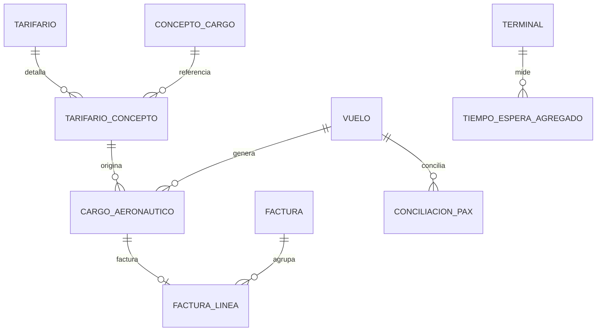

# Fase 1 -- Modelo de Datos: M5 Revenue & Billing + M6 Passenger Experience

**Feature**: [spec.md](./spec.md) | **Fuente de verdad del esquema**:
`docs/sdd/AEROHUB-SDD-DATA-001-MonetDB-v1.0.md` §9 (transcrito fielmente,
sin invención de columnas)

Todas las tablas viven en el esquema SQL `billing`. Propiedad por módulo
(ver [research.md](./research.md) Decisión 3): `aerohub_billing` declara y
escribe `concepto_cargo`, `tarifario`, `tarifario_concepto`,
`cargo_aeronautico`, `factura`, `factura_linea`, `conciliacion_pax`;
`aerohub_passenger` declara y escribe `tiempo_espera_agregado` únicamente.

## `concepto_cargo` (catálogo global, sin `tenant_id`)

| Columna | Tipo | Nulo | Restricción |
|:---|:---|:---|:---|
| id | BIGINT | NO | PK |
| codigo | VARCHAR(30) | NO | UQ |
| nombre | VARCHAR(150) | NO | |
| unidad_medida | VARCHAR(20) | NO | |
| base_calculo | VARCHAR(30) | NO | CHK IN ('peso_mtow','pax','tiempo_estacionamiento','uso_pasarela','fijo') |

Sembrado por `db/seeds/generate.py` (mismo patrón que `TIPOS_TAREA` en
S1.5), no editable vía API en este sprint (fuera de alcance -- ver
`spec.md` Assumptions).

## `tarifario` (alcance tenant)

| Columna | Tipo | Nulo | Restricción |
|:---|:---|:---|:---|
| id | BIGINT | NO | PK |
| tenant_id | BIGINT | NO | de `contexto_tenant_id()`, nunca del body |
| nombre | VARCHAR(100) | NO | |
| moneda | CHAR(3) | NO | |
| vigente_desde | DATE | NO | |
| vigente_hasta | DATE | SÍ | CHK ≥ vigente_desde cuando no nulo |
| estado | VARCHAR(20) | NO | CHK IN ('borrador','vigente','expirado') |
| creado_por_usuario_id | BIGINT | NO | FK → `tenants.usuario.id` |

**Regla de dominio**: a lo sumo un `tarifario` en estado `'vigente'` por
`(tenant_id, moneda)` en un instante dado -- validado en `application/`
antes de escribir (fail fast), no por constraint de motor (MonetDB no
soporta `EXCLUDE`, mismo hallazgo que bloqueo de fila en S1.4).

## `tarifario_concepto`

| Columna | Tipo | Nulo | Restricción |
|:---|:---|:---|:---|
| id | BIGINT | NO | PK |
| tarifario_id | BIGINT | NO | FK → `tarifario.id`; UQ (tarifario_id, concepto_cargo_id) |
| concepto_cargo_id | BIGINT | NO | FK → `concepto_cargo.id` |
| tarifa_unitaria | DECIMAL(14,4) | NO | CHK ≥ 0 |
| monto_minimo | DECIMAL(14,2) | SÍ | |
| monto_maximo | DECIMAL(14,2) | SÍ | CHK ≥ monto_minimo cuando ambos no nulos |

Habilita RF-T10 (tarifas configurables) sin desplegar código: cambiar
precios es un INSERT/UPDATE de datos, no una migración.

## `cargo_aeronautico` (instantánea inmutable -- ver research.md Decisión 5)

| Columna | Tipo | Nulo | Restricción |
|:---|:---|:---|:---|
| id | BIGINT | NO | PK |
| tenant_id | BIGINT | NO | de `contexto_tenant_id()` |
| vuelo_id | BIGINT | NO | FK → `ops.vuelo.id` (redeclarada localmente, patrón S1.4/S1.5) |
| concepto_cargo_id | BIGINT | NO | FK → `concepto_cargo.id` |
| tarifario_concepto_id | BIGINT | NO | FK → `tarifario_concepto.id` |
| cantidad | DECIMAL(12,2) | NO | CHK > 0 |
| tarifa_aplicada | DECIMAL(14,4) | NO | copiada de `tarifario_concepto.tarifa_unitaria` en el momento del cálculo -- NUNCA recalculada |
| monto_calculado | DECIMAL(14,2) | NO | `cantidad * tarifa_aplicada`, clamped a `[monto_minimo, monto_maximo]` si aplican -- NUNCA recalculado |
| calculado_en | TIMESTAMPTZ | NO | DEFAULT now() |

**Invariante verificado por prueba de integración**: tras crear un
`cargo_aeronautico`, hacer `UPDATE` sobre `tarifario_concepto.tarifa_unitaria`
del mismo concepto y releer el cargo -- `tarifa_aplicada`/`monto_calculado`
deben permanecer idénticos.

## `factura` / `factura_linea`

| Tabla | Columna | Tipo | Nulo | Restricción |
|:---|:---|:---|:---|:---|
| `factura` | id | BIGINT | NO | PK |
| `factura` | tenant_id | BIGINT | NO | UQ (tenant_id, aerolinea_id, periodo_inicio, periodo_fin) |
| `factura` | aerolinea_id | BIGINT | NO | FK → catálogo global `aerolinea.id` |
| `factura` | periodo_inicio | DATE | NO | |
| `factura` | periodo_fin | DATE | NO | CHK ≥ periodo_inicio |
| `factura` | moneda | CHAR(3) | NO | |
| `factura` | estado | VARCHAR(20) | NO | CHK IN ('borrador','emitida','pagada','vencida','disputada') |
| `factura` | emitida_en | TIMESTAMPTZ | SÍ | |
| `factura` | vence_en | TIMESTAMPTZ | SÍ | |
| `factura_linea` | id | BIGINT | NO | PK |
| `factura_linea` | factura_id | BIGINT | NO | FK → `factura.id` |
| `factura_linea` | cargo_aeronautico_id | BIGINT | NO | FK → `cargo_aeronautico.id`; UQ -- un cargo se factura una sola vez |
| `factura_linea` | descripcion | VARCHAR(200) | NO | |
| `factura_linea` | cantidad | DECIMAL(12,2) | NO | |
| `factura_linea` | precio_unitario | DECIMAL(14,4) | NO | copiado de `cargo_aeronautico.tarifa_aplicada` -- evidencia contable congelada |
| `factura_linea` | monto | DECIMAL(14,2) | NO | copiado de `cargo_aeronautico.monto_calculado` |

`factura.total` **no es columna** -- se deriva con
`SUM(factura_linea.monto) WHERE factura_id = :id` en `infrastructure/`.

**Transiciones de `estado`**: `borrador` -> `emitida` (al calcular y
agrupar líneas) -> `pagada` | `vencida` | `disputada`. `role_billing_officer`
solo puede mover a `disputada` (Up, "disputas" en la matriz) -- no puede
crear ni emitir facturas nuevas por mano (eso es el motor/Sistema, CU-O17).

## `conciliacion_pax`

| Columna | Tipo | Nulo | Restricción |
|:---|:---|:---|:---|
| id | BIGINT | NO | PK |
| tenant_id | BIGINT | NO | UQ (tenant_id, vuelo_id, periodo) |
| vuelo_id | BIGINT | NO | FK → `ops.vuelo.id` |
| periodo | VARCHAR(7) | NO | formato `YYYY-MM` |
| pax_reportado_aerolinea | SMALLINT | NO | CHK ≥ 0 |
| pax_registrado_sistema | SMALLINT | NO | CHK ≥ 0 |
| fuente_reporte | VARCHAR(50) | NO | |
| conciliado_en | TIMESTAMPTZ | SÍ | |
| conciliado_por_usuario_id | BIGINT | SÍ | FK → `tenants.usuario.id` |

`diferencia` **no es columna** -- se deriva como
`pax_reportado_aerolinea - pax_registrado_sistema` en `infrastructure/`.
Diferencia cero es el caso de éxito de la compuerta de pruebas de
conciliación.

## `tiempo_espera_agregado` (M6 -- propiedad de `aerohub_passenger`, PN-11)

| Columna | Tipo | Nulo | Restricción |
|:---|:---|:---|:---|
| id | BIGINT | NO | PK |
| tenant_id | BIGINT | NO | UQ (tenant_id, terminal_id, fecha, franja_inicio) |
| terminal_id | BIGINT | NO | FK → `ops.terminal.id` (redeclarada localmente) |
| fecha | DATE | NO | |
| franja_inicio | TIME | NO | |
| franja_fin | TIME | NO | CHK > franja_inicio |
| minutos_estimados | DECIMAL(6,2) | NO | CHK ≥ 0 |
| muestra_n | INTEGER | NO | CHK ≥ 0 -- descarta estimaciones con soporte estadístico insuficiente |
| calculado_en | TIMESTAMPTZ | NO | DEFAULT now() |

**Verificación PN-11 (0 PII)**: ninguna columna identifica pasajero,
vuelo individual, ni agente -- solo terminal + ventana horaria + agregado
numérico. Test de integración recorre `information_schema` de esta tabla
y falla si aparece cualquier columna fuera de esta lista exacta.

## Relaciones (ER, transcrito del SDD §9)

## Alcances G1/G2 (guardián de tenant)

| Tabla | Alcance | Notas |
|:---|:---|:---|
| `concepto_cargo` | global | catálogo, sin `tenant_id` |
| `tarifario` | tenant | |
| `tarifario_concepto` | tenant (vía `tarifario_id`) | sin `tenant_id` propio -- alcance heredado, mismo patrón que `factura_linea` vía `factura_id` |
| `cargo_aeronautico` | tenant | |
| `factura` | tenant | |
| `factura_linea` | tenant (vía `factura_id`) | |
| `conciliacion_pax` | tenant | |
| `tiempo_espera_agregado` | tenant | |

`role_support`: **sin alcance registrado** en ninguna de estas tablas
(ver research.md Decisión 4) -- cualquier intento de consulta resuelve en
404 (PN-01), nunca 403.
